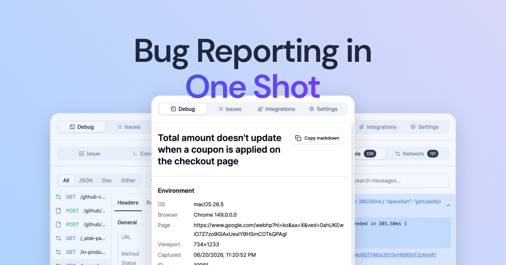

# BugShot

**English** · [한국어](README.ko.md)



[](https://chromewebstore.google.com/detail/bugshot/ohakhekagkodklkickemonmifdcbhmig)
[](https://chromewebstore.google.com/detail/bugshot/ohakhekagkodklkickemonmifdcbhmig/reviews)
[](LICENSE)

**Bug Reporting in One Shot.**

Open-source bug reporting from your browser, straight to your tracker.

BugShot is a Chrome side panel that captures what happened — screenshots,
recordings, console and network logs, user actions, environment details, and
even CSS before/after diffs — and turns it into a report for Jira, GitHub,
Linear, Notion, GitLab, Asana, ClickUp, or Slack.

No BugShot account. No hosted workspace. Your capture data never passes through
a BugShot server. BugShot is free, with no paid tier planned: there is no
capture backend to run, no usage to meter, and no hosting bill to recover.

[Install from the Chrome Web Store](https://chromewebstore.google.com/detail/bugshot/ohakhekagkodklkickemonmifdcbhmig)
· [Read the docs](https://bug-shot.com/en/docs)
· [Privacy](#privacy)

## From a visible bug to an actionable report

1. **Capture the problem** — pick an element, take a screenshot, or record it.
2. **Collect the evidence** — environment, console, network, and action logs
   are attached automatically.
3. **Send it where work happens** — review the report and submit it directly
   to your tracker or Slack.

## Why I built it

I'm a product designer. When I found a UI bug, I used to inspect the page in
DevTools, change the CSS, take screenshots, move over to Jira, and manually
build a before/after table for the issue.

That was tedious, so I made a tool that let me finish the whole workflow in one
place and send the result to Jira in the format I wanted.

As I used it at work, our QA team asked if it could handle general bug reports
too. That added screenshots and recordings, followed by network requests,
console logs, and the rest of the evidence needed to reproduce a bug. It became
an internal tool for the QA team; I still use it every day and keep
improving it.

What started as a way to avoid making CSS diff tables by hand grew into this
product in its first three months.

## Privacy by architecture

Bug reports can contain some of the most sensitive parts of a production
session: customer data in screenshots, tokens in network traffic, internal
identifiers in console output, and the contents of form interactions.

I didn't want BugShot to become another server that received and stored that
data. These are the core data paths:

```text
Your browser ────────────────────────→ Your tracker or Slack
     │
     ├── when you use AI ────────────→ The LLM endpoint you selected
     │
     ├── OAuth exchange only ────────→ BugShot OAuth proxy
     │
     └── anonymous usage events ─────→ PostHog (via a proxy domain we own)
```

Screenshots, recordings, logs, CSS changes, attachments, and report bodies are
assembled in the extension and sent directly to the destination you connected.
For Jira, GitHub, Notion, Asana, ClickUp, and Slack, the BugShot-operated OAuth
proxy relays authorization-code exchanges and token refreshes; Linear and
GitLab exchange tokens directly via PKCE. Capture data never goes through the
proxy. Anonymous analytics contain no capture or report content. Those events
leave through `in.bug-shot.com`, a domain we own whose DNS record points
straight at PostHog Cloud — it exists so ad and DNS blockers don't silently
drop the numbers, and no BugShot server sits on that path either.

This has deliberate trade-offs: there is no BugShot account, team workspace,
cloud sync, or server-side capture processing. The project is open source so
you can inspect that architecture instead of taking the privacy claim on trust.

[See every external request BugShot makes](docs/privacy.en.md#3-external-transmission).

## Getting Started

**Requires Chrome 116 or later.** Other Chromium browsers that ship the Side
Panel API (Edge, Brave, Arc) should work, but Chrome is what's tested. There is
no Firefox or Safari build — the whole UI is a Chrome MV3 side panel, and
neither browser implements that API.

1. **Install** from the [Chrome Web Store](https://chromewebstore.google.com/detail/bugshot/ohakhekagkodklkickemonmifdcbhmig).
2. **Open the panel** — click the toolbar icon or press `Cmd/Ctrl+Shift+E`.
3. **Connect a destination** — choose a tracker or Slack in the *Integrations* tab.
4. **Capture** — edit an element's styles, capture an element or area, take a
   viewport or full-page screenshot, or record the tab or screen. You can also
   start a report without a capture from the console or network log tabs.
5. **Submit** — review the evidence and send the completed report.

Full walkthrough in the [Quick Start guide](https://bug-shot.com/en/docs/quick-start).

## Features

### 🎨 Styling

Fix the bug visually before you even describe it.

- **Element picker** — hover to highlight, click to select any DOM element on the page. Works on nested and deeply styled elements.
- **DOM tree navigation** — can't reach it by hovering? Browse the live DOM tree in a dialog and pick the node directly, or step to its parent or first child — for wrappers and elements buried under an overlay.
- **Live CSS editing** — edit layout, spacing, sizing, color, typography, borders, and more through structured fields, or switch to a syntax-highlighted CSS code editor — prefilled with the element's current styles (four-side longhands merged into shorthands), with autocomplete and inline color swatches — to edit raw CSS directly (arbitrary properties, `!important`). Changes apply to the live page instantly, so you can dial in the exact fix and see it in place.
- **Class & text editing** — edit an element's class list or visible text live; those changes are tracked alongside its style diff.
- **Design token awareness** — resolves `var()` chains and shows the token name (e.g. `--color-primary`) instead of the raw computed value, so the report speaks your design system's language.
- **Before/after diff** — every change is tracked and rendered as a before → after table in the issue, plus paired before/after screenshots that widen to the enclosing dialog or table row so the fix is recognizable at a glance. Developers see exactly which properties to change. **Both images can be annotated** so you can point at the offending element even when the frame holds several, and removing an annotation restores the shot you originally captured. Edits across multiple elements are stacked and preserved until you submit.

### 📸 Capture

Grab exactly what's on screen and mark it up.

- **Element capture** — click an element to crop just that element as a clean screenshot; its DOM selector is added to the issue environment automatically.
- **Works inside iframes** — the picker reaches one level into embedded frames, cross-origin ones included.
- **Area capture** — drag any region of the screen to capture a precise slice.
- **Screen capture** — grab the whole visible viewport in one click, no dragging.
- **Full-page capture** — scroll and stitch the entire page into one tall screenshot; fixed and sticky headers are printed once, and very long pages stop at a limit with a notice.
- **Annotation** — mark up the shot with arrows, a freehand pen, text, shapes, and highlights before attaching it. Zoom (fit-to-width up to 400%) and pan the canvas so you can annotate fine detail on a tall full-page shot; the finished image is always attached at its original resolution.
- **Inline evidence** — capture an extra area or paste, drop, or add images directly into a body section, then annotate, restore, or delete them in place.

### 🎬 Recording

When a still image isn't enough, record the behavior.

- **Tab recording** — record the current tab, up to 60 seconds, encoded to MP4 (WebM fallback where MP4 isn't supported).
- **Screen recording** — record any window or the full screen via the system picker, up to 60 seconds.
- **Draw while recording** — a mini toolbar (pen, box, or highlighter; up to 5 colors, fewer on a narrow panel; three thicknesses) lets you mark up the page during tab/screen recording. Freehand strokes fade tail-first in draw order over ~3s; a box fades all at once. Either way it's baked into the video.
- **30s Replay** — an opt-in, always-on buffer that keeps the **last 30 seconds** as MP4. It looks back across page navigations, so you can catch the bug even *after* spotting it — no need to hit record beforehand.
- **Trim before you file** — stopping any recording (tab, screen, or 30s Replay) opens a trim screen. Drag the handles to keep just the bug moment, and the attached console, network, and action logs are narrowed to the same range. Leave the handles alone and nothing is re-encoded; if re-encoding fails, the original clip is attached as is.

### 📋 Logs

Reproduction context, collected for you in the background.

- **Network & console logs** — captured automatically while the panel is open and attached to the issue. Includes **WebSocket frames** and logs from **cross-origin iframes** (payment widgets, embeds), all filterable by origin.
- **Action log** — clicks, text input, navigations, keyboard shortcuts, checkbox/radio toggles, dropdown selections, and drag & drop recorded as step-by-step reproduction. Sensitive values are masked, both by field label and by value shape (emails, long digit runs); rich-text editor content is never recorded.
- **Add a log to the body** — pick one console or network entry and drop it into the issue body as a code block (JSON pretty-printed and highlighted), right where you're describing the symptom. The attachment only opens after a download; this reads in the issue itself.
- **API hosts in the environment** — hosts from the network log that share a domain with the page are filled into the issue environment automatically, so a reader knows which server to look at without downloading the attachment. It is an ordinary row, so edit or delete it if it is not what you want.
- **Log viewer** — a standalone `logs.html` report with a **video-synced timeline**: click any console/network/action entry to jump to that exact moment in the recording. It also carries a **Report tab** (issue body preview + copy as markdown) and per-tab exports (HAR, console/action JSON).

All three logs ride along with every capture except element style editing, and the whole logs.html bundle can be toggled off with one switch before you submit (also toggleable on already-saved issues).

### 🤖 AI

- **AI draft** — BYOK (Bring Your Own Key) with OpenAI, Anthropic, Gemini, and more; falls back to Chrome Built-in AI when no key is set. Drafts the title and body from your capture (styles, screenshot, or log summary) in one go. When the AI cites a relevant error log, the actual console/network entry is inserted into the body as a code block — serialized by the app, so log contents can't be hallucinated.
- **AI styling** — describe the fix in words and the AI writes the CSS onto the selected element, live on the page.
- **Repro auto-fill** — **on by default** once you connect an AI: after a recording, the steps-to-reproduce section is written for you from the action log, which means the action log is sent to that AI. Turn it off under Settings → Issue settings → Other.

### 📥 Issue list & drafts

- **Submitted issues** — every report you've filed stays in the *Issue list* tab with its platform badge, searchable and filterable by submitted/draft. Refresh to pull the current state back from the tracker, or change the status right from the panel and have it written back. Reports shared to Slack can be **promoted to a tracker issue later**, and the original Slack thread gets a reply with the new issue's URL.
- **Drafts** — not ready to file? Save the report as a draft, reopen it later, edit any field, and submit when it's ready.

### 🔗 Integrations

Connect via OAuth or a token. Every **tracker** supports destination selection
and attachment upload. Assignee covers every tracker except Notion; label
selection is GitHub, Linear and GitLab only. **Slack** is a messenger rather than
a tracker — it sends to a channel or DM instead.

Set defaults once in the *Integrations* tab — destination (project, repo, team,
workspace) plus **assignee**, CC, label, and issue type — and every new report comes
pre-filled. Whoever you assigned last still wins over the default, so the common
case stays one click.

| Platform | Auth | Highlights |
|---|---|---|
| **Jira** | OAuth 3LO / API Token | project metadata, auto-upload attachments |
| **GitHub** | OAuth / PAT | repo, labels, assignees, file upload |
| **Linear** | OAuth PKCE / API Key | team, project, labels, priority |
| **Notion** | OAuth / Internal Token | database picker, status & select properties |
| **GitLab** | OAuth PKCE / PAT | gitlab.com + self-managed instances |
| **Asana** | OAuth / PAT | workspace, project, assignee |
| **ClickUp** | OAuth / API Token | workspace → space → list, assignee |
| **Slack** | OAuth (user token) | channel/DM, @mentions, title + threaded details & files |

### 🌐 Export & i18n

- **Markdown copy** — paste into Slack, Confluence, or anywhere with tables intact
- **File attachments** — attach your own files to the report, uploaded natively to the tracker
- **Local download** — save the captured screenshot/video and the `logs.html` report
- **i18n** — Korean / English
- **Report body composition** — toggle which sections (description, steps to reproduce, expected result, notes) go into the issue and **drag them into the order you want**, media and logs included; plus a title prefix
- **Theme** — light / dark / system

## Development

```bash
pnpm install
pnpm dev          # dev server (HMR via @crxjs/vite-plugin)
pnpm build        # production build → dist/ (runs build:log-viewer first)
pnpm build:log-viewer  # log viewer bundle only (build/build:store/build:e2e run it automatically)
pnpm build:store  # store upload build (strips manifest key)
pnpm preview      # preview the production build
pnpm typecheck    # type check only
pnpm test         # unit tests (Vitest)
pnpm test:watch   # unit tests in watch mode
pnpm build:e2e    # e2e-only build → dist-e2e/ (test fixture — never load/upload)
pnpm test:e2e     # Playwright e2e suite (run build:e2e first)
pnpm sync:agents  # regenerate the Codex mirror (AGENTS.md, .agents/skills/)
```

Load the unpacked extension from `dist/` at `chrome://extensions` (developer mode).
The e2e suite lives in `e2e/` — see [`e2e/README.md`](e2e/README.md) for coverage and gotchas.
Patches are welcome: [`CONTRIBUTING.md`](CONTRIBUTING.md) covers which branch to
target, what CI checks, and what won't be merged.

### Build it yourself

Don't take the privacy claim on faith — build from source and watch the network
tab:

```bash
git clone https://github.com/SinhyeokKang/bugshot-2.git
cd bugshot-2
pnpm install
cp .env.example .env.local   # optional — see below
pnpm build
```

Then load `dist/` as an unpacked extension. Every key in `.env.example` is
optional: without OAuth client IDs the OAuth buttons are hidden and you connect
platforms with a personal access token instead, and without a PostHog key
analytics is a no-op. So a build from an empty `.env.local` is fully functional
*and* makes zero analytics requests.

Open DevTools on the side panel and compare what you see against the
[transmission table](docs/privacy.en.md#3-external-transmission) — the only
BugShot-operated endpoint in the whole list is the OAuth token-exchange proxy,
which relays the code→token swap and never carries capture data.

## Stack

| | |
|---|---|
| Runtime | Chrome MV3 — Side Panel + Service Worker + Content Script |
| UI | React 18, TypeScript, Tailwind CSS v3, shadcn/ui |
| State | Zustand + chrome.storage (session / local) |
| Build | Vite + @crxjs/vite-plugin |
| Test | Vitest (unit) · Playwright (e2e) |

## Architecture

The decisions that shaped the codebase, and what each one cost:

**No backend, by construction.** There is no BugShot server in the data path —
not "we don't look at it," but nowhere to look. Captures, logs, and report
bodies are assembled in the extension and POSTed straight to your tracker with
your own credentials. The one BugShot-operated endpoint is a Cloudflare Worker
that swaps an OAuth code for a token, because the client secret can't ship in a
public bundle; Linear and GitLab skip even that via PKCE. The cost is real:
no cross-device sync, no team workspace, no server-side processing — features
that would each require breaking this property, so they don't get built.

**Recorders are a synchronous IIFE, and that constrains the build.** Console and
network hooks have to be installed at `document_start` *before* the page's own
inline scripts run, or the first errors are already gone. That only holds if the
recorder chunk is self-contained — a single external static import turns it into
an async loader and the hooks land too late. So the throttle helper is
deliberately duplicated between the recorder and the side panel rather than
shared, and a `sessionStorage` flag lets recording start buffering before the
side panel has even connected.

**Full-page capture is orchestrated across three contexts.** The side panel
drives it, a content-script executor scrolls the page, and each tile goes
through the background worker's `captureVisibleTab`. Repeated `fixed` headers
and late-appearing `sticky` elements are suppressed by `visibility` between
tiles — including elements that appear or change position mid-capture — then
the original styles and scroll offset are restored.

**iframe support is one level deep, and says so.** The picker is injected into
all frames; a child registers with the top frame over `postMessage` and elements
are identified by a `selector + frameId` composite key. Frames that don't
register — nested two levels deep, or sandboxed — hit an explicit refusal path
with a dialog rather than failing silently. The registration token is a
correlation hint, not an authentication boundary: the child broadcasts it, so a
hostile parent page can read it. That's a documented, accepted limit, not an
oversight.

**Styles are resolved against your design system.** The CSS pipeline follows
`var()` chains to report `--color-primary` instead of a computed RGB triple —
which means fetching cross-origin stylesheets from the background worker at a
page-supplied URL, i.e. an SSRF surface. It runs behind
[`src/lib/ssrf-guard.ts`](src/lib/ssrf-guard.ts): http(s) only, with loopback,
private, link-local, CGNAT, multicast, IPv6 ULA, and IPv4-mapped-IPv6 bypasses
all rejected, plus `credentials: "omit"`, `redirect: "manual"`, a timeout, a
content-type check, and size caps. One residual gap is documented in that file
rather than papered over: a hostname that resolves to an internal address can't
be caught statically, since `fetch` re-resolves DNS. The fetched CSS is used
on-device only.

**Eight tracker integrations behind one adapter seam.** Each platform gets its
own auth (OAuth or token), field schema, and upload path, but the report body is
built once and rendered per target — Markdown, Jira ADF, Notion blocks, Slack
mrkdwn.

Much of this can't be unit-tested — DOM measurement, pointer drags, canvas, and
media APIs need a real browser — so a Playwright suite carries what Vitest
can't, and the coverage metric deliberately excludes browser-bound files so the
number stays an honest signal.

Full detail lives in [`docs/ARCHITECTURE.md`](docs/ARCHITECTURE.md) (Korean).

## Privacy

Every outbound request the extension can make is enumerated here — trackers,
Slack, your LLM endpoint, the OAuth proxy, and analytics — with the exact data
each one carries:

- **[External transmission table](docs/privacy.en.md#3-external-transmission)** — every destination, what it receives, and why
- **[Permissions notice](docs/privacy.en.md#6-permissions-notice)** — why the extension needs `<all_urls>`
- **[docs/PERMISSION.md](docs/PERMISSION.md)** — per-permission engineering reference: lifecycle, expiry, fallbacks (Korean)

Full policy: [English](docs/privacy.en.md) · [한국어](docs/privacy.ko.md) ·
[bug-shot.com](https://bug-shot.com/en/privacy)

### Why it asks for access to every site

Chrome renders this permission as *"Read and change all your data on all
websites"* — the most alarming line in the install dialog, and it's required
rather than optional. BugShot did ship the optional version first, requesting
the permission at runtime, and it was dropped because it broke in use:
`captureVisibleTab` runs on either `activeTab` or a broad host permission, and
`activeTab` is revoked the moment the page makes a cross-document navigation,
with no way to re-acquire it programmatically. A recording or a 30-second
replay would simply die when the bug you were chasing navigated — which is
precisely when you need it.

So the permission is broad. The data path isn't — everything it unlocks happens
on your machine, and the transmission table above is the complete list of what
leaves it. If you'd rather narrow the grant, Chrome lets you — **Extensions →
BugShot → Site access** — with the understanding that the features which need
the breadth will degrade accordingly.

> **A note on language.** This README is kept in sync with its
> [Korean edition](README.ko.md), as are the privacy policy and the user guide.
> The engineering docs under `docs/` and the source comments are written in
> Korean — the project is built and maintained by one person, and that's the
> language it was thought in.
> Everything you need to audit the privacy claims above is in English.

## License

[MIT](LICENSE) © 2026 Sinhyeok Kang
