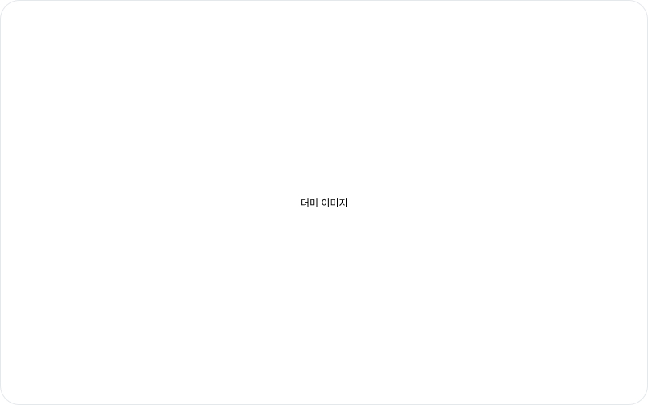

# Device Viewport

"It only breaks on mobile." Chasing that report usually means dragging your browser window narrower and narrower — except the side panel is pushing the page over, so you can never quite land on the width you want. Open DevTools' device toolbar instead and now BugShot's captures and logs are looking at a different screen than you are.

Device Viewport closes that gap. **Pin the width inside BugShot and finish the whole run** — capture, logs, report — without leaving.

## Picking a width

The viewport row sits in the **Debug** tab, just under the sub-tab bar on the **Issue** sub-tab. Pick one of four.

| Segment | Good for |
|---|---|
| **Full** | Your browser window as-is. This is the default. |
| **390** | Phone, portrait |
| **768** | Tablet, portrait |
| **1024** | Small laptop |

Each button carries a device icon, but **the number is the real label**. Narrow the panel and the text folds away to leave just the icon — hover it or read it with a screen reader and the width is still announced.

> A width that won't fit your window is dimmed and won't respond. Hover it and you'll see **The window is too narrow for this width**. Widen the browser and it comes back on its own, no clicking required.

## What changes, and what doesn't

Pick a width and the page re-renders inside a viewport that size, so **responsive breakpoints genuinely fire**. It doesn't impersonate a whole device, though, so check the table below first — writing a report around something that isn't actually emulated will send people chasing the wrong thing.

| | Emulated |
|---|:---:|
| Viewport width (`innerWidth`, `vw`) | ✅ |
| Responsive breakpoints (media queries) | ✅ |
| Screen-pinned elements (`position: fixed`) | ✅ |
| High-density image swaps (2x, 3x) | ❌ |
| Touch events and touch-device detection | ❌ |
| Browser identity string (User-Agent) | ❌ |

So this is a tool for **"what does the layout do when it gets narrow"**. A site that branches on the visiting device may well serve you its desktop screen, and that's working as intended. It's the same reason the buttons say numbers instead of names like `iPhone 14`.

## Before you switch it on

The first time you pick a width, you'll get a one-time confirmation titled **The page will reload**. Two things are worth knowing up front:

- The page reopens when you turn on a device viewport or go back to **Full**. On screens you can't redo — a completed checkout, say — it's safer to stay out.
- The original page is only hidden from view; it keeps running behind the scenes. Autosaves and periodic requests can therefore happen twice.

Read it, hit **Continue**, and you won't be asked again.

There's one welcome exception. **Going from one width to another doesn't reload anything.** Move from 390 to 768 and your scroll position and anything you'd typed stay put. Only a trip through **Full** reopens the page.

## When you navigate to another site

Follow a link to a different site while the mode is on and **the whole page reopens there**, with the viewport re-established at the same width. Logs start fresh, and if you had an issue in progress you'll get a heads-up. Once in a while the width doesn't carry over and you land on **Full** — just pick the width again, nothing else is lost.

It sounds like a detour, but there's a reason. Trapping another site inside that small frame makes the browser treat it as a separate visit, so you'd get a **logged-out screen** — and a screenshot of that documents a page nobody actually saw. Moving the whole page across keeps you signed in.

> If a site keeps bouncing you around and the viewport can't be kept, BugShot says so and returns you to **Full**.

## While the mode is on

- **Page capture (the scrolling one) is locked.** The button dims and hovering it tells you why. To grab a long page end to end, switch back to **Full** first. Area capture, screen capture, element capture, and recording all work as usual.
- **Elements inside an iframe on the page can't be picked** — payment windows, embedded widgets, that sort of thing. A dialog explains it, and switching back to **Full** restores normal picking.
- Pages that refuse to be opened inside a frame won't hold the viewport, and you'll land back on **Full**. Banks and government sites often set this.

## Checking whether it's on

The viewport row tucks itself away once you move on to writing the issue, so you can focus on the write-up. In its place, the **Environment** section shows the current width as `Viewport 390px`.

The screen size recorded in the report's **Environment** is the width you picked, not your browser window — so nobody has to ask "which width did this break at?". Screenshots are captured inside that viewport, and video reports record the same width in their Environment.

---

With the width set, just capture the way you normally would — [Inspect & Style](element/README.md), [Screenshot](screenshot/README.md), and [Recording](video/README.md) all work inside this viewport.
