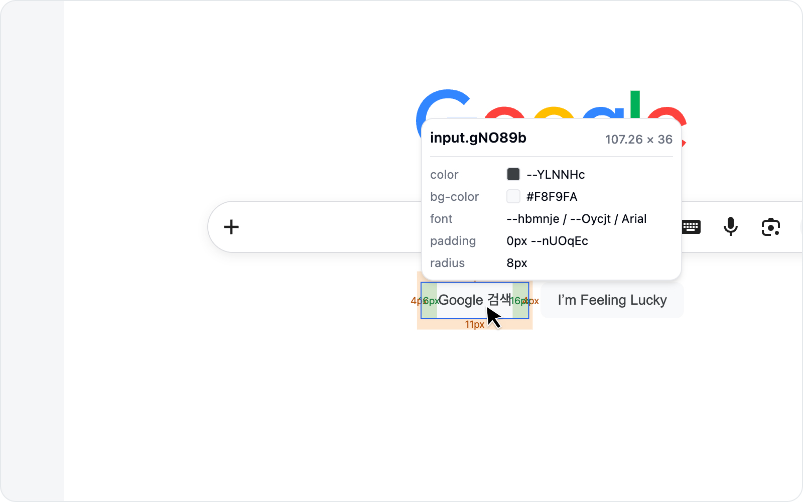
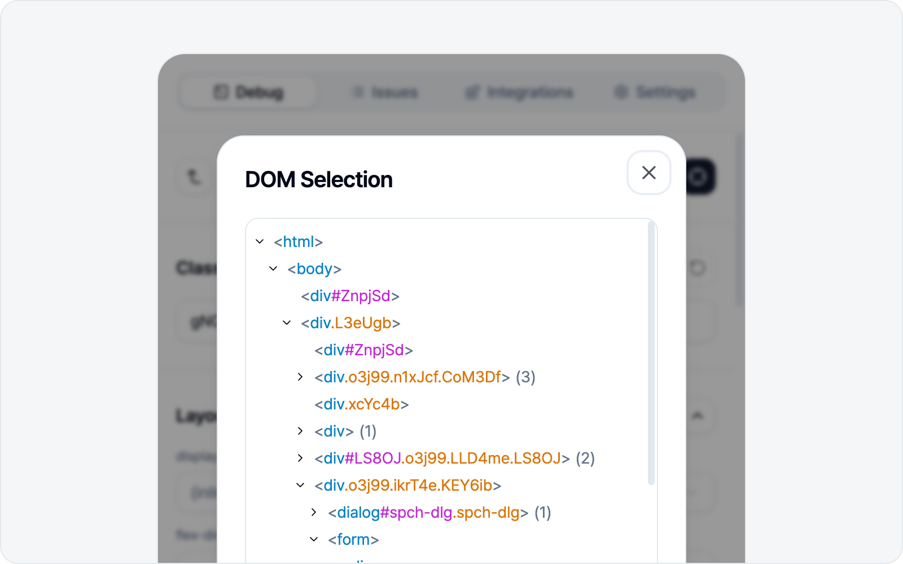

# Pick an Element

## Start picking

In the **Debug** tab, click **Edit element style**. A crosshair appears over the page, and the element under your cursor lights up.

> Just want a screenshot of the element without touching its styles? [Capture element](../screenshot/capture.md) is the quicker route.

## Click an element

Click the element you want to select it. Its details show up in the side panel.

## Move through the DOM tree

Can't quite land on the exact element? No problem — you can **move to its parent or child** from the current selection. Step up (parent) or down (child) until you hit the right one.

Want to start over? **Pick another element** lets you begin fresh anytime.

## Elements inside iframes

Elements inside an iframe embedded in the page (a frame holding another document) can be selected and edited just like any other. Even when the frame comes from a **different origin (cross-origin)** — a payment window, an embedded widget — no worries: click an element inside, tweak its styles, and capture it, all the same.

The exception is a frame nested inside another frame, or one locked down by a security policy (sandbox) — its inner elements stay out of reach. In that case a notice appears and the pick is cancelled, so grab that part with [Screenshot](../screenshot/capture.md) as an image instead.
