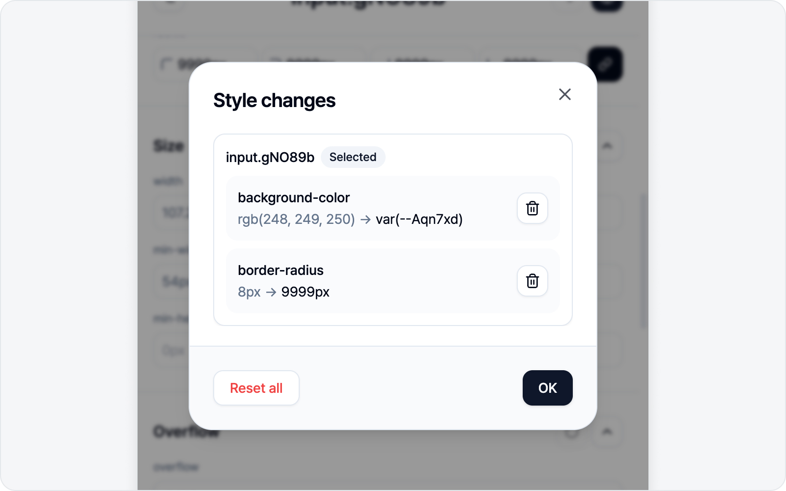
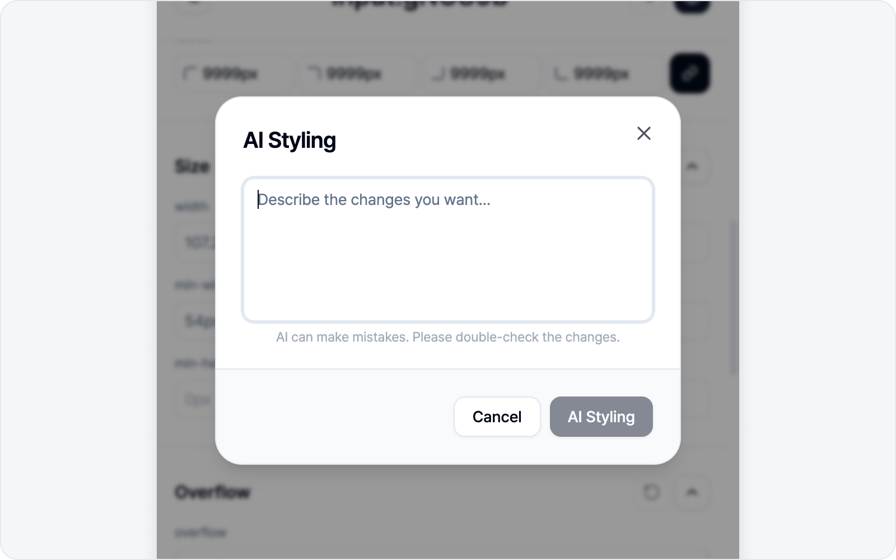

# Styling

Once an element is selected, the style panel opens. Change a value and it's **applied to the page right away**, so you can fine-tune while watching the fix on the real screen.

## Style panel sections

From top to bottom, the panel is organized into these sections (labels show in English on screen).

1. **Class** — Edit the element's class list.
2. **Layout** — display, position, flex alignment, margin, padding, gap.
3. **Container** — background, opacity, border radius.
4. **Border** — border width, color, and style. Adjust each of the four sides (top/right/bottom/left) on its own, or link them to set all at once.
5. **Size** — width, height, and min/max.
6. **Overflow** — overflow, white-space, text-overflow.
7. **Text** — Edit the element's text content (shown only for elements with text).
8. **Typography** — font size, weight, line height, letter spacing, align, color.
9. **Effects** — shadow, filter, blend.
10. **Transition** — transition property, duration, easing.

## Live preview and reverting

- Changing a value applies it to the page **immediately**.
- Each section can revert just its inline changes, and there are buttons to revert Class or Text to the original — so feel free to experiment.

## Review changes

Lost track of what you've changed? Hit the **Review changes** button at the bottom of the panel. The number beside it is how many changes you've made so far — and if you haven't changed anything, the button stays disabled.

Open it and a dialog lists your edits **grouped per element**, each shown as **before → after**. You'll see the element you have selected now, plus any you buffered earlier (see [More than one element in one issue](#more-than-one-element-in-one-issue) below).

- **Reset this change** (trash icon, right of each row) — rolls back just that one item to its original value. The page and style panel update right away. Reset the last item on an element and that element's card disappears entirely.
- **Reset all** (bottom left) — rolls back every change across all elements (this one asks for a quick confirmation).

Row resets run instantly without asking, so tidy up with peace of mind. Once nothing is left to revert, the dialog closes on its own.

## AI Styling

With an AI (LLM) connected, an **AI Styling** banner appears in the panel. When touching values by hand feels like a chore, just **describe what you want**.

- "Make the button rounder"
- "Add more spacing"
- "Bigger, bolder text"

AI finds the right style/class changes and applies them to the page instantly. Without an AI connected, this banner doesn't appear.

> See [AI LLM Connection](../settings/ai.md) for how to connect. AI slips up now and then, so give the applied result a quick look.

## More than one element in one issue

Bugs rarely sit in just one spot. Sometimes you want to bundle several elements — "the button color + the label alignment next to it + the card padding" — into a single issue.

Fixed element A? Click **Pick another element** (top right) and grab the next one (B). A's changes **stay on the page** instead of disappearing, and they ride along into the issue too. Keep going for A, B, C… as many as you like — before/after is recorded per element.

> Buffered elements show up in **Review changes**, grouped per element, where you can pull out individual items (remove every item on an element and the whole element drops out). To clear everything at once, hit **Reset all**, or just cancel the draft or finish submitting.

## Next step

When you're done editing, click **Next** to move to the issue draft. The before and after are captured as a comparison.

> **Next** is enabled once at least one style has changed (if you've already buffered an element, you can move on without changing the current one). To include an element as-is (without style changes), use [Capture element](../screenshot/capture.md) instead.

---

🌐 [한국어](https://bugshot.gitbook.io/ko/element/styling)
