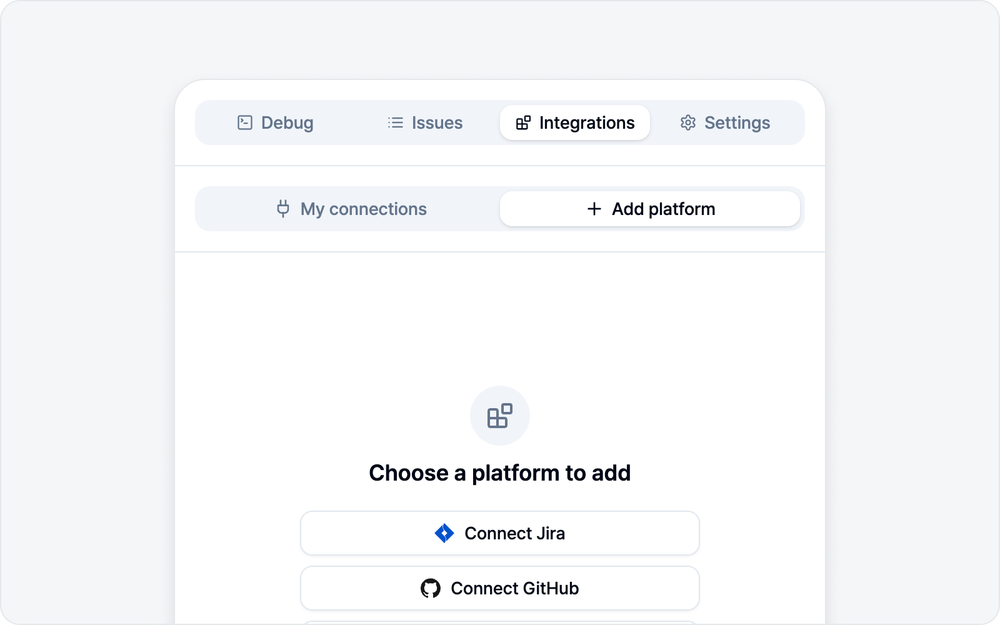

# Integrations

A report you worked on only truly shines once it reaches the issue tracker your team uses. In the **Integrations** tab, connect whichever platform you're on — Jira, GitHub, Linear, Notion, GitLab, Asana, or ClickUp — and you can file captured bugs straight into it as issues. Want to give your team a quick heads-up before filing a formal issue? You can send to **Slack** too.

With no platform connected yet, the side panel takes you to this **Integrations** tab automatically. No pressure — just start by connecting one.

## Jump to

- [Connecting Platforms](platforms.md) — How to connect all eight platforms and what each needs.
- [Issue Tracking](issue-tracking.md) — Browse and manage your drafts and submitted issues.
