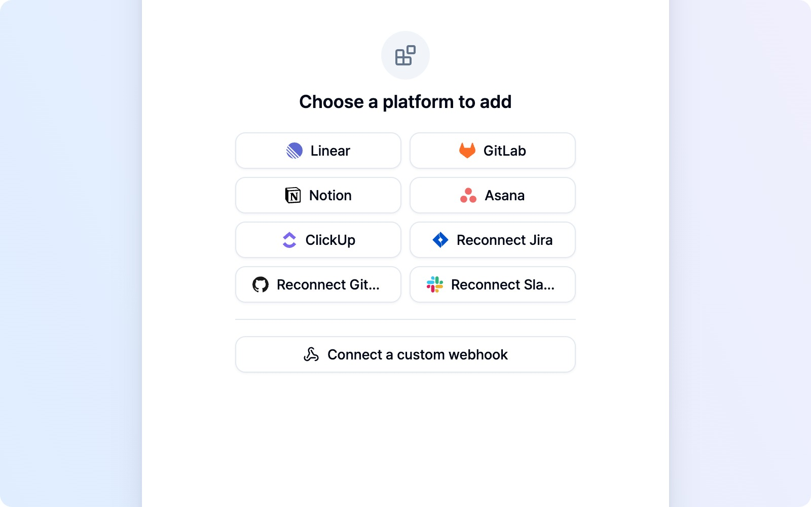
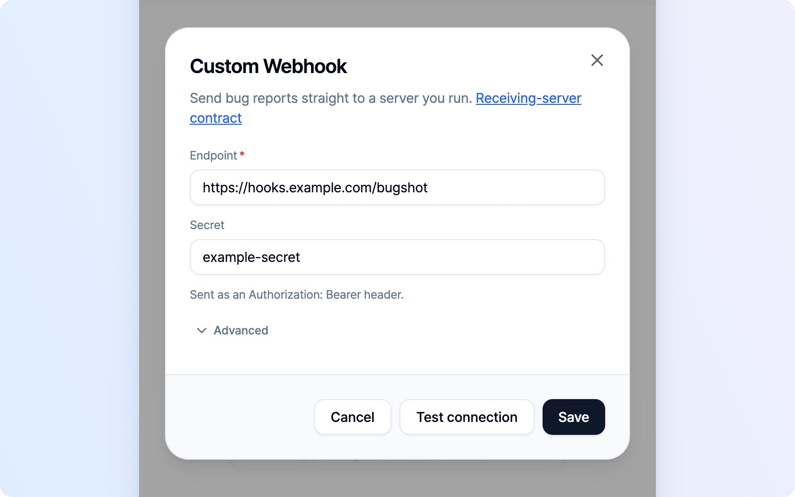
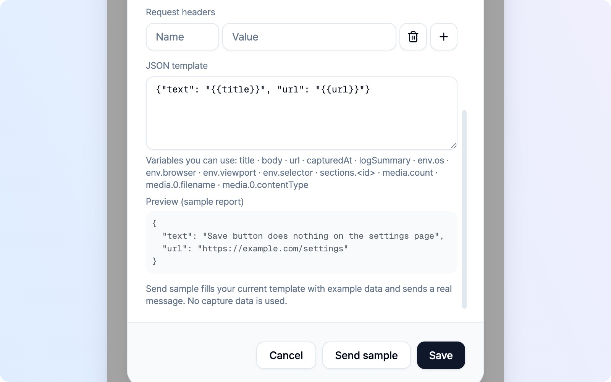

# Custom Webhook

Does your team use a tool outside the supported platform list, or want reports delivered straight to an internal system? **Custom Webhook** sends bug reports to a server you run. Captures and the report body go directly from your browser to the address you choose, without passing through a BugShot server.

Start with **a receiving server and its endpoint address**. If someone on your team manages the server, ask them for the address and secret. For developers building the receiver, the [receiving-server contract](https://github.com/SinhyeokKang/bugshot-2/blob/main/docs/webhook-contract.md) is available in English and includes the request and response formats and a runnable example server.

> Reports can contain sensitive screenshots and logs. Use a server you trust. The server operator is responsible for how received data is stored and used.

## Connect and test

1. Open **Integrations → Add platform**, then click **Connect a custom webhook** below the platform list.
2. Enter your receiving address in **Endpoint**.
3. If your server requires a secret, enter it in **Secret**. This field is optional. Its value is sent in an `Authorization: Bearer` header, not as a signature.
4. Keep the default **Multipart** format and click **Test connection** to check that the server responds. This sends a small probe instead of a report; your server developer should handle it as described in the contract.
5. Click **Save**. Testing the connection does not save your settings.

Use an `https` address. Private destinations such as an internal network or `localhost` may use `http`, with a warning that the request is not encrypted. BugShot does not follow redirects, so enter the **final receiving address**.

Once saved, choose **Custom Webhook** when submitting an issue. There is no project or channel to pick: reports go to the address you configured. Each teammate sets up the connection in their own browser.

## Advanced settings and delivery formats

You can leave **Advanced** closed for the default setup. Open it when your receiver needs a different format or extra headers. If you have saved advanced values, this section opens expanded the next time you edit the connection.

| Format | What is sent | After submission |
|---|---|---|
| **Multipart** (default) | The body, captured images, video, log files, and attachments in one request | An issue-list entry links to the address returned by your server |
| **JSON template** | A JSON body shaped for the receiver. **No media is sent** | **No issue-list entry is created** |

Add **Request headers** as name/value pairs if your server needs them. Headers the browser cannot send and duplicate names are flagged when saving. An explicit `Authorization` header takes precedence over the **Secret** field.

Use **JSON template** for hooks that expect a particular format, such as Slack or Discord. Insert variables such as `{{title}}` and `{{body}}`, then check the available variables and **Preview (sample report)** below the field. Invalid JSON and unsupported variable names are flagged when saving. The receiver contract lists the variables and full delivery requirements.

With JSON template selected, **Send sample** replaces **Test connection**. It fills your current template with example data, without using your current capture. **It can create a real message at the destination**, so check the preview before sending. Click **Save** to keep your settings.

> A timeout does not mean nothing arrived. Check the receiver before sending the report or sample again.

## Edit settings and check results

To change the address, secret, or template, open **Integrations → Add platform → Edit your custom webhook**. Your saved values are filled in, so just change what you need and click **Save**.

Reports submitted with Multipart appear in the issue list as **Submitted**. Click the card to open the address returned by your server. Server-side progress is not synced back to BugShot; check that address for updates. JSON template submissions leave no issue-list entry, so check the destination for the result.

If a connection or submission fails, follow the message to check the address and secret. Even if the server responds, a Multipart response missing the required fields is treated as a failed submission, and your original report is retained. Ask your server developer to check the response requirements in the contract.
