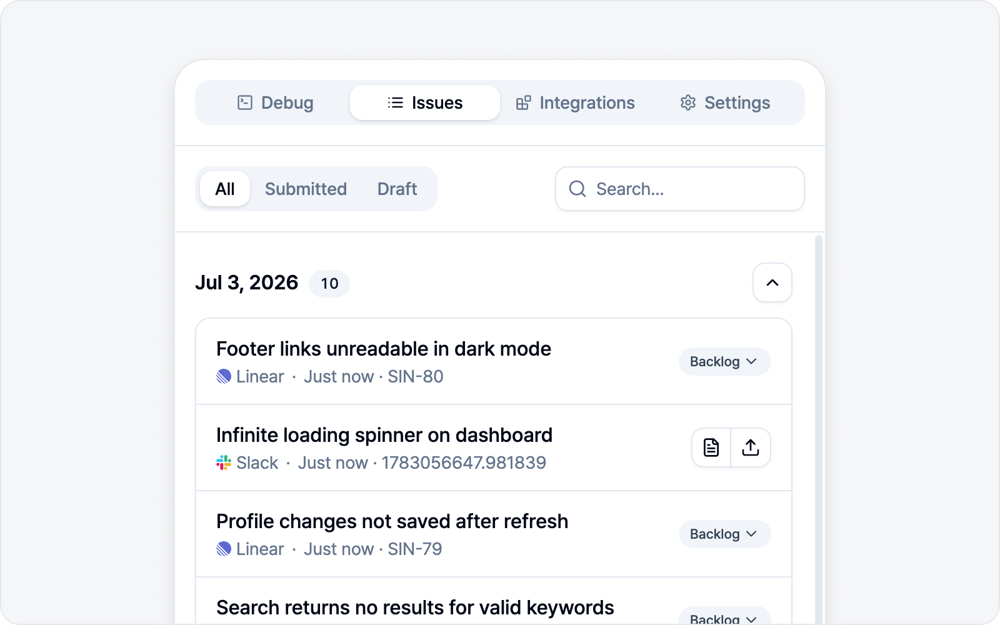
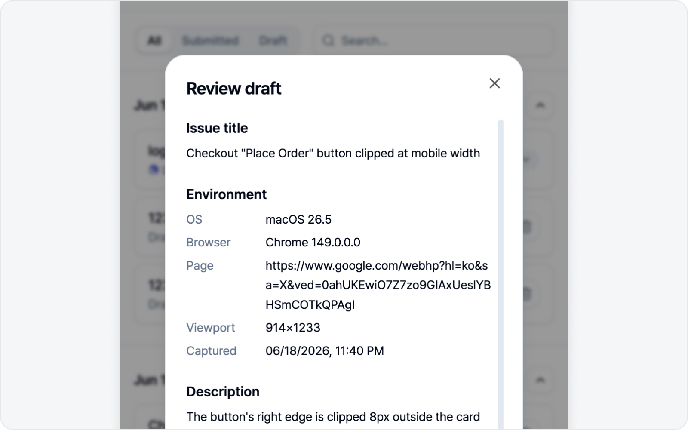

# Issue Tracking

Never lose track of where your drafts and submitted issues went. The **Issues** tab gathers them all in one place.

## Find and filter

Even when the list grows, you'll find things fast.

* **Filter** — All / Submitted / Draft.
* **Search** — Find by title.
* **Date groups** — Items are grouped by the date they were written or submitted.

## Open a row

Click an issue row to open its detail.

* **Draft** — Editable. Keep writing, or tweak it and submit.
* **Submitted** — Read-only. Review what was filed and the link on the platform.

## Refresh

Re-fetches the current status of a submitted issue from the platform (open, closed, etc.). Just keep in mind it only works while that platform is **connected**.

## Delete all

Clears every issue in the list at once. Only the drafts and records stored locally are deleted — issues already filed on the platform stay put, so no need to worry.
