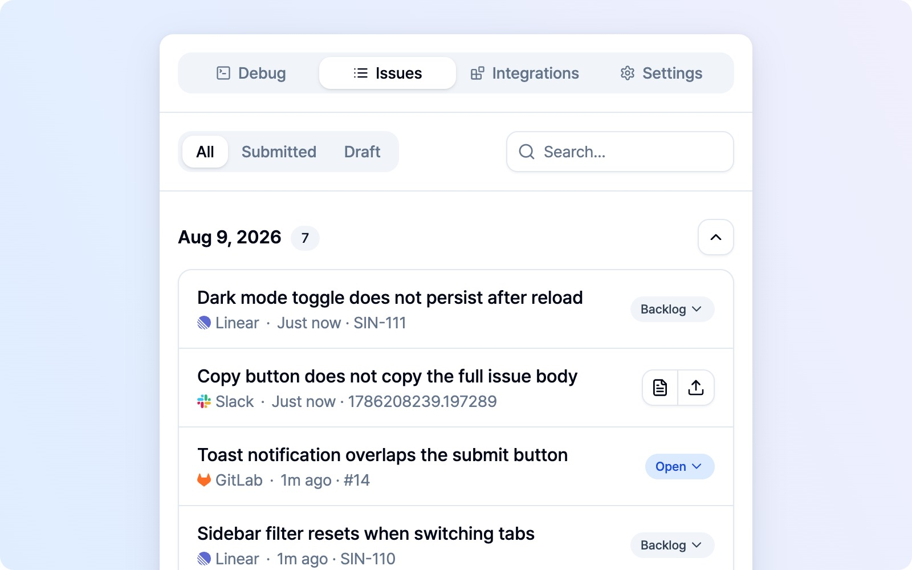
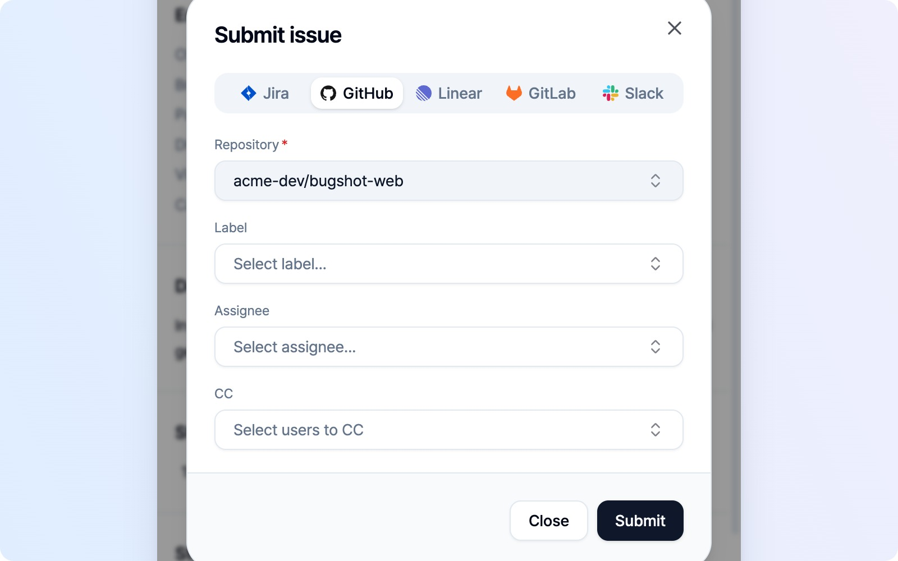

# Issue Tracking

Never lose track of where your drafts and submitted issues went. The **Issues** tab gathers them all in one place.

## Find and filter

Even when the list grows, you'll find things fast.

- **Filter** — All / Submitted / Draft.
- **Search** — Find by title.
- **Date groups** — Items are grouped by the date they were written or submitted.

## Open a row

What opens depends on the row’s state.

- **Draft** — Editable. Keep writing, or tweak it and submit.
- **Submitted** — Opens the issue on its platform. A row with a recovery notice opens read-only recovery details instead.
- **Preserved Slack issue** — When a tracker is connected, use **View details** to review or edit the saved draft, then **Promote to tracker**. Resolve any recovery notice first.

## When attachments or registration need checking

An issue can be registered while a file or its body link is still missing. Open a row marked **Attachments need attention** to check each file and its saved copy. A registered issue stays in **Submitted**. Local recovery details remain available even after you disconnect the platform.

Use **Download** to save the files you need and attach them to the existing issue yourself. Files keep the format prepared for submission, such as a ZIP for Notion logs or a JPEG for Asana images. Downloading does not mark remote delivery as complete. **Local file unavailable** means the saved file has expired or is no longer in your browser.

## Retrying attachments

A missing file does not mean starting over with a new issue. Press the circular-arrow button (**Retry attachments**) at the right of a row marked **Attachments need attention**, or the **Retry attachments** button at the bottom of its recovery details. BugShot finds the issue that is already registered, uploads only what is still missing, and fills in body links when needed. **It never creates a new issue**, so nothing gets duplicated.

- **Finished work is not repeated.** A file that uploaded but lacks its body link is not uploaded again; only the body is fixed. If only some files succeed, the next attempt handles just the rest.
- **Other people's edits stay.** If someone added a sentence or changed the status or assignee meanwhile, BugShot leaves that alone and fills only the places meant for attachments.
- **An edited or deleted attachment place is never overwritten.** The file row shows **The issue body was edited, so the link was not added**, and files that already uploaded are not sent again. Open the issue to check it yourself.
- **One run at a time.** While it runs, the button shows a spinner (and **Retrying attachments** in the recovery details), and extra clicks start nothing. If another side panel is already working on the same issue, your press is quietly skipped. **Delete local copies** is locked during a retry.
- **You get the result right away.** When everything finishes, you see **Attachments done: N** and the notice disappears. If some fail again, you see **N failed again** and the remaining files update. An upload or link that could end up duplicated is shown as **Result needs checking** when its outcome is unknown, and is not resent automatically (platform exceptions are in [Platforms](platforms.md)).

> A retry reads the issue body and then updates it right away, so if someone edits the same body at almost the same moment, their change can be overwritten. It is rare, but on an issue many people are editing, open it once after the retry.

### When it cannot retry

If the button is hidden or stops after you press it, the recovery details explain why and what to do instead. **Download** always keeps working.

| Situation | What you see | What you can do |
|---|---|---|
| A different account is connected (you find out when you press) | A notice that it is not the account that submitted, so it cannot retry automatically | Reconnect that account in the Integrations tab, or download and attach yourself |
| The account could not be verified when the issue was submitted | The button is hidden from the start, with an "Automatic retry is unavailable" notice | Download the files and attach them yourself |
| Connection lost or sign-in expired | Reconnect guidance | Reconnect in the Integrations tab (see [Platforms](platforms.md) for what resets) |
| No permission to edit (403) | Permission guidance | Use **Open issue** to check, or attach yourself |
| Issue not found (404, deleted, etc.) | A new one is not created | Download the files and attach them where needed. **Open issue** is hidden because the link leads nowhere |
| Result needs checking | The files may already be there, so they are not resent | Use **Open issue** to check; download if they are missing |
| Record left by an earlier version | Automatic retry not supported | Download and attach yourself |
| Custom Webhook | There is no retry button | Download the files to use them |
| **Local file unavailable** (only one file is missing) | Only that file cannot be retried | The other files can still be retried |
| **Local file unavailable** (expired, or local copies were deleted) | The button is hidden | Nothing is left to retry, so open the issue and check it yourself |

If **Result needs checking** appears and the button is still there, BugShot may have been unable to confirm the account or issue for a moment. It just checks again, so feel free to press once more. If the same notice came from an unexpected error during a run, though, some writes may already have gone through, so open the issue and check first.

If you see **Registration could not be confirmed**, check the destination first. Resubmission is blocked to avoid creating a duplicate. Choose **Confirm not registered** only after checking that the issue does not exist, then confirm in the dialog. Closing the dialog leaves everything unchanged.

## Refresh

Re-fetches the current status of a submitted issue from the platform (open, closed, etc.). Just keep in mind it only works while that platform is **connected**.

## Delete all

Clears every issue in the list at once. Local drafts, records, and their associated recovery data are cleaned up — issues already filed on the platform stay put, so no need to worry.

If attachment delivery or a later submission step is incomplete, or issue creation cannot be confirmed, the files needed for recovery stay in your browser. They expire 30 days after the submission attempt and are cleaned up when you next open the side panel after expiry. Deleting the issue record also removes its recovery record. A file shared with another draft may remain for that draft.

Confirm **Delete local copies** in recovery details to remove the saved recovery files now. For a confirmed registered issue, this also clears the recovery notice; the remote issue and attachments stay unchanged. If registration is unknown, deleting files does not unblock resubmission. Originals saved for Slack promotion or shared with another draft may remain.
