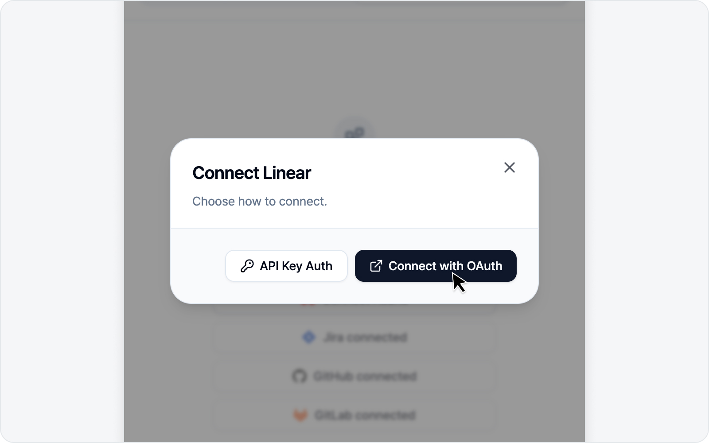
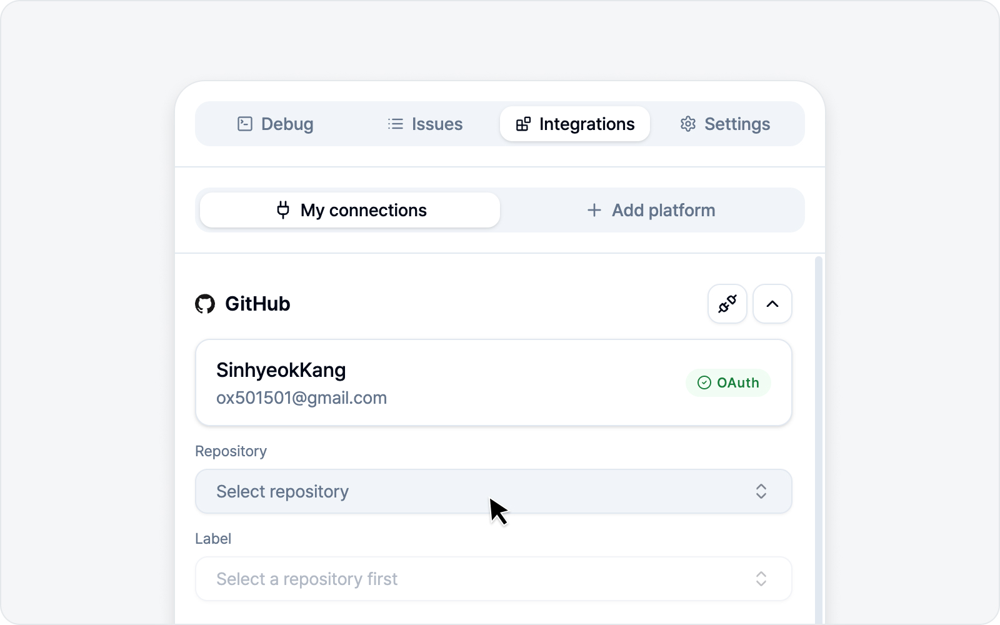

# Connecting Platforms

Connect platforms in the **Integrations** tab. With nothing connected you land on "Add platform"; once one is connected you land on "My integrations".

## How to connect

It's simpler than it sounds — three steps and you're done.

1. In "Add platform", pick the platform you want to connect.
2. When the connect-method dialog appears, choose **OAuth** (browser login) or **enter a token** directly.
3. With OAuth, just approve access in the login window. With a token, paste the token you generated along with any required fields.

OAuth is usually the easiest. That said, if your org policy blocks OAuth or you'd rather use a token, the token method works just as well.

## What each platform needs

| Platform | Connect method | Fields when using a token | Generate a token |
|---|---|---|---|
| Jira | OAuth / API Token | baseUrl, email, apiToken | id.atlassian.com → API tokens |
| GitHub | OAuth / PAT | PAT | github.com/settings/tokens |
| Linear | OAuth / API Key | apiKey | linear.app security settings |
| Notion | OAuth / Internal Token | token | notion.so integration |
| GitLab | OAuth / PAT | instanceUrl (self-managed only), pat | gitlab.com PAT |
| Asana | OAuth / PAT | pat | app.asana.com my-apps |

> When connecting a GitLab self-managed instance or a custom LLM, BugShot may ask for extra access to that domain. Don't be alarmed — approve it and the connection wraps up.

## Defaults after connecting

Once connected, you can pick a default location for new issues — a project for Jira/GitLab, a repository for GitHub, a team for Linear, a database for Notion, a project for Asana. Set it once and you won't have to choose it every time you write an issue, which saves a lot of clicks.

## Disconnecting

In "My integrations" you can disconnect each platform (the unplug icon), or disconnect everything at once. Don't worry — disconnecting has no effect on issues you've already submitted.

---

🌐 [한국어](https://bugshot.gitbook.io/ko/integrations/platforms)
