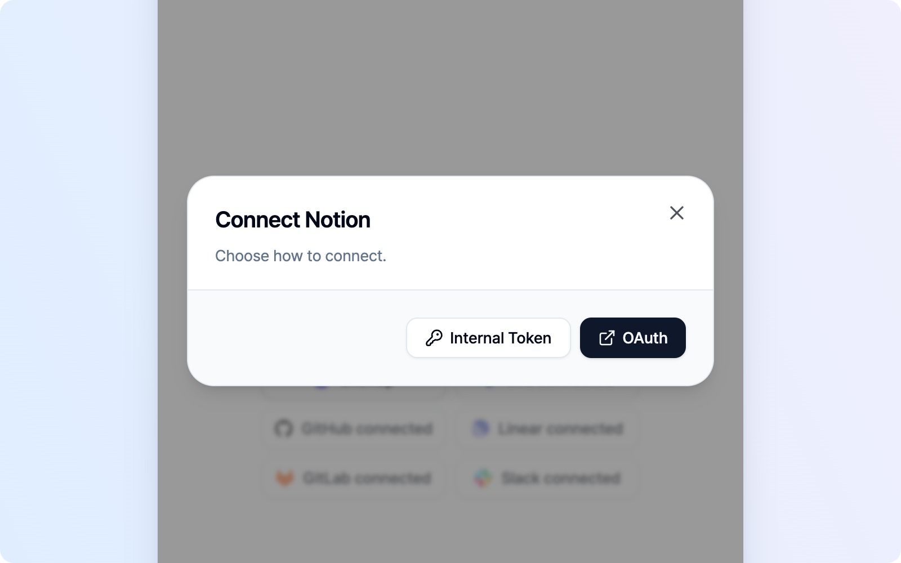
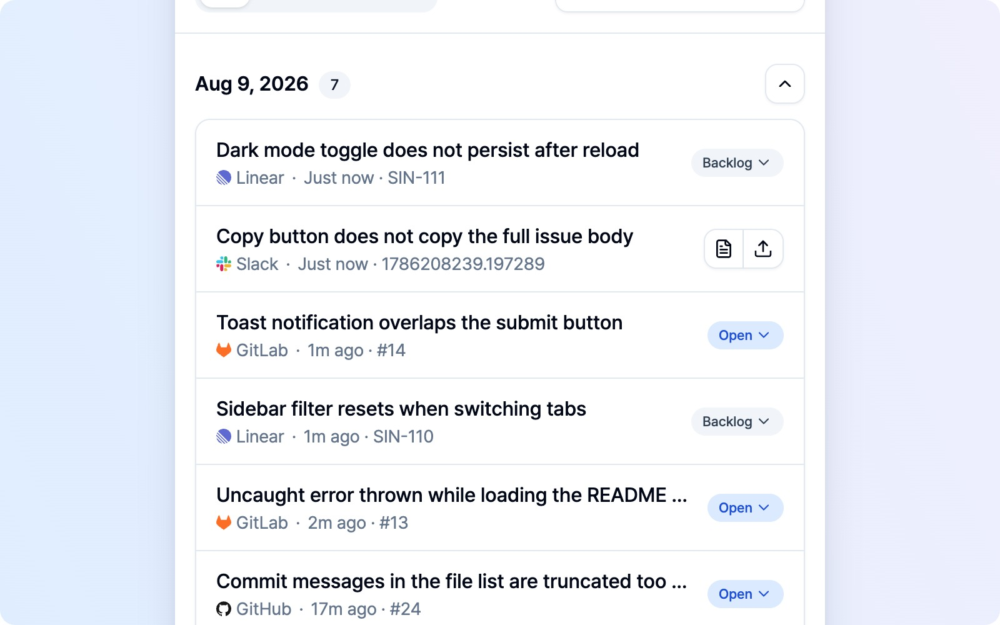
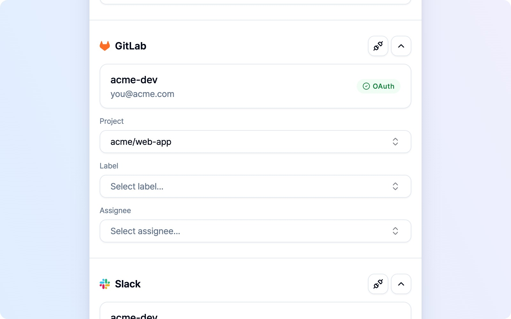

# Connecting Platforms

Connect platforms in the **Integrations** tab. With nothing connected you land on "Add platform"; once one is connected you land on "My integrations".

## How to connect

It's simpler than it sounds — three steps and you're done.

1. In "Add platform", pick the platform you want to connect.
2. When the connect-method dialog appears, choose **OAuth** (browser login) or **enter a token** directly.
3. With OAuth, just approve access in the login window. With a token, paste the token you generated along with any required fields.

OAuth is usually the easiest. That said, if your org policy blocks OAuth or you'd rather use a token, the token method works just as well. Note that **Slack supports OAuth only**, so hitting "Connect Slack" takes you straight to the login window.

Below those eight sits **Custom Webhook**, on its own line under a divider. It isn't a service BugShot set up for you — it's a way to **send reports to a server you built yourself**, which is why it doesn't sit in the brand grid. [Custom Webhook](#custom-webhook--send-to-a-server-you-built) below covers it.

## What each platform needs

| Platform | Connect method | Fields when using a token | Generate a token |
|---|---|---|---|
| Jira | OAuth / API Token | baseUrl, email, apiToken | id.atlassian.com → API tokens |
| GitHub | OAuth / PAT | PAT | github.com/settings/tokens |
| Linear | OAuth / API Key | apiKey | linear.app security settings |
| Notion | OAuth / Internal Token | token | notion.so integration |
| GitLab | OAuth / PAT | instanceUrl (self-managed only — **https addresses only**; localhost is exempt), pat | gitlab.com PAT |
| Asana | OAuth / PAT | pat | app.asana.com my-apps |
| ClickUp | OAuth / API Token | pat | app.clickup.com Settings > Apps |
| Slack | OAuth only | — (no token entry) | — |
| Custom Webhook | Enter the address yourself | The receiving address (**https only** — an internal network or localhost may use http), secret (optional) | — (a server you built) |

## Slack — a quick share to a channel or DM

Slack is a messaging app rather than an issue tracker, so it works a little differently from the others. It's perfect for when you want to drop a quick "hey, this is broken" into a team channel before filing a formal issue.

- **Posts as you**: connect via OAuth and messages go out **under your own name** (not a bot). That means there's no bot to invite into channels.
- **Where it goes**: pick any public channel, private channel, or DM you're a member of. (Channels you haven't joined won't show up in the list.)
- **Title in the channel, details in a thread**: the title posts as a message in the channel, while the details — environment info, style changes, log summary — plus screenshots, video, and log files land as **thread replies** under it. Your channel timeline stays clean with just the one-line title.
- **Mentions**: pick members to mention and they'll be pinged by `@name` in the message.

> Slack messages don't have an "open/closed" state, so the issue list just shows "Submitted"; click it to jump straight to the message.

### Promote to a real tracker later

Shared something to Slack and then realized it deserves a proper issue too? No worries. Issues you share to Slack keep their **original data — capture images, video, and logs — intact**. So the moment you connect a tracker like Jira or GitHub, two buttons appear on the right of that Slack card in the issue list: **View details** and **Promote to tracker**.

- **View details**: reopen the saved capture and logs to take another look. From here you can also hit the pencil-shaped **Edit** button next to the title or any body section to **polish the wording before moving it to a tracker** — handy when you shared a quick note on Slack but want the formal issue to read cleanly. Just note that these edits **won't change the message you already sent to Slack**; they only apply when you promote it to a tracker.
- **Promote to tracker**: opens the submit dialog (with Slack left out). Pick a tracker, file it as a formal issue, and the card turns into a regular issue while the Slack history is cleared. BugShot also drops a **comment linking to the new tracker issue right in the original Slack thread**, so teammates following that conversation can see exactly where it landed.

> If you haven't connected a tracker yet, the two buttons stay hidden and you'll just see the "Submitted" badge and a shortcut to the message, as before. Connect a tracker later and the buttons quietly show up on the same card. Clicking the card body always jumps to the Slack message — that never changes, so don't worry.

## Custom Webhook — send to a server you built

Maybe your team's tool isn't one of the eight above, or you'd rather drop reports straight into an internal system. **Custom Webhook** sends the report **as-is to a server you run yourself**. You'll find it at the bottom of the "Add platform" screen, under a divider.

One thing to know up front: this is a feature **you have to bring a server for**. There's nowhere BugShot receives these on your behalf — the report goes straight to the address you type in. The [receiving-server contract](https://github.com/SinhyeokKang/bugshot-2/blob/main/docs/webhook-contract.md) lays out the format and includes a reference server you can run as-is.

The connect dialog is deliberately small — two fields.

- **Endpoint**: where the report goes. For safety only `https` is accepted — except for **non-public addresses** like an internal network or `localhost`, where `http` is allowed and a heads-up about sending in the clear appears under the field.
- **Secret** (optional): fill it in and every request carries it as an `Authorization: Bearer <secret>` header. Your server just checks that the value matches to know the request really came from your BugShot.

Need more than that? Open **Advanced**. It stays folded by default, and reopens already expanded if you've set something in there before.

- **Format**: **Multipart** (the default) sends your captured images, video, and log files along in one request, then uses the address your server returns to add a row to the issue list. **JSON template** is for places with a fixed shape of their own, like Slack or Discord — with it **no media goes along and no row lands in the issue list** (BugShot doesn't read the response). Whichever you pick, a line right under the field keeps telling you what it does.
- **Request headers**: if your server expects extra headers, add them as name/value pairs. Names the browser can't send (`Cookie`, `Host`, and friends) or the same name twice are flagged when you save — better than typing one in and having it silently never go out.
- **JSON template**: appears once you pick the JSON format. Drop values in with double braces like `{{title}}` and `{{body}}`; every name you can use is listed under the field, and anything outside that list is refused at save time. The **preview** just below fills your template with a sample report so you can see the shape before anything is sent.

With Multipart, **Test connection** sends a small check instead of a report; your server can acknowledge it without storing anything, as described in the contract. With JSON template, the button becomes **Send sample** and fills your current template with example data. It uses no capture data, but **it can create a real message at the destination**. A timeout does not mean nothing arrived, so check before sending again.

To change the address or the template later, come back to the same spot — once connected, the button reads **Edit your custom webhook** and opens the form with everything you saved already filled in.

> What the receiving server does with the data is **yours to decide and yours to answer for**. Reports can carry sensitive things — screenshots, logs — so take a moment to be sure that address is somewhere you trust before entering it along with a secret. Also note BugShot **won't follow a redirect** to another address: that keeps your secret from leaking to a server you didn't pick, so point the endpoint at the final address directly.

## Defaults after connecting

Once connected, you can pick a default **location** for new issues (Custom Webhook has nothing to pick — its destination is the single address you entered) — a project for Jira/GitLab, a repository for GitHub, a team for Linear, a database for Notion, a project for Asana, a list for ClickUp (picked as Workspace → Space → List), a channel for Slack. Set it once and you won't have to choose it every time you write an issue, which saves a lot of clicks.

You can also pre-fill the **values that go into the issue**. Pick a default **Assignee** for Jira, GitHub, GitLab, Linear, Asana, or ClickUp (Notion and Slack have no assignee), and while you're there, a default **Label** (GitHub, GitLab, Linear) or **Default issue type** (Jira). Whatever you set shows up already filled in when you write an issue — though **whoever you picked on your last submission wins**. Assign to the same person every time and it just keeps going; assign to someone else once, and that person carries over next time.

> **A GitHub repository doesn't have to be yours.** Type a name, write it out as `facebook/react`, or paste the repository's address straight in — a trailing `/issues` or the like won't throw it off. Handy for reporting to an open-source project. Repositories that **don't take issues** are another matter: they show up with an `Issues off` or `Archived` badge and can't be picked, which beats having your issue turned away at submission time.

> To load assignee candidates, pick the location first (a repository for GitHub, a project for GitLab, a team for Linear, a workspace for Asana and ClickUp). Until you do, the assignee field waits, disabled, and tells you what to pick first. Jira is the exception — you can search for an assignee before choosing a project.

One thing worth knowing: **changing the location clears** the assignee and label defaults under it. A different repository or project probably means a different set of members, and we'd rather clear the field than quietly assign someone who doesn't belong there. Just pick again in the new location.

> **For Jira, you can also switch the project at submission time.** What you pick here is your usual destination; while writing an issue you can move it to a different project from the **Project** field at the top of the submit dialog. Your connection settings stay put, so the default project you set here doesn't change. Switching projects clears the issue type, assignee, parent epic, and linked issues (they may not exist over there) — priority and CC have nothing to do with the project, so they stay. Right after the switch the issue type list opens on its own so you can pick one straight away, and the submit button stays locked until you do. And the "whoever you picked on your last submission wins" rule above applies **to the project too**, so the next issue you write opens on the project you just filed to.

> **If your project runs sprints, you can pick one at submission time too.** A **Sprint** field appears right below **Issue type** in the submit dialog, listing the sprints that are active or coming up. It's optional — leave it empty and the issue still files fine. The field only shows up after BugShot asks Jira "does this project and issue type have a sprint field?" and hears yes, so it simply won't appear on a Kanban-only project or one with no board attached yet. If the project has several boards, each sprint shows which board it belongs to underneath its name. The "whoever you picked on your last submission wins" rule carries over here as well, so the same sprint is pre-filled next time — and if that sprint has closed in the meantime, the field clears itself.
>
> If you connected Jira **through OAuth (the browser sign-in)**, the sprint list may come up empty. Reading sprints needs one more Jira permission, and an account you connected earlier only carries the permissions it was granted at the time. Reconnect Jira once — see **Reconnecting** below — and the list will fill in. This doesn't apply if you connected with an API token.

## Reconnecting

When a connection drops or a platform needs fresh permissions, just **press that platform again under "Add platform"**. Anything already connected reads **Reconnect {platform}** instead. You don't have to disconnect first.

If an expiry notice pops up, it's even quicker: press **Reconnect** in that notice and BugShot takes you to the integrations tab with the platform's connect dialog already open. Not a good moment? **Close** puts it away.

Reconnecting resets that platform's **defaults** (location, assignee, label, and so on), so give them another pass afterwards. If you reconnect as the same account, the values you picked on your last submission stay — they're only cleared when you connect as **a different account**. The dialog spells this out before you go ahead.

## Disconnecting

In "My integrations" you can disconnect each platform (the unplug icon), or disconnect everything at once. Don't worry — disconnecting has no effect on issues you've already submitted.
