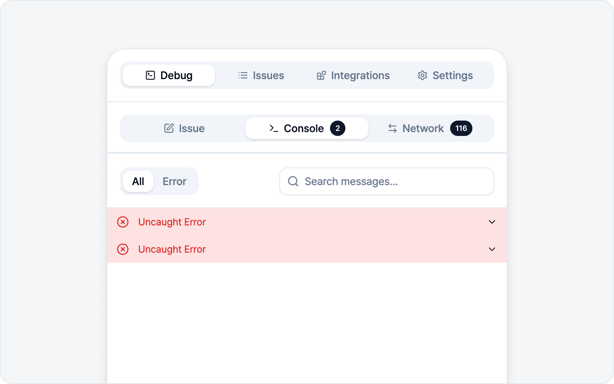

# Logs

A bug report with logs attached gets to the root cause much faster. BugShot collects three kinds of them for you, automatically.

- **Console logs** — Output and errors the page printed.
- **Network logs** — Requests and responses that went out (WebSocket messages included).
- **Action logs** — What you actually did: clicks, typing, navigation. The "what I did" half of "I did this, and then this happened."

All three attach by default to **every capture mode except element style editing** (screenshot, write-issue, and recording), and they keep collecting the whole time the side panel is open — so whatever happened before you started capturing is already in there.

You'll meet these logs in two places.

- **Live logs** — Open and read the logs right inside the side panel. You can even file an issue from logs alone, without capturing anything.
- **Log viewer** — The screen for opening a log report (`logs.html`) attached to an issue. It lines up the video and the logs by time — mainly a tool for the developer who receives and works the bug.

## Jump to

- [Live Logs](live.md) — Read console/network in the panel + file a logs-only issue.
- [Log Viewer](viewer.md) — Opening an attached report, from the developer's side.
