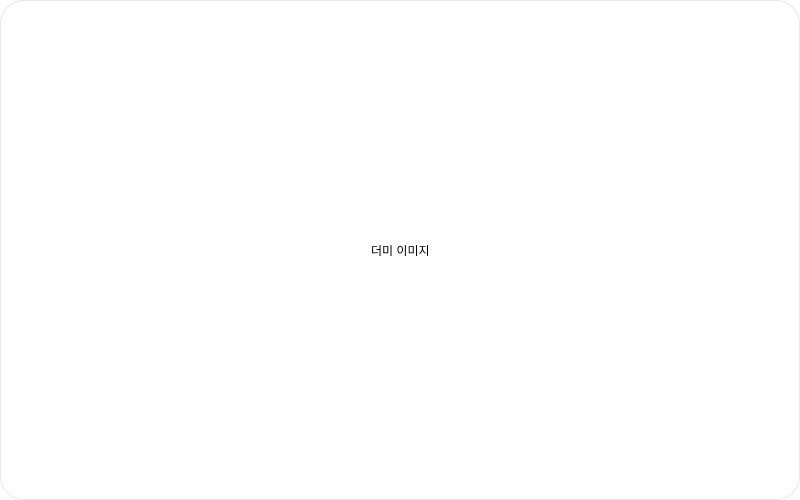

# Log Viewer

This page is from the angle of the **developer who receives and works the bug**. Issues filed with BugShot may carry a log report file (`logs.html`). Open it and you can view the video and the logs lined up by time on one screen. If the issue was filed in screenshot mode, the captured screenshot shows on the left instead of a video — it's static, with no playback or timeline, so you can glance at "what the screen looked like" while reading the logs.

## How to open it

Download the `logs.html` attached to the issue and open it in a browser. It's a single HTML file, so it opens right away with nothing to install — easy.

The receiver gets the file attached to the issue, but **the person filing the bug can grab it ahead of time too.** In the issue draft or preview screen, the **Download** button on the right of the **Log attachments** section pulls down the very same `logs.html` that gets attached — handy for checking it before you submit, or for sharing just the file without filing an issue at all.

## Timeline markers

The screen has a timeline alongside the video, with logs plotted on it as markers. Whichever log tab you're on, all **three kinds show together on one timeline**, so you can see at a glance what happened at that moment.

- **Console** — Console output and errors.
- **Network** — Network requests.
- **Action** — User actions: clicks, text input, and navigation, plus keyboard shortcuts and special keys, checkbox and radio toggles, dropdown selections, and drag-and-drop. (Navigation shows up as a kind of action marker.)

### How much of what you typed gets recorded

Action logs capture **which value you entered**, not just that you entered one. "Put -1 in the quantity field and it broke" only reproduces if the value is there. So values you type into fields and pick from dropdowns are recorded **as-is (up to 500 characters)** and attached to the issue — unless they trip one of the rules below.

Sensitive values are masked automatically (`***`) in two ways.

- **By the field** — password inputs, autocomplete hints, and sensitive keywords in the field's name, label, or placeholder (password, card, cvv, ssn, token, and the like).
- **By the shape of the value** — even when the label gives nothing away, a value is masked if it looks like an email address or a run of 9 or more digits (phone, card, national ID, or bank account numbers).

Anything you write in a **rich-text editor** — mail bodies, documents, message composers — is never recorded as a value; only the fact that you typed is kept.

> That said, a value with no clue in **either its label or its shape** (a search term, ordinary text) is kept verbatim. If you're on a screen where you enter something sensitive, switch the log attachment toggle off before you submit. You can always open the log card beforehand to see exactly what was captured.

Logs from several origins (including iframes embedded in the page) all land on one timeline. In the Console, Network, and Action lists, an **origin filter** above the list lets you narrow down by origin, so you're never unsure which origin a log came from (each origin button also shows that origin's log count).

## Video and logs in sync

- Play the video and follow the logs at that point in time.
- **Click a marker and the video jumps to that moment**, switching to that marker's log tab (Console, Network, or Action) — see "what the screen looked like when this error fired" right away.
- **Clicking a log entry in the list also moves the video to that log's moment** — while skimming the logs, jump straight to the video at any point you're curious about. (Clicking just the time shown on the left of an entry does the same.)
- Logs and video share one time axis, making it easy to follow the repro from start to finish.

## The merged timeline

Right below the video sits a timeline that **merges the console, network, and action logs into one line-by-line stream in time order**. Instead of hopping between the log tabs on the right, you can read straight down what happened at each moment.

- **One event per line** — the time on the left, a kind icon, and the content sit side by side. Network requests read as a sentence, like "Posted `/api/order`", so you can tell what the request was at a glance.
- **Filter by kind** — the **All · Console · Network · Action** tabs above the list narrow it to a single kind (each tab shows its count too).
- **Search** — type a word into the search box (`Search timeline…`) and only the lines containing it remain. It scans network request URLs and response bodies too, not just console messages.
- **Click to jump the video** — click any line and the video moves to that log's moment, with the right side switching to that kind's log tab so you can follow through to the details. (Clicking just the time on the left of a line does the same.)
- **The current line highlights as it plays** — play the video and the line matching the current position highlights automatically, so "which log fired while this was on screen" is easy to spot.

> Screenshot-mode reports have no video, so this timeline doesn't appear — you get the captured screenshot on the left and the log tabs on the right instead.

## Report tab

It's not just video and logs — the **issue write-up itself** lives inside this file too. Click the **Report** tab at the top and you'll see the title, the environment, and the body sections (what happened, steps to reproduce, expected result) exactly as they were filed. Any images pasted into the body show up inline as well, so you can grasp "what the problem was" right here, without bouncing back to the original issue page.

- Want to take the content elsewhere? Hit **Copy** — the write-up is copied to your clipboard as Markdown, ready to paste into another doc or a chat.
- If the file doesn't include a report, this tab simply stays disabled, so there's nothing to worry about.
