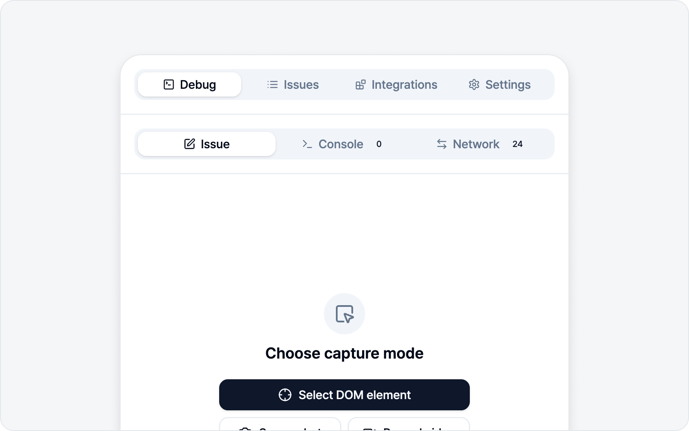
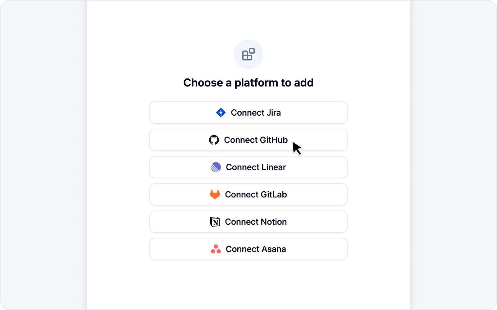
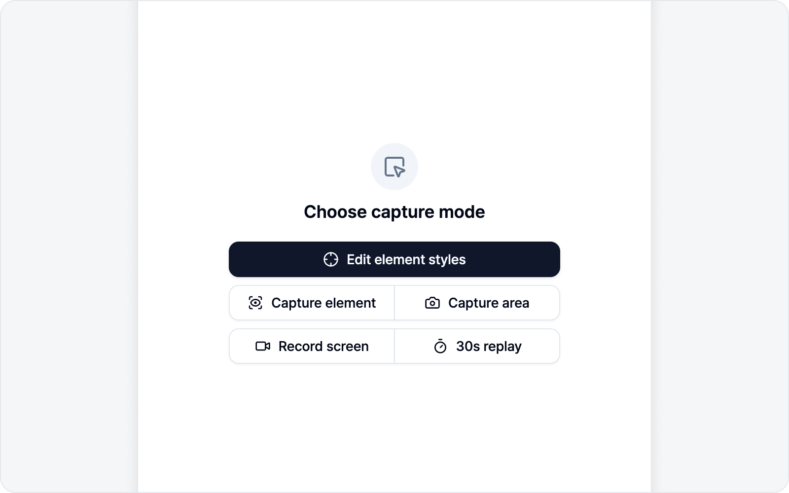
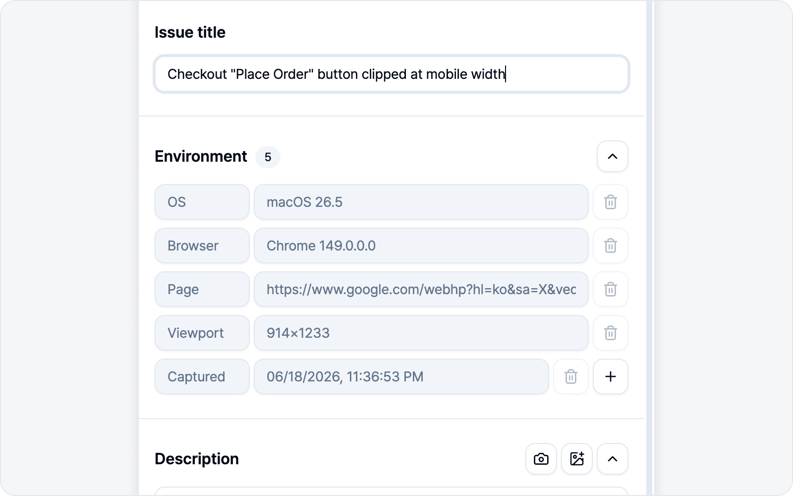
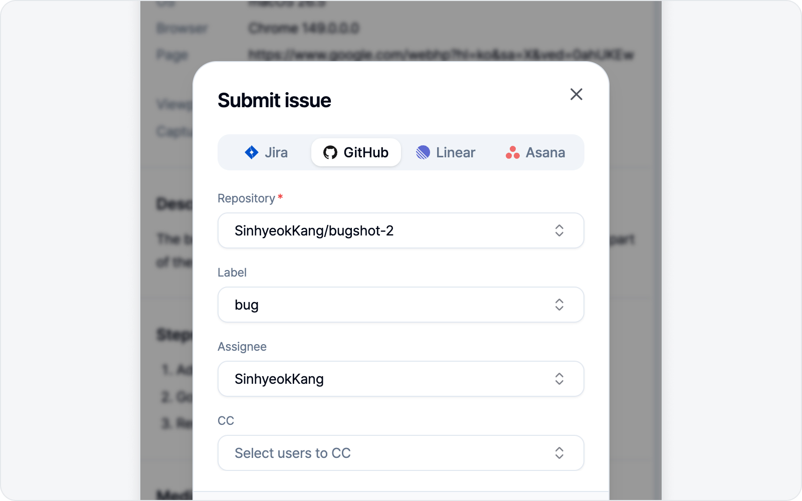

# Quick Start

New here? No worries — going from install to your first submitted issue takes about five minutes. Walk through this flow once and the rest comes naturally.

## 1. Install

Install BugShot from the [Chrome Web Store](https://chromewebstore.google.com/detail/bugshot/ohakhekagkodklkickemonmifdcbhmig). A BugShot icon shows up in your toolbar.

## 2. Open the side panel

Click the BugShot icon in the toolbar, or press `Cmd/Ctrl+Shift+E` to open the side panel.

> If the shortcut doesn't respond, it may be clashing with your OS or another extension — just open it from the toolbar icon instead.

## 3. Connect a platform

To file an issue you need at least one platform connected. In the **Integrations** tab, just connect one of Jira, GitHub, Linear, Notion, GitLab, Asana, or ClickUp. [Connecting Platforms](integrations/platforms.md) walks you through it step by step.

> Don't feel like setting this up right now? Skip it. Capturing and drafting work either way, and when it's time to submit, a banner at the bottom of the screen will bring you back here.

## 4. Capture

In the **Debug** tab, pick a capture mode.

- **Edit element style** — Pick an element, edit its styles, and report before/after.
- **Capture element** — Click an element to crop just that element as a screenshot.
- **Screenshot** — Drag a region, grab the whole visible screen, or capture the entire page including what's below the fold — then mark it up.
- **Record screen** — Record the behavior as a video.

If you're not sure which to pick, **Screenshot** is the simplest place to start.

## 5. Write the body

After capturing, you land on the issue draft. Just fill in the title and the Description, Steps to reproduce, and Expected result — the environment (OS, browser, URL, etc.) fills itself in, so don't sweat it.

## 6. Submit

Give the body a quick look in the preview, fill in the connected platform's fields (project, assignee, etc.), and hit **Submit issue**. A link to the created issue pops right up.

---

Want the details of each step? They continue in [Inspect & Style](element/README.md), [Screenshot](screenshot/README.md), and [Recording](video/README.md).
