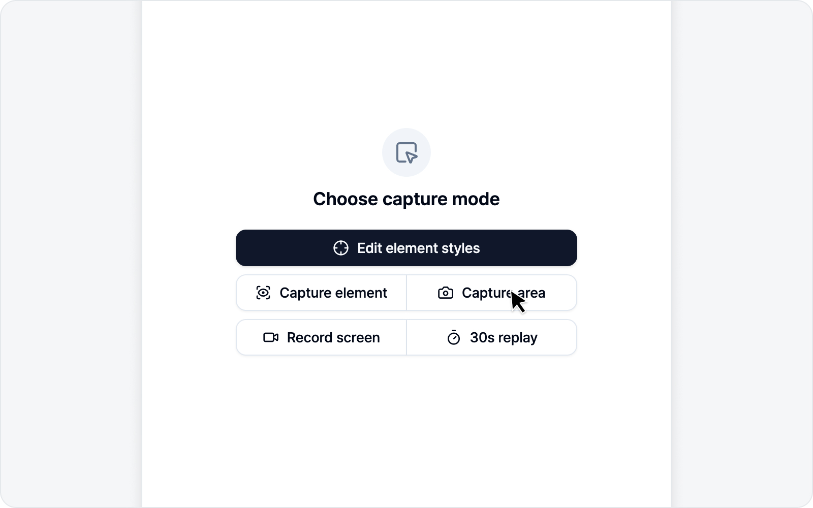

# Screenshot

Capture a region of the screen, draw on it to point out the bug, and file it as an issue. It's the fastest, most intuitive route — easy to reach for even on day one.

You can start two ways — **Capture area** to drag a region, or **Capture element** to crop a single element — and the flow is **capture → annotate → write the issue**.

## Jump to

* [Capture](capture.md) — Drag a region or pick a single element.
* [Annotation](annotation.md) — Draw on the captured image.
* [Write an Issue](issue.md) — Submit with the annotated screenshot.
