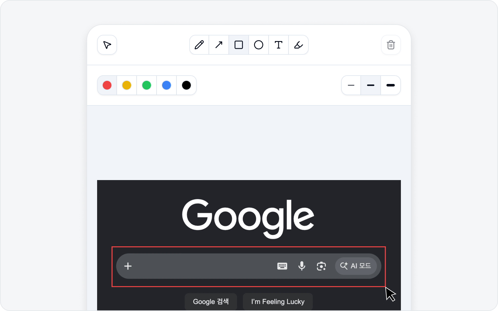

# Annotation

Draw on the captured image to mark where the bug is and what it is. Point with an arrow, box it off, jot a note — and the reader gets it at a glance. It's simpler than it sounds, so don't sweat it.

## Add, edit, remove

- **Add annotation** — Start annotating on top of the captured image.
- **Edit annotation** — Reopen what you've drawn and adjust it.
- **Remove annotation** — Clear what you've drawn.

## Tools

The annotation editor keeps every tool you need right in the toolbar. It's BugShot's own toolbar, so the labels are **fully localized** — just pick a tool and draw on the image.

- **Select** — Grab something you've already drawn to move, resize, or change its color and thickness (text uses font size instead).
- **Pen · Arrow · Rectangle · Ellipse** — Draw freehand, point, box things off, or circle them. These tools let you set the line thickness to **Thin · Medium · Thick**.
- **Text** — Drag a box where you want it, then type your note inside. Pick the font size from **Small · Medium · Large**.
- **Highlight** — Sweep a highlighter color over an area to emphasize it. Highlight thickness is adjustable too — **Thin · Medium · Thick**.

Pick a color from **Red · Yellow · Green · Blue · Black**. Made a mistake? Just hit **Undo · Redo**, and you can always **Delete** an annotation you no longer want — so draw freely.

## Zooming and moving around

A tall image — a full-page capture, say — is unreadable when it's squeezed into one screen. Use the **Zoom level** controls at the bottom of the canvas to blow it up as much as you need and land your annotations exactly where they belong.

- **Zoom in · Zoom out** — The `+` and `−` buttons step through the zoom levels. Zooming keeps **whatever is in the middle of your view** centered, so put the spot you care about in the middle first, then zoom.
- **Zoom level list** — Click the number in the middle to open the list: **Fit width** (the default, sized to the canvas width), **Whole image** (see it end to end), and 50% through 400%.
- **Fit width button** — It appears at the bottom-left of the canvas once you change the zoom. One click takes you back to where you started.

The editor opens with the **Select** tool active. When the image spills past the view, **drag an empty spot to move the canvas** — the cursor turns into a hand. Drag an annotation you've drawn and it moves instead, so the two never get confused. No mouse? Focus the canvas and use the arrow keys.

> Picking a drawing tool dims the zoom controls so they stay out of your way. Switch back to **Select** when you want to change the zoom again.

Zooming only changes **how you view the image**. The finished screenshot is always attached at its original resolution, so zoom in as much as you like.

## Done

When you're finished, click **Done** to finalize the image. The annotated screenshot is attached to the issue. Not happy with it? **Cancel** backs you out, no harm done.

> Continue with [Write an Issue](issue.md).
