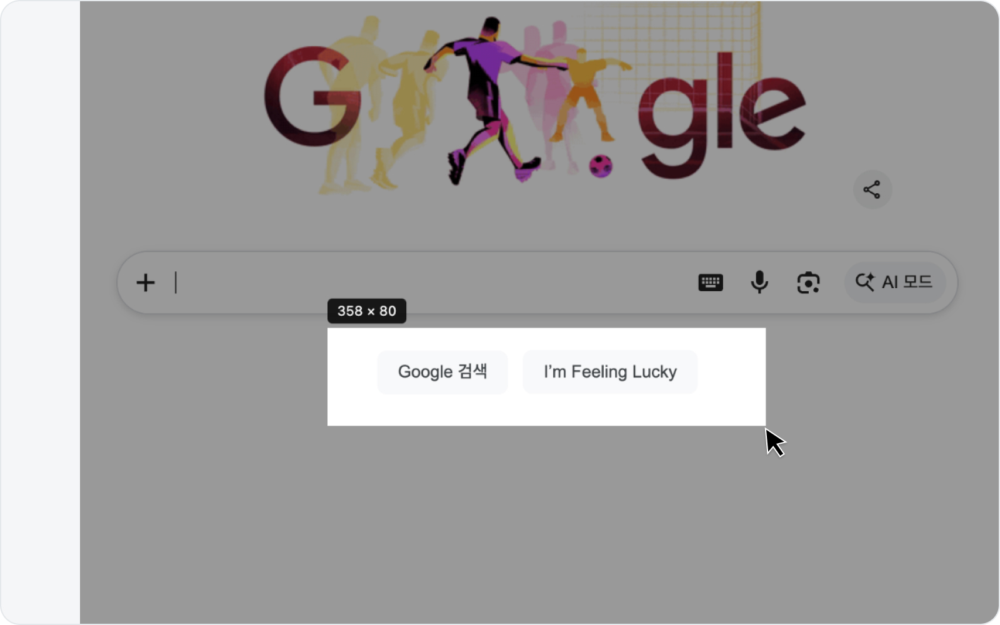
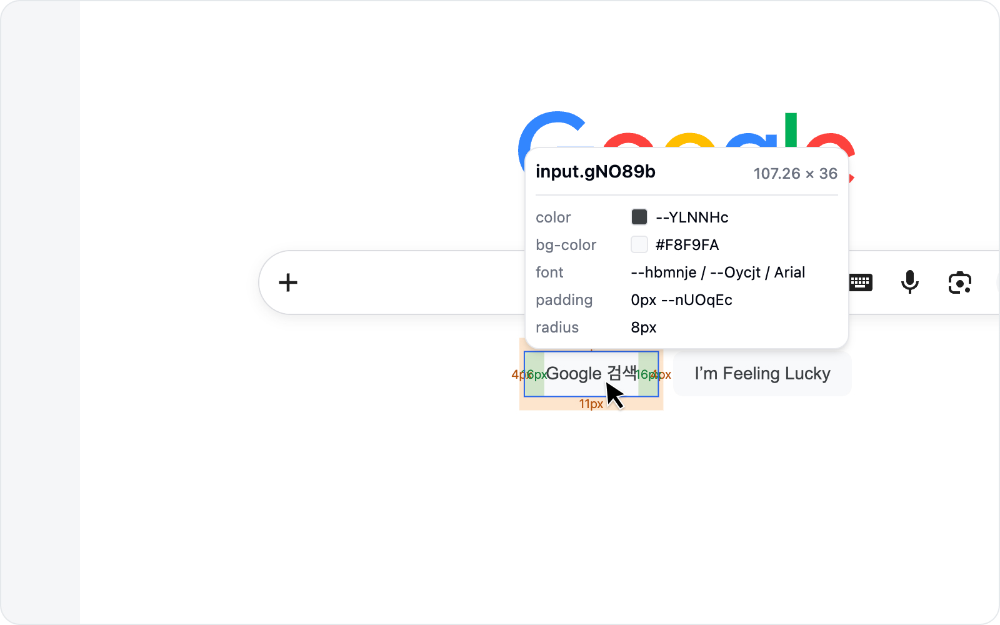

# Capture

You can grab a screenshot two ways: **Capture area**, where you drag a region of the screen yourself, and **Capture element**, where you click a single element and it crops just that element. Either way the rest of the flow (annotate → write the issue) is identical, so start with whichever feels easier.

## Capture an area

In the **Debug** tab, click **Capture area**.

Drag to select the region you want to capture. You can crop just the part where the bug shows up instead of the whole page, so the reader knows exactly where to look.

## Capture an element

In the **Debug** tab, click **Capture element** and a crosshair appears over the page. Hover an element to highlight it, then click to crop just that element's region into a screenshot. For elements with clear edges — buttons, cards — it's faster and more precise than dragging by hand.

> **Capture element** doesn't change any styles. To pick an element and compare styles before/after, use [Inspect & Style](../element/) instead.

As a bonus, the captured element's DOM selector is recorded on the issue's **Environment** as a `DOM` line, so the reader knows exactly which element on the screen it was.

## Output

The selected region (or element) is captured as an image exactly as it currently appears (viewport-based). Once capture is done, you move on to annotation naturally.

> See [Annotation](annotation.md) for how to draw on it.
