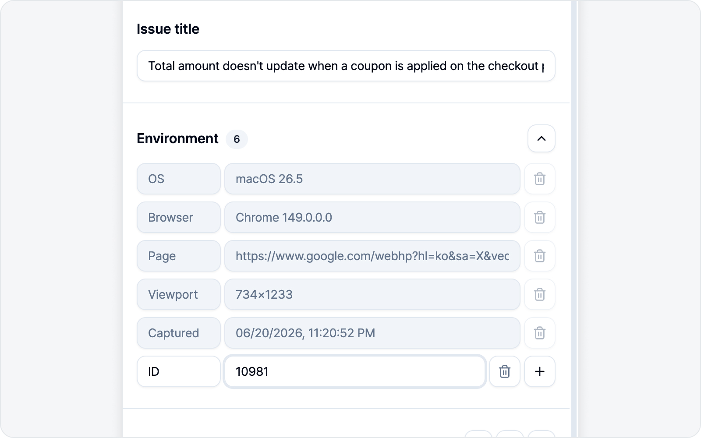
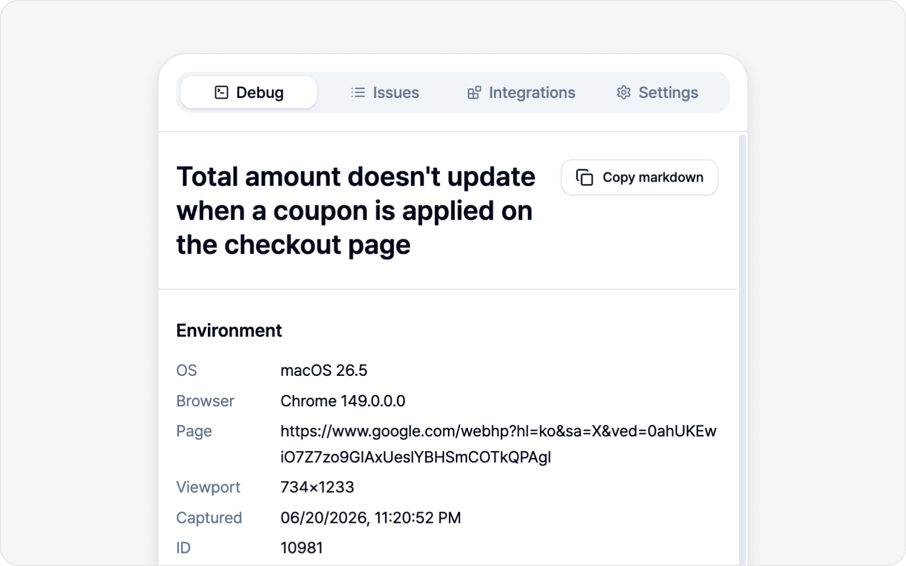
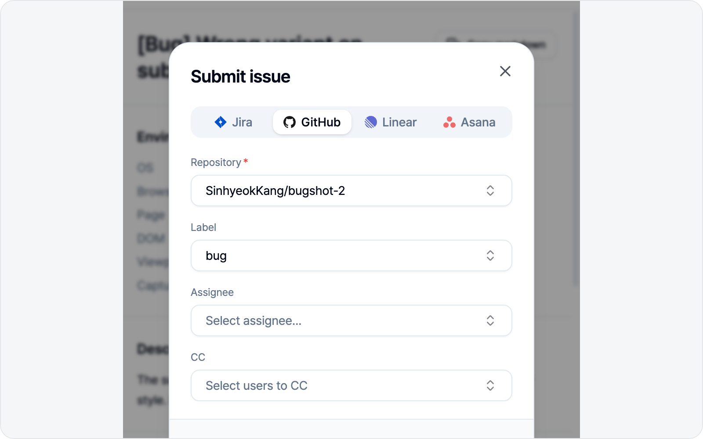

# Write an Issue (screenshot mode)

When you finish annotating and click **Done**, the issue draft opens. Just fill it in top to bottom.

## 1. Title

Your configured title prefix (e.g. `[QA] `) is pre-filled. Type the rest of the title after it.

## 2. Environment

OS, browser, page URL, viewport size, and capture time fill in **on their own** (read-only). Want to add more context? Just drop in a variable row yourself.

## 3. Media — annotated screenshot

The media in screenshot mode is the **annotated screenshot**. The image you marked up with arrows and boxes is attached to the issue as-is. The **Download** button on the right of the Media section also lets you save this screenshot as an image file.

## 4. Body sections

Sections appear per your body composition — Description, Steps to reproduce, Expected result, Notes (only the ones you've turned on). Steps to reproduce is an ordered list. Fill them in by hand, or let AI Draft below do it in one shot.

### Pulling the log that matters into the body

Sections you write as prose — Description, Expected result, Notes — have an **Add log** button on the right of their header (Steps to reproduce is an ordered list, so it doesn't). Instead of describing the response in words, drop the log itself into the body.

The button opens the **Add log** dialog. **Console** and **Network** tabs each show a count badge, and you search and filter exactly as you would in the log tabs. Click the entry you're after, read it in the detail pane, then hit **Add**.

- **Network** — carries the request path and status code plus the **request and response bodies**. Perfect for the "200, but the response says it failed" case the status code alone can't show.
- **Console** — carries the message the page printed, and the stack trace when it's an error.

What lands is a code block, but it's **just text** — trim it or edit it however you like. It's separate from the attached `logs.html`: the attachment only shows up once the reader downloads and opens the file, while a log you add this way is **right there in the issue body**.

Long logs are nothing to worry about. Any code block over 15 lines lands **collapsed**, so a single response never swallows the panel. Hover the block and a pill appears at the bottom center — **Expand (38 lines)**, where the number is that block's full line count. Click it to see the whole thing, **Collapse** to fold it back, and preview behaves the same way. Start editing inside a collapsed block and it opens up on its own, so type away. Folding is purely for comfortable reading — **the issue you file always carries the full log**.

> A log in the body is visible to everyone who can see the issue, and console logs go in verbatim with no masking. If the screen prints anything sensitive, give it a look in the detail pane before you add it.

## ✨ AI Draft

If filling in each line by hand feels tedious, this is where AI earns its keep. With an AI connected, a purple **"Let AI write your draft"** banner shows up right below the body sections.

Click **AI Draft** on the right and a small input box opens. Describe the bug in a line or two, hit **Generate**, and AI fills in **both the title and the body sections** at once. Only the sections you've turned on get filled, and your title prefix stays put. If you've already jotted down a title or body, AI takes that in as context too — and any images you placed in the body stay put, with only the text refreshed.

In screenshot mode, AI reads the **annotated screenshot** you attached. A one-line description helps it pin down what's wrong on screen and reflect it in the draft.

> AI slips up now and then, so give the generated draft a quick look. The banner only shows when an AI is connected — see [AI LLM Connection](../settings/ai.md) for how.

## 5. Log attachments

Screenshot mode attaches three kinds of logs too. **All three toggles are on by default**, so they come along without any extra steps — turn one off if you don't need it.

- **Console Logs** — Console output and errors from the session so far.
- **Network Logs** — Network requests made along the way.
- **Action Logs** — Clicks, text input, navigation, shortcuts, toggles, dropdown selections, and drag-and-drop — everything you did on the way to the screenshot, captured as reproduction steps.

Logs keep collecting the whole time the side panel is open, so whatever happened *before* you hit capture is already in there.

> Values you type into fields and pick from dropdowns are recorded **as-is**, unless they look sensitive. Knowing which value broke things is usually the whole point of a repro. See the [Log Viewer](../logs/viewer.md) for the exact rules and what to watch out for.

The **Download** button on the right of the Log attachments section lets you grab the same log report (`logs.html`) that gets attached to the issue — right here, before you even submit.

> See [Live Logs](../logs/live.md) for how to read and work with logs.

## 6. Preview

Give the body a look in the preview before submitting. **Copy** copies it as-is to paste elsewhere.

## 7. Submit

Fill in the connected platform's fields (project, assignee, labels, etc.) and hit **Submit issue**. A link to the created issue appears when it's done.

At the bottom of the fields sits a **CC** field. Pick the folks who should be in the loop on this bug (reviewers, designers, PMs) and they land as a `cc @name` mention at the bottom of the created issue, each getting a notification on the platform. Select several at once and search by name to find them fast. Whoever you pick is pre-filled on your next issue too, so you don't have to reselect every time.

> CC unlocks once you've picked the parent item first — repo, team, project, or workspace. Notion is the one exception: its connected integration needs the "read user information" permission to load the member list, so if it comes up empty, reconnect Notion in Settings.
