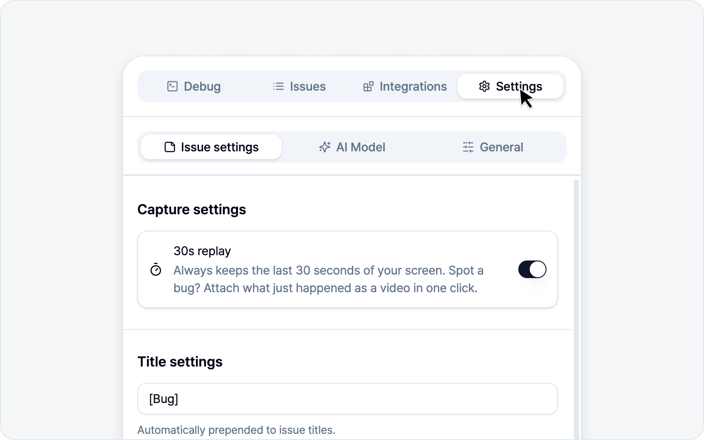

# Settings

How issues get written, whether to connect an AI, your language and theme — set up the things you use often once, right here in the **Settings** tab. Settings are split into easy-to-scan sub-tabs — Issue / AI model / General.

- **Issue** — Title prefix, body section composition, 30s replay.
- **AI model** — Connect a bring-your-own-key (BYOK) LLM.
- **General** — Language and theme.

## Jump to

- [Issue Settings](issue.md) — Title prefix, body sections, 30s replay.
- [AI LLM Connection](ai.md) — Connect an LLM to turn on AI Styling and AI Draft.
- [General](general.md) — Language and theme, plus quick links for the guide, reviews, and contact.

---

🌐 [한국어](https://bugshot.gitbook.io/ko/settings)
