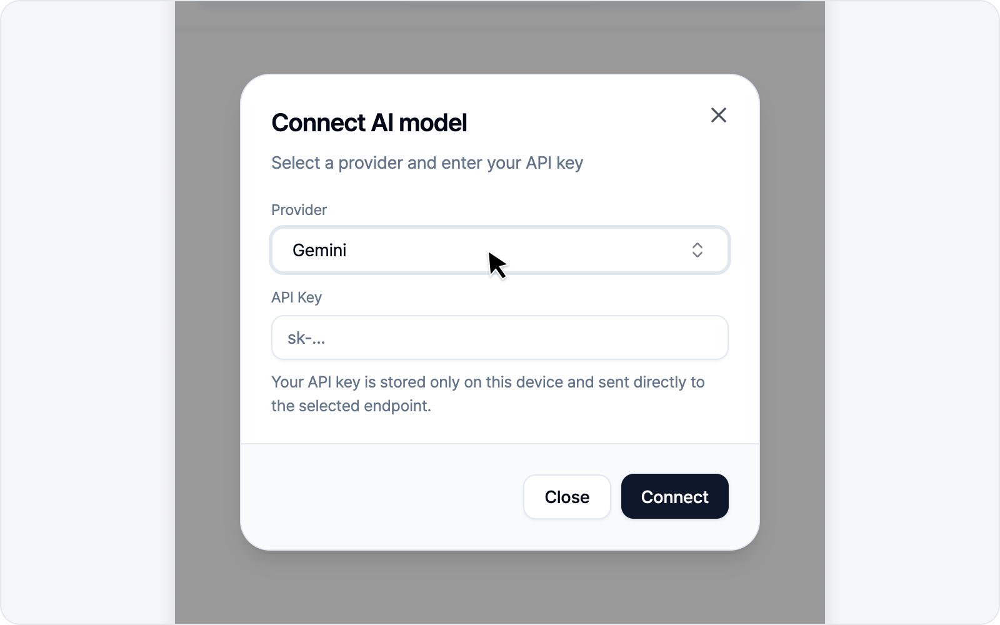

# AI LLM Connection

In the **AI model** sub-tab of Settings, connect the LLM you already use. BugShot runs no AI server of its own — it uses your own key (BYOK — Bring Your Own Key). So it's your key, your model, and you can use it with peace of mind.

No key? No problem. If Chrome's built-in AI is available in your browser, the basic AI features just work with it — no setup needed.

## Connect

Just three things to enter.

- **Base URL** — Your LLM API endpoint.
- **API Key** — The key issued by that service.
- **Model ID** — The name of the model to use.

Most providers with an OpenAI-compatible endpoint connect without a hitch. BugShot may request access to that domain on connect — go ahead and approve it.

## Which AI runs

BugShot picks the AI for you, in this order — you rarely have to think about it.

1. **If you've connected an LLM**, it runs on that model. The AI banner shows the provider name (e.g. OpenAI) as a badge.
2. **If you haven't**, it falls back to Chrome's built-in AI automatically. The badge then reads **Chrome AI**, and no key or setup is needed.
3. **If Chrome's built-in AI isn't available either**, the AI features simply don't appear. In that case, just connect an LLM above.

> Chrome's built-in AI may not be offered depending on your browser version and device. For something more reliable, connecting your own LLM is the safer bet.

## Two features it turns on

Once AI is ready, two features become available.

- **AI Styling** — While inspecting an element, change styles with plain language like "make the button rounder" or "add more spacing." → [Styling](../element/styling.md)
- **AI Draft** — Auto-fill the issue body from your capture and logs. → [Write an Issue (element)](../element/issue.md)

> AI slips up now and then, so give the generated result a quick look before submitting.

---

🌐 [한국어](https://bugshot.gitbook.io/ko/settings/ai)
