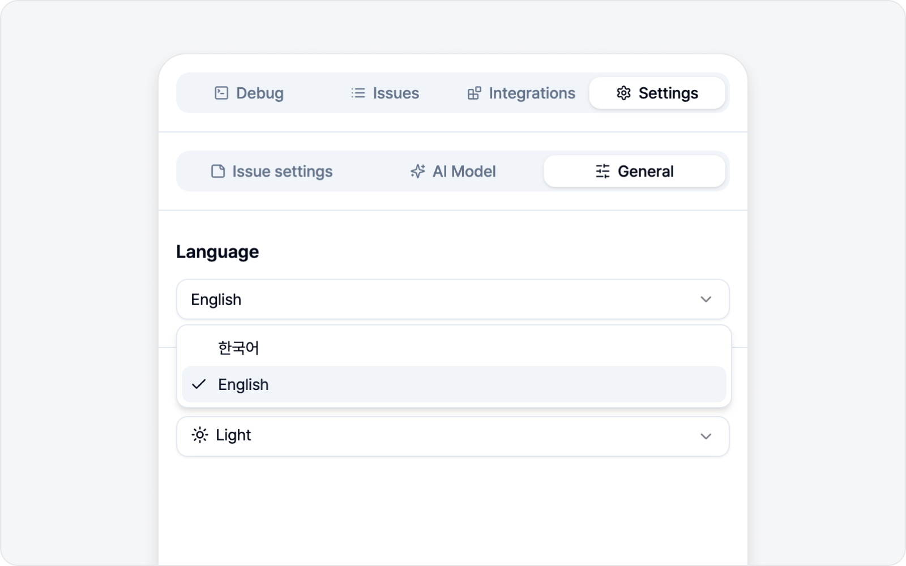
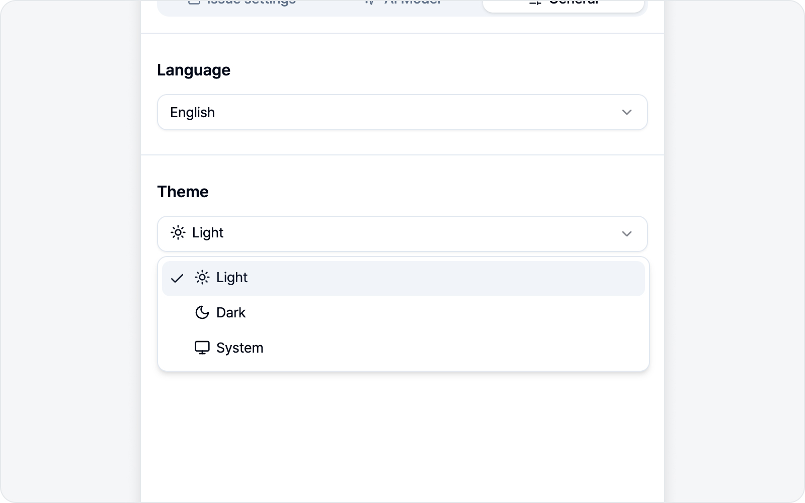
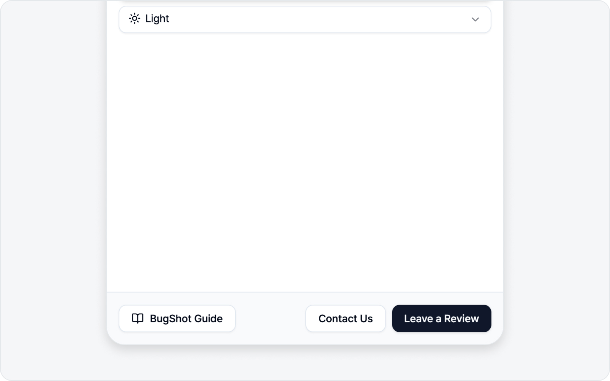

# General

Settings you set once and forget — like language and theme — all live in the **General** sub-tab. Nothing complicated here, so feel free to look around.

## Language

Pick the display language for BugShot. You can choose between **한국어** (Korean) and **English**. The change applies across the whole side panel right away — no refresh needed.

> The user guide opens in your language too. Set it to Korean and you get the Korean guide; set it to English and you get the English one.

## Theme

Choose how bright the panel looks. There are three options.

| Theme  | What it does            |
| ------ | ----------------------- |
| Light  | Bright interface        |
| Dark   | Dark interface          |
| System | Follows your OS setting |

With **System**, BugShot goes dark automatically whenever your OS is in dark mode. If you'd rather not think about it, System is the easy pick.

## Guide · Review · Contact

At the bottom of the General tab you'll find three handy buttons.

* **BugShot Guide** — Opens the guide you're reading right now in a new tab, in your current language.
* **Leave a Review** — Takes you to BugShot's review page on the Chrome Web Store. If it's been helpful, a quick word means a lot to us.
* **Contact Us** — Opens an email so you can ask a question or report a bug. Stuck on something? Don't hesitate to reach out.
