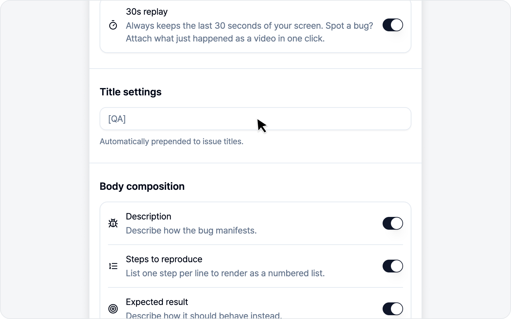
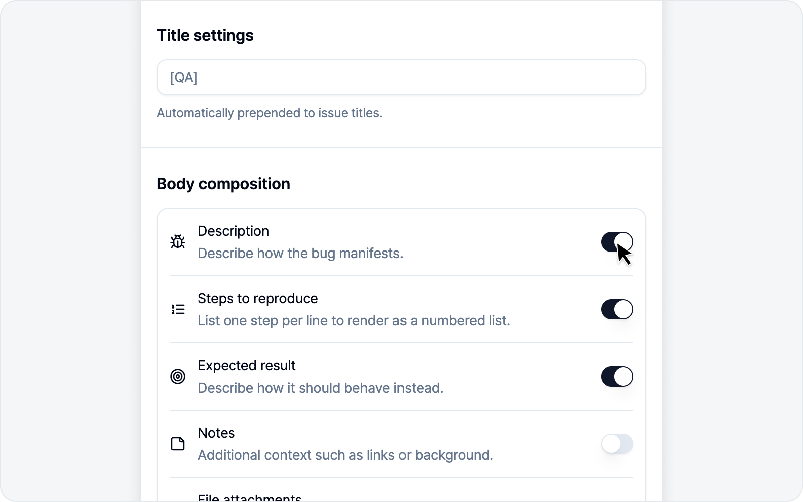
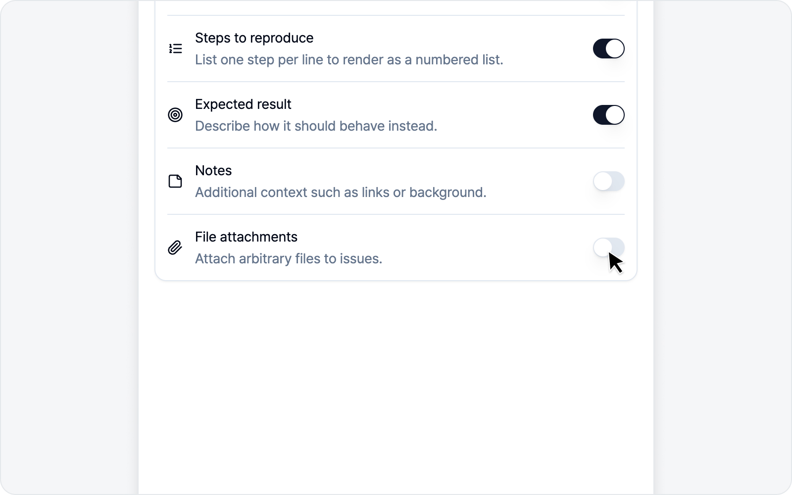
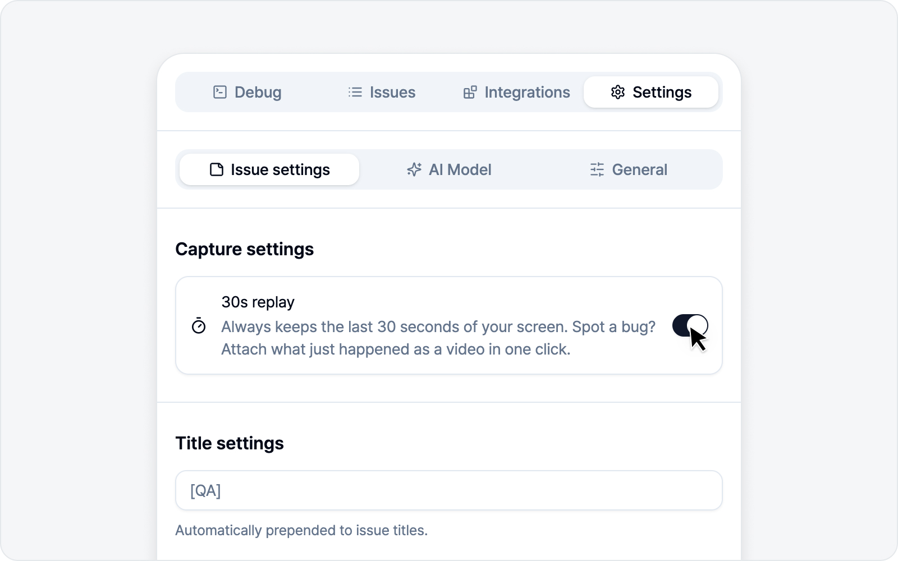

# Issue Settings

Set up the parts that repeat on every issue here, and each one gets a little lighter on your hands.

## Title prefix

A string automatically prepended to issue titles. Set it to `[QA] `, for example, and every title starts with `[QA] `. Pretty handy if your team uses label conventions.

## Body composition

Turn the body sections on or off. Four sections come ready out of the box.

| Section | Default | Input format |
|---|---|---|
| Description | On | Paragraph |
| Steps to reproduce | On | Ordered list |
| Expected result | On | Paragraph |
| Notes | Off | Paragraph |

- **Steps to reproduce** is an ordered list — enter one step per line and it numbers them 1, 2, 3… for you.
- **Notes** is off by default, so flip it on only when you need it.
- You can **override each section's label and placeholder text**. Rename "Description" to match your team's wording, for instance.

## File attachments

Sometimes you need to drop a file straight onto an issue — something captures or logs can't quite hold. Flip this toggle on and an **Attachments** area appears on the issue screen, where you can pick files to send along.

- It's **off** by default.
- You can attach **up to 10 files**, **50MB** total.
- Each platform has its own per-file size cap (Notion 5MB, GitLab 10MB, for example). Files over that show an "over limit" note and may be rejected by the platform on upload.
- Attached files upload together when you submit the issue.

## 30s replay

Always keeps the last 30 seconds of your screen. Spot a bug? Attach what just happened as a video in one click.

Turning this toggle on **requests screen capture permission**. Replay only works once you approve it — and if the permission is ever revoked, replay turns off on its own, so there's nothing to clean up.

> Curious how to use 30s replay? See [30s Replay](../video/replay.md).

---

🌐 [한국어](https://bugshot.gitbook.io/ko/settings/issue)
