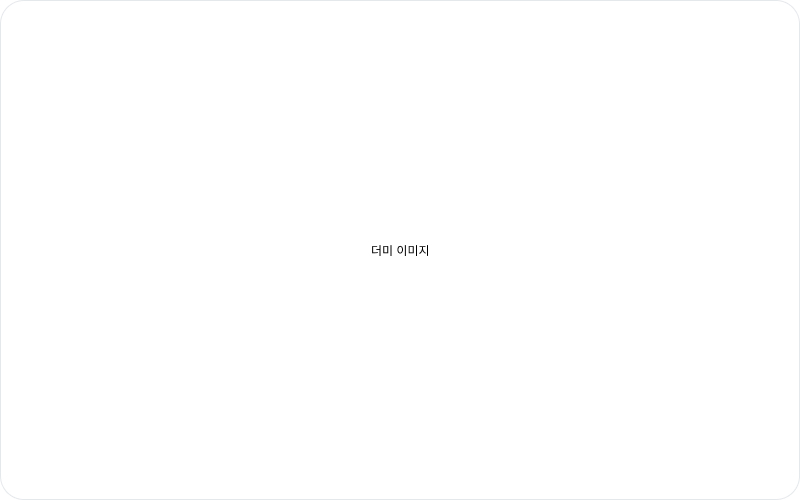

# Issue Settings

Set up the parts that repeat on every issue here, and each one gets a little lighter on your hands.

## Title prefix

A string automatically prepended to issue titles. Set it to `[QA] `, for example, and every title starts with `[QA] `. Pretty handy if your team uses label conventions.

## Recording mode

In the **Recording settings** section, pick ahead of time whether the record button captures **just the tab, or the full screen and other windows too**. The record button on the capture screen follows the mode you choose here.

- **Tab** — Records only the tab you're looking at. Fast, with no share picker.
- **Screen** — Pick the full screen or a specific window to record. Use it when you need to capture beyond the tab (another app window, a payment or login window that pops up on its own).

Once you pick a mode, it stays put until you change it. Your choice shows up right away in the record button's icon and label on the capture screen.

## 30s replay

Always keeps the last 30 seconds of your screen. Spot a bug? Attach what just happened as a video in one click.

Turning this toggle on starts keeping the last 30 seconds of your screen. There's no separate permission prompt — just flip the switch and it's on. Since it keeps capturing your screen in the background, feel free to turn it off when you don't need it.

> Curious how to use 30s replay? See [30s Replay](../video/replay.md).

## Body composition

Choose which sections go into the issue body — and **what order they go in**. These come ready out of the box.

| Item | Default | Input format |
|---|---|---|
| Description | On | Paragraph |
| Steps to reproduce | On | Ordered list |
| Media & Logs | Always | — |
| Expected result | On | Paragraph |
| Notes | Off | Paragraph |

- **Steps to reproduce** is an ordered list — enter one step per line and it numbers them 1, 2, 3… for you.
- **Notes** is off by default, so flip it on only when you need it.
- You can **override each section's label and placeholder text**. Rename "Description" to match your team's wording, for instance.

### Media & Logs

This is where element style changes, captured media, and collected logs land. Unlike the other items it has **no on/off switch — you only set where it goes**. Nothing is captured, nothing shows up in the body, so there's nothing to turn off. Whether logs ride along with an issue is decided on the issue screen itself, on the log card.

### Reordering

Grab the handle on the left of any row and drag it up or down. The new order saves the moment you drop it, and every issue you write from then on follows it.

You can do the same from the keyboard.

1. Press Tab until the handle has focus.
2. Press Space to pick the item up.
3. Use ↑ · ↓ to move it.
4. Press Space again to drop it. (Esc cancels.)

Move **Media & Logs** to the top, for example, and your screenshots or video will come before the description. Handy for matching your team's issue template.

> Shuffled things around and want the original layout back? Hit the restore button to the right of the **Body composition** heading. It stays inactive while you're on the default order and lights up once you change it. It restores the **order only** — whatever you turned on or off stays that way.

## Other

### Fill steps to reproduce

With **Fill steps to reproduce** on, the moment you land on the issue screen after recording, AI reads the action log it just captured and **fills the Steps to reproduce section for you**. It saves you from retyping each step by hand.

- It's **on** by default.
- It only kicks in when an AI model is connected — with no AI available, nothing gets auto-filled and Steps to reproduce stays empty. See [AI LLM Integration](./ai.md) to connect one.
- When it runs, the action log is sent to the connected AI. If you recorded a sensitive screen, feel free to turn it off.
- If you turn the Steps to reproduce section off under **Body composition** above, there's nothing left to fill, so this option goes inactive too. Your on/off choice is remembered and comes back when you re-enable the section.

> Want to see how it fills things in? Check out [Writing an Issue (Recording mode)](../video/issue.md).

### File attachments

Sometimes you need to drop a file straight onto an issue — something captures or logs can't quite hold. Flip this toggle on and an **Attachments** area appears on the issue screen, where you can pick files to send along.

- It's **off** by default.
- You can attach **up to 10 files**, **50MB** total.
- Each platform has its own per-file size cap (Notion 5MB, GitLab 10MB, for example). Files over that show an "over limit" note and may be rejected by the platform on upload.
- Attached files upload together when you submit the issue.
