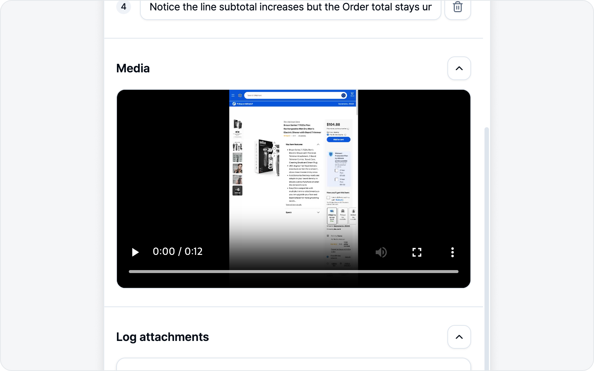
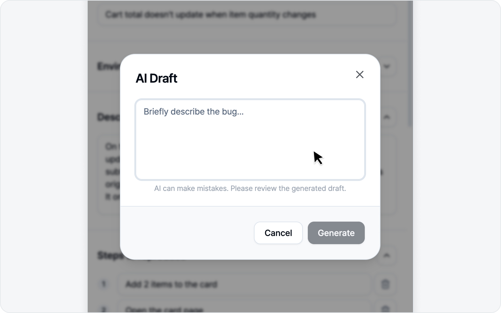
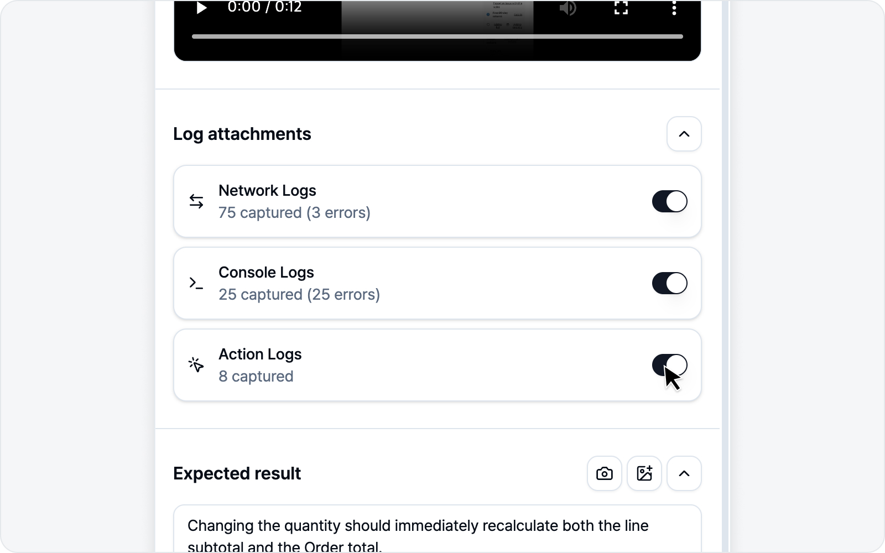
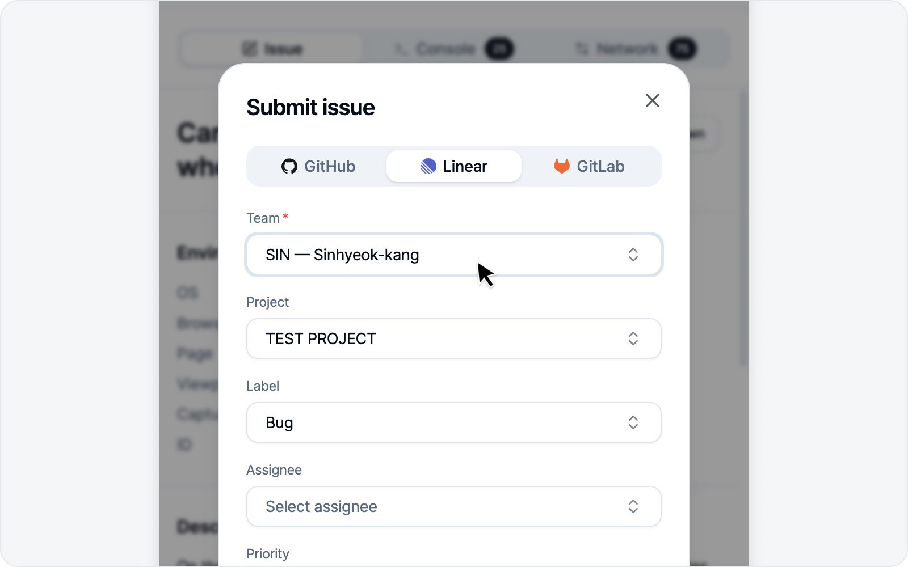

# Write an Issue (recording mode)

🌐 [한국어](https://bugshot.gitbook.io/ko/video/issue)

When recording finishes, the issue draft opens. Just fill it in top to bottom and submit. Recording mode is the one that bundles **the richest logs alongside the video**.

## 1. Title

Your configured title prefix (e.g. `[QA] `) is pre-filled. Type the rest of the title after it.

## 2. Environment

OS, browser, page URL, viewport size, and capture time fill in **on their own** (read-only). Want to add more context? Just drop in a variable row yourself.

## 3. Media — video

The media in recording mode is the **video**. The clip you just recorded (or pulled in via 30s replay) is attached to the issue. The **Download** button on the right of the Media section also lets you save this video as a file.

## 4. Body sections

Sections appear per your body composition — Description, Steps to reproduce, Expected result, Notes (only the ones you've turned on). Steps to reproduce is an ordered list. Fill them in by hand, or let AI Draft below do it in one shot.

## ✨ AI Draft

If filling in each line by hand feels tedious, this is where AI earns its keep. With an AI connected, a purple **"Let AI write your draft"** banner shows up right below the body sections.

Click **AI Draft** on the right and a small input box opens. Describe the bug in a line or two, hit **Generate**, and AI fills in **both the title and the body sections** at once. Only the sections you've turned on get filled, and your title prefix stays put. If you've already jotted down a title or body, AI takes that in as context too — and any images you placed in the body stay put, with only the text refreshed.

In recording mode, AI works from a **summary of the console, network, and action logs**, weaving what actually happened during the recording into the draft. With the richest logs of any mode, this is where AI Draft is most accurate.

> AI slips up now and then, so give the generated draft a quick look. The banner only shows when an AI is connected — see [AI LLM Connection](../settings/ai.md) for how.

## 5. Log attachments — recording-mode policy

On top of the video, recording mode bundles three kinds of logs. **All three toggles are on by default**, so they're captured richly without you lifting a finger.

- **Console Logs** — Console output and errors during the recording.
- **Network Logs** — Network requests made during the recording.
- **Action Logs** — A record of user actions: clicks, text input, and navigation, plus **keyboard shortcuts and special keys (Enter, Esc, ⌘K, and the like), checkbox and radio toggles, dropdown selections, and drag-and-drop**. (It captures which keys and actions happened, not every character you type.) **Action logs are only captured in recording mode.**

The video timeline and the logs are linked by time, so the reader can walk through "what happened at this moment" in the [Log Viewer](../logs/viewer.md).

The **Download** button on the right of the Log attachments section lets you grab the same log report (`logs.html`) that gets attached to the issue — before you submit. The video is bundled right in, so you can open it straight in the [Log Viewer](../logs/viewer.md).

## 6. Preview

Give the body a look in the preview before submitting. **Copy markdown** copies it as-is to paste elsewhere.

## 7. Submit

Fill in the connected platform's fields (project, assignee, labels, etc.) and hit **Submit issue**. A link to the created issue appears when it's done.

At the bottom of the fields sits a **CC** field. Pick the folks who should be in the loop on this bug (reviewers, designers, PMs) and they land as a `cc @name` mention at the bottom of the created issue, each getting a notification on the platform. Select several at once and search by name to find them fast. Whoever you pick is pre-filled on your next issue too, so you don't have to reselect every time.

> CC unlocks once you've picked the parent item first — repo, team, project, or workspace. Notion is the one exception: its connected integration needs the "read user information" permission to load the member list, so if it comes up empty, reconnect Notion in Settings.

