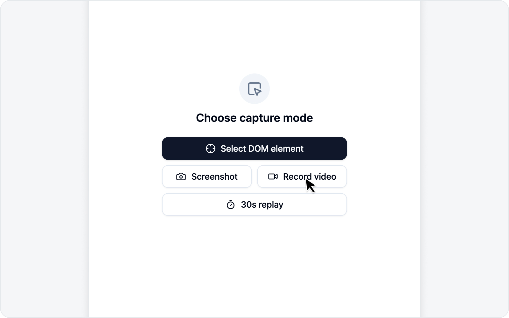

# Live Recording

🌐 [한국어](https://bugshot.gitbook.io/ko/video/record)

BugShot's live recording starts from a single **record button** on the capture screen. Whether it captures just the **tab** you're looking at or the **full screen and other windows** too is something you pick ahead of time in settings — and you can change it anytime, so don't sweat it.

## Choosing the recording mode

The record button in the **Debug** tab follows the mode you picked in settings (**Record tab** / **Record screen**). Choose it under **Settings > Issue settings > Recording settings > Recording mode**. Your choice shows up immediately in the record button's icon and label.

## Tab recording

With **Record tab** selected, one click on the record button starts recording the tab you're looking at — fast, with no share picker.

> That said, if you opened the side panel on one site and then **navigated to another**, tapping Record tab can't capture that tab directly (a browser permission rule), so it automatically falls back to the screen-share picker. Just pick the tab you're on from the list.

## Screen recording

Need to show something outside the tab — another app window, the full screen, a payment or login window that pops up on its own? Set the mode to **Record screen**. When you click the record button, your browser opens a "what do you want to share?" picker where you choose **the full screen, a specific window, or a tab**, then hit share to start.

> Screen recording goes through the browser's own permission picker, so there's one selection step. Just so you know.

## While recording

A timer shows the **elapsed time and the maximum length** while you record. Just perform the steps that reproduce the bug as you normally would.

- **Stop recording** — Stop recording and wrap it up as a video.
- **Cancel** — Discard the recording and go back to the start.

For screen recording, you can also click the browser's **Stop sharing** bar at the top to finish. The video has a **maximum length** and stops on its own once it's reached, so there's no need to watch the clock.

## Processing and output

When you stop, the video is processed to MP4 and a thumbnail is generated. Once processing finishes, you move on to the issue draft naturally.

> Continue with [Write an Issue](issue.md).
