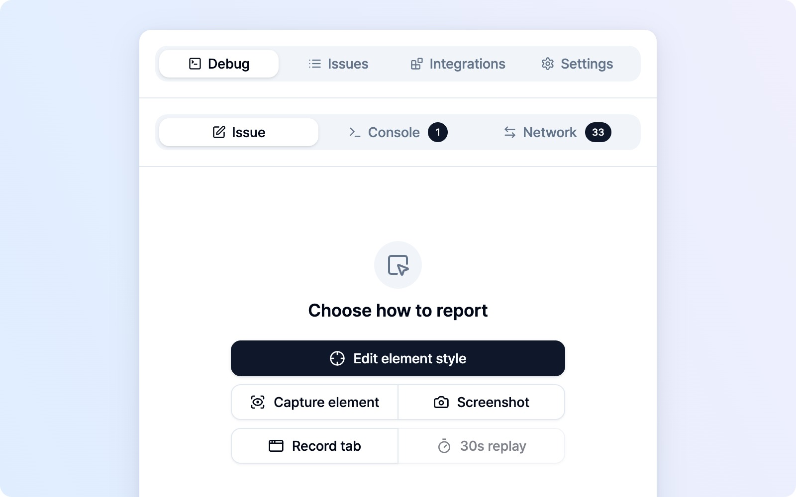
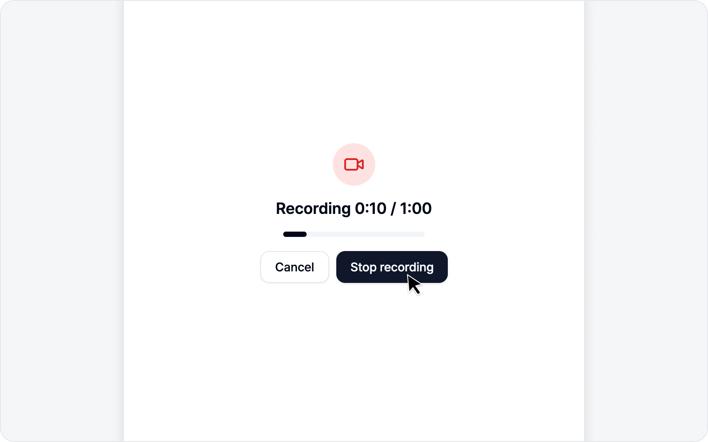

# Live Recording

BugShot's live recording starts from a single **record button** on the capture screen. Whether it captures just the **tab** you're looking at or the **full screen and other windows** too is something you pick ahead of time in settings — and you can change it anytime, so don't sweat it.

## Choosing the recording mode

The record button in the **Debug** tab follows the mode you picked in settings (**Record tab** / **Record screen**). Choose it under **Settings > Issue settings > Recording settings > Recording mode**. Your choice shows up immediately in the record button's icon and label.

## Tab recording

With **Record tab** selected, one click on the record button starts recording the tab you're looking at — fast, with no share picker.

> That said, if you opened the side panel on one site and then **navigated to another**, tapping Record tab can't capture that tab directly (a browser permission rule), so it automatically falls back to the screen-share picker. Just pick the tab you're on from the list.

## Screen recording

Need to show something outside the tab — another app window, the full screen, a payment or login window that pops up on its own? Set the mode to **Record screen**. When you click the record button, your browser opens a "what do you want to share?" picker where you choose **the full screen, a specific window, or a tab**, then hit share to start.

> Screen recording goes through the browser's own permission picker, so there's one selection step. Just so you know.

## While recording

A timer shows the **elapsed time and the maximum length** while you record. Just perform the steps that reproduce the bug as you normally would.

- **Stop recording** — Stop recording and wrap it up as a video.
- **Cancel** — Discard the recording and go back to the start.

For screen recording, you can also click the browser's **Stop sharing** bar at the top to finish. The video has a **maximum length** and stops on its own once it's reached, so there's no need to watch the clock.

## Drawing on screen

"This button here," "this area looks broken" — for the parts that are hard to put into words, you can draw right on top of the recording to point them out. Once recording starts, a **drawing toolbar** appears below the recording controls — pick a color, a **Pen** or **Highlight**, and a thickness, just like the screenshot annotation editor.

- Click **Pen** or **Highlight** to turn drawing on, and your cursor becomes a crosshair. From there, **press and drag** on the page to draw a line along the path. **Highlight** is thick and translucent, like a marker — great for calling out a whole area.
- Pick from five colors — **Red, Yellow, Green, Blue, Black** — and three thicknesses — **Thin, Medium, Thick**. It's simpler than it sounds.
- Each line **fades away in the order you drew it, starting from the beginning of the stroke, over a few seconds**, so there's nothing to erase — just draw whenever you want to highlight something.
- While you're drawing, page clicks are paused, but **scrolling still works**. When you're done, click the active **Pen/Highlight** button again or press **Esc** on the page to turn drawing off and use the page as usual.

Your drawings are baked right into the recorded video, so teammates watching later can see exactly where to look.

> If you're sharing **another window or monitor** with screen recording, drawings only appear on the tab where BugShot is open, so they may not show up in that recording. Share that tab if you want to keep what you drew on it.

## Processing and output

When you stop, the video is processed to MP4 and a thumbnail is generated. Once processing finishes, the **trim screen** opens right away so you can keep just the part you need before moving on to the issue draft.

## Trimming the clip

Stopping a recording takes you to a **trim screen** first, not straight to the issue draft. The bug itself usually happens in just a moment of the whole recording, so cutting the ends means teammates reading your report don't have to hunt for it. And it's not just the video — **the logs attached with it get narrowed to the same range**.

Up top, the trim screen has **Video**, **Console**, **Network**, and **Action** tabs. The Video tab plays your clip in the middle; switch to a log tab and that type of captured log opens up in the same spot (each tab shows a count of what it caught). No matter which tab you're on, the timeline handles and buttons like undo and apply stay right there, so you can trim while reading the logs.

- **Pick the range** — Drag the **Start** and **End** handles at the ends of the timeline to set what to keep. As you move a handle, the selected length ("8s / 42s") shows in the middle of the button row below.
- **Play / pause** — Use the **Video** tab to scrub through the clip and find the bug (playback pauses for a moment when you switch to a log tab). The timeline marks **where errors occurred** (console/network) and **where the page navigated** to help you decide what to keep — click a mark to jump straight to that log tab.
- **Preview what gets cut** — As you move a handle, the logs that will be cut go **dimmed** in the log tabs. So before you apply, you can see exactly which logs are about to drop.
- **Undo / redo** — Moved a handle by mistake? No worries — undo or redo it.

When you're happy, hit **Apply**. The video is rebuilt to keep only the selected range, and the console, network, and action logs get narrowed to match (the ones shown dimmed drop out).

> While the video is being rebuilt, a **"Trimming the video"** screen takes over and shows the progress. It stays until the work is done, so just leave it be and give it a moment. Closing the panel or switching to another tab pauses the work, and it picks back up when you return.

Nothing to trim? Leave the handles alone and hit **Apply**. Nothing gets re-encoded, so you go **straight** to the issue draft with no waiting.

> To drop the recording entirely, hit **Discard recording**. You'll confirm with "Discard this recording?", then the video you just captured and the logs collected with it are deleted and you're back at the start screen.

> And if rebuilding the video ever fails, nothing to worry about — the **untrimmed original is attached as is** and you move on to the issue draft. Your recording never disappears.

> Continue with [Write an Issue](issue.md).
