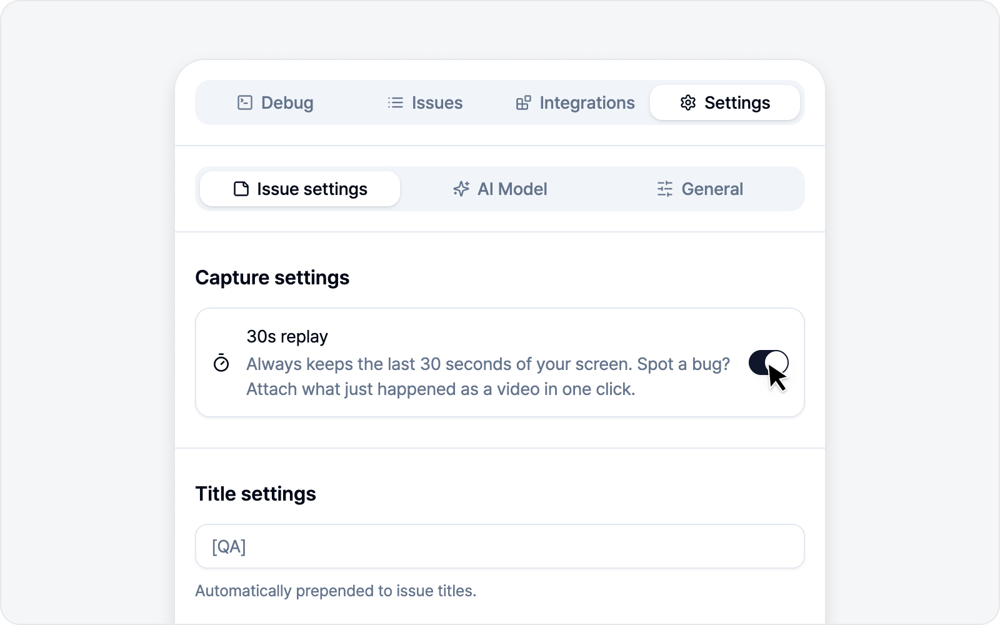

# 30s Replay

Bugs never wait for you to hit record first, do they? 30s replay **always keeps the last 30 seconds** of your screen, so right after you spot a bug you can attach what just happened as a video in one click. It saves you from those "ugh, I should've been recording" moments.

## Prerequisite: setting + permission

Replay only works once it's turned on ahead of time.

> First, in [Issue Settings](../settings/issue.md), **turn on the 30s replay toggle and approve screen capture permission**. The last 30 seconds are only kept once permission is granted. And if permission is ever revoked, replay turns off on its own — nothing for you to worry about.

Granting this permission once comes with a bonus beyond replay: even if you **navigate to another page mid-task, the side panel stays open and your capture keeps going**. It applies as long as the permission sticks around — even with the replay switch back off — so reproducing a bug across pages feels a lot smoother.

## Using it

Once it's ready, the **30s replay** button on the debug screen pulls the last 30 seconds into a video. A quick glance at the button tells you what's going on.

- **Disabled** — Not turned on in settings yet. (Click it and you'll be told you can enable 30s replay in settings.)
- **Recording** — The screen is being recorded. You can grab the last 30 seconds anytime.
- **Encoding…** — Turning the grabbed 30 seconds into a video.
- **Ready** — The video is made and attached to the issue.

> Once the video is made, you move to the issue draft. Continue with [Write an Issue](issue.md).

---

🌐 [한국어](https://bugshot.gitbook.io/ko/video/replay)
