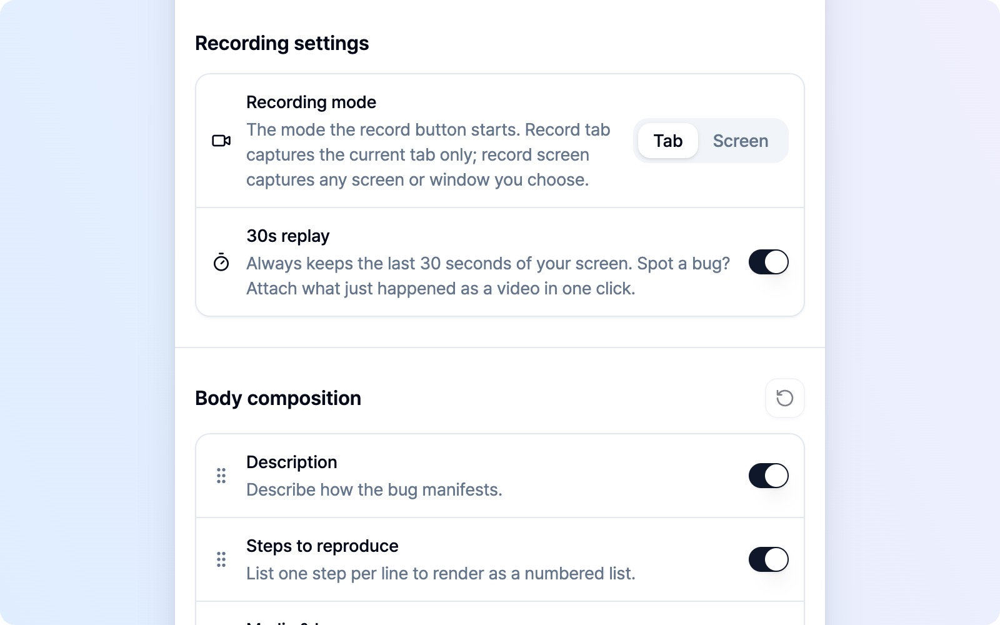
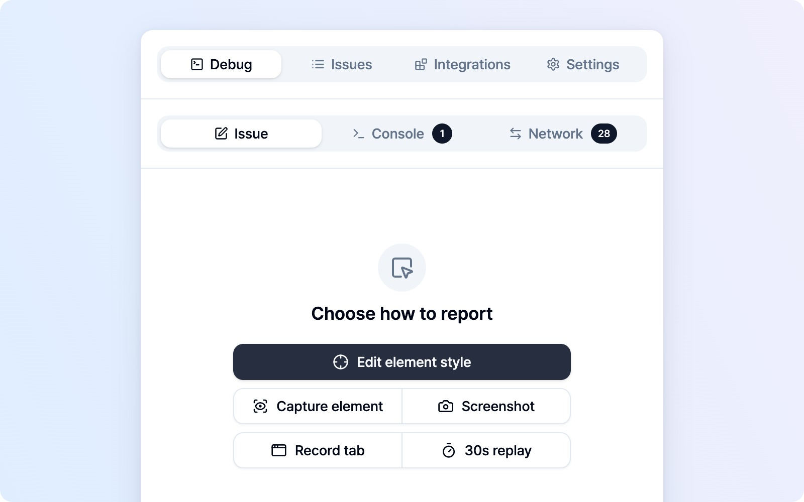

# 30s Replay

Bugs never wait for you to hit record first, do they? 30s replay **always keeps the last 30 seconds** of your screen, so right after you spot a bug you can attach what just happened as a video in one click. It saves you from those "ugh, I should've been recording" moments.

## Prerequisite: setting

Replay only works once it's turned on ahead of time.

> First, in [Issue Settings](../settings/issue.md), **turn on the 30s replay toggle**. The last 30 seconds start getting kept from the moment you flip it on. There's no separate permission prompt — just turn the switch on.

On top of that, even if you **navigate to another page mid-task, the side panel stays open and your capture keeps going**. It applies whether or not you use replay, so reproducing a bug across pages feels a lot smoother.

## Using it

Once it's ready, the **30s replay** button on the debug screen pulls the last 30 seconds into a video. A quick glance at the button tells you what's going on.

- **Disabled** — Not turned on in settings yet. (Click it to jump to **Issue settings**, where you can turn it on right there.)
- **Recording** — The screen is being recorded. You can grab the last 30 seconds anytime.
- **Encoding…** — Turning the grabbed 30 seconds into a video.
- **Ready** — The video is made and attached to the issue.

## Trimming the clip

The bug itself usually happens in just a moment of those 30 seconds. Once the video is made, a **trim screen** pops up over the issue draft so you can cut the unneeded parts and keep only the bug moment. It's simpler than it sounds — trim the ends to keep only what matters.

> This screen isn't just for 30s replay. It shows up **exactly the same way when you stop a tab or screen recording**, so you can use trimming without turning 30s replay on at all.

Drag the **Start** and **End** handles at the ends of the timeline to set what to keep, then hit **Apply** — the video is rebuilt to keep only that range, and the console, network, and action logs attached with it get narrowed to match. As you move a handle, the logs that will be cut go **dimmed** in the log tabs, so you can see what drops before you commit.

> For the full walkthrough of the screen and each button, see "Trimming the clip" in [Live Recording](record.md). Both capture modes use the **exact same screen**.

There's just one thing that differs for replay: leave the handles untouched and hit **Apply** to keep the **full 30 seconds**.

> The trim screen shows up **just once** right after capture, and the original is cleared once you apply. Don't need to trim? Just hit **Apply** as is. To drop this capture entirely, hit **Discard recording** — you'll confirm with "Discard this recording?" and return to the start screen.

> Once you apply, you move to the issue draft. Continue with [Write an Issue](issue.md).
