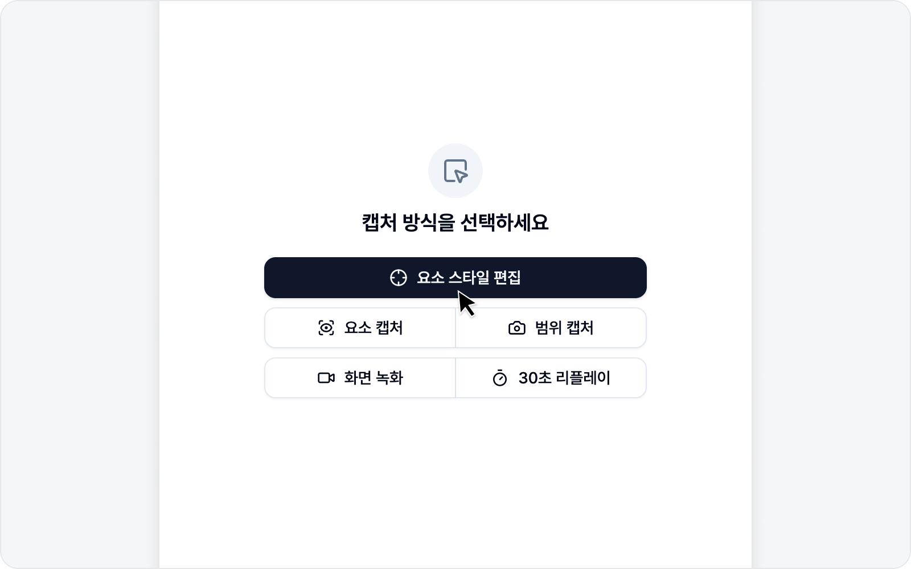

# 요소 선택 & 스타일링

웹 페이지의 요소를 직접 골라 스타일을 고치고, 고치기 전과 후를 나란히 담아 리포트하는 모드입니다. "이 버튼 여백이 좁아요"를 말로 설명하는 대신, before/after로 한눈에 보여줄 수 있습니다.

흐름은 의외로 단순합니다 — **요소 클릭 → 스타일 라이브 수정 → before/after로 이슈 작성**. 여러 요소를 한 이슈에 함께 담을 수도 있습니다.

## 바로가기

- [요소 선택](picker.md) — 페이지에서 요소를 고르고 DOM 트리로 이동.
- [스타일링](styling.md) — 스타일 패널로 수정하고 AI에게 맡기기.
- [이슈 작성](issue.md) — before/after를 담아 이슈로 제출.
