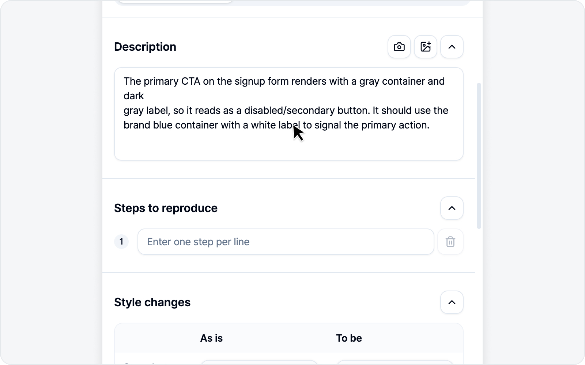

# 이슈 작성 (요소 모드)

스타일 수정을 마치고 **다음**을 누르면 이슈 초안이 열립니다. 아래 순서대로 채워 가면 됩니다.

## 1. 제목

설정해 둔 제목 접두어(예 `[QA] `)가 미리 채워져 있습니다. 이어서 제목을 적으면 됩니다.

## 2. 재현 환경

OS·브라우저·페이지 URL·뷰포트 크기·캡처 시각이 **알아서 채워집니다**(읽기 전용). 더 알리고 싶은 정보가 있으면 변수 행을 직접 더하셔도 됩니다.

## 3. 미디어 — before/after 스타일 표

요소 모드의 핵심입니다. 고치기 전과 후의 스타일이 **비교 표**로 담겨서, 어떤 속성을 어떤 값으로 바꿨는지 한눈에 들어옵니다. 받는 분도 "무엇을 어떻게 바꿔야 하는지"를 표 하나로 바로 이해합니다.

[스타일링](styling.md)에서 여러 요소를 담았다면, **요소마다** 선택자 소제목과 함께 before/after 표가 차례로 들어갑니다.

## 4. 본문 섹션

설정한 본문 구성대로 섹션이 나타납니다 — 발생 현상·재현 과정·기대 결과·비고(켜 둔 것만). 재현 과정은 번호 목록으로 입력합니다. 한 줄씩 직접 채워도 되고, 아래 AI 초안 작성으로 한 번에 채워도 됩니다.

## ✨ AI 초안 작성

한 줄 한 줄 직접 적기 번거로우셨다면, 이 기능이 큰 힘이 됩니다. AI를 연결해 두면 본문 섹션 아래에 보라색 **"AI로 초안을 작성해보세요"** 배너가 나타납니다.

오른쪽 **AI 초안 작성**을 누르면 작은 입력창이 열립니다. 버그를 한 줄로 가볍게만 적어 주면(요소 모드에서는 비워 두셔도 됩니다) AI가 **제목과 본문 섹션을 한 번에** 채워 줍니다. 채워지는 건 켜 둔 섹션뿐이고, 제목 접두어도 그대로 유지됩니다.

요소 모드에서는 **before/after 스타일 변경 내용**(과 캡처한 전·후 이미지)을 근거로 삼아, 어떤 속성이 어떻게 바뀌어야 하는지가 초안에 자연스럽게 담깁니다.

> AI도 가끔 실수하니 생성된 초안은 한 번 확인해 주세요. 배너는 AI를 연결했을 때만 보입니다 — 연결 방법은 [AI LLM 연동](../settings/ai.md)에 있습니다.

## 5. 로그 첨부

요소 모드에서는 로그를 첨부하지 않습니다. 로그가 필요한 버그라면 [스크린샷](../screenshot/issue.md)이나 [녹화](../video/issue.md) 모드를 쓰시면 됩니다.

## 6. 미리보기

제출 전 본문을 미리보기로 확인합니다. **마크다운 복사**로 본문을 그대로 복사해 다른 곳에 붙여 넣을 수도 있습니다.

## 7. 제출

연결한 플랫폼의 필드(프로젝트·담당자·라벨 등)를 채우고 **이슈 제출**을 누르면 됩니다. 등록이 끝나면 이슈 링크가 표시됩니다.

필드 맨 아래엔 **참조**(CC) 칸도 있습니다. 이 버그를 함께 알아야 할 분들(리뷰어·디자이너·PM 등)을 골라 두면, 등록된 이슈 본문 맨 아래에 `cc @이름` 멘션으로 들어가고 각자에게 플랫폼 알림이 갑니다. 여러 명을 한 번에 고를 수 있고, 이름으로 검색해 빠르게 찾을 수 있어요. 한 번 고른 분들은 다음 이슈에도 미리 채워지니 매번 다시 고르지 않으셔도 됩니다.

> 참조는 레포·팀·프로젝트·워크스페이스처럼 상위 항목을 먼저 골라야 활성화됩니다. Notion만은 연결한 통합에 '사용자 정보 읽기' 권한이 있어야 멤버 목록을 불러올 수 있으니, 목록이 비어 있다면 설정에서 Notion을 다시 연결해 주세요.

---

🌐 [English](https://bugshot.gitbook.io/en/element/issue)
