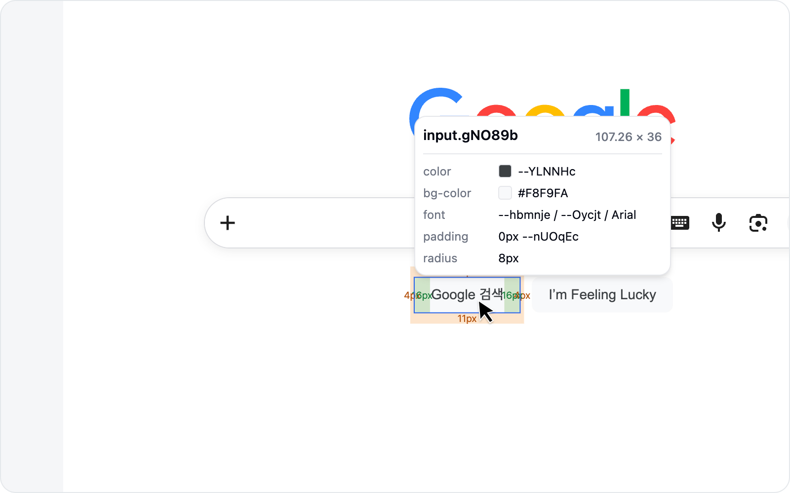
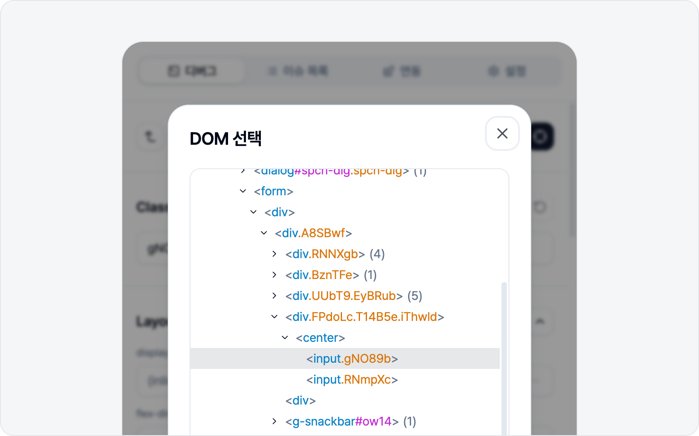

# 요소 선택

## 선택 시작

**디버그** 탭에서 **요소 스타일 편집**을 누릅니다. 그러면 페이지 위에 십자선(crosshair)이 뜨고, 마우스를 올린 요소가 강조됩니다.

> 스타일은 손대지 않고 요소 모습만 스크린샷으로 담고 싶다면, [요소 캡처](../screenshot/capture.md)가 더 빠릅니다.

## 요소 클릭

원하는 요소를 클릭하면 선택됩니다. 선택된 요소의 정보는 사이드패널에 표시됩니다.

## DOM 트리로 이동

정확히 원하는 요소가 잘 안 잡혀도 괜찮습니다. 선택된 요소를 기준으로 **부모·자식 요소로 이동**할 수 있거든요. 한 단계 위(부모)나 아래(자식)로 옮겨 가며 딱 맞는 요소를 찾으면 됩니다.

처음부터 다시 고르고 싶으면 **다시 선택**으로 언제든 새로 시작할 수 있습니다.

## iframe 안의 요소

페이지에 박힌 iframe(다른 문서가 들어 있는 프레임) 안의 요소도 대부분 그대로 선택·편집할 수 있습니다. 결제 창이나 임베드 위젯처럼 **다른 출처(cross-origin)에서 불러온 프레임**이어도 걱정 마세요. 안쪽 요소를 클릭해 스타일을 바꾸고 캡처까지 그대로 이어집니다.

다만 프레임 안에 또 프레임이 겹쳐 있거나(중첩), 보안 정책(sandbox)으로 막혀 있는 경우엔 안쪽 요소에 접근할 수 없습니다. 이럴 땐 안내가 뜨면서 선택이 취소되니, 그 부분은 [범위 캡처](../screenshot/capture.md)로 이미지처럼 담아 보세요.
