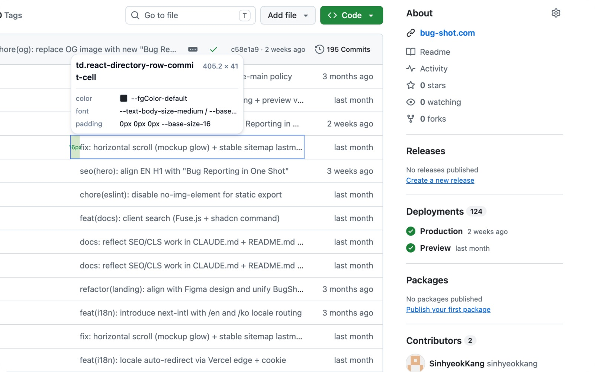
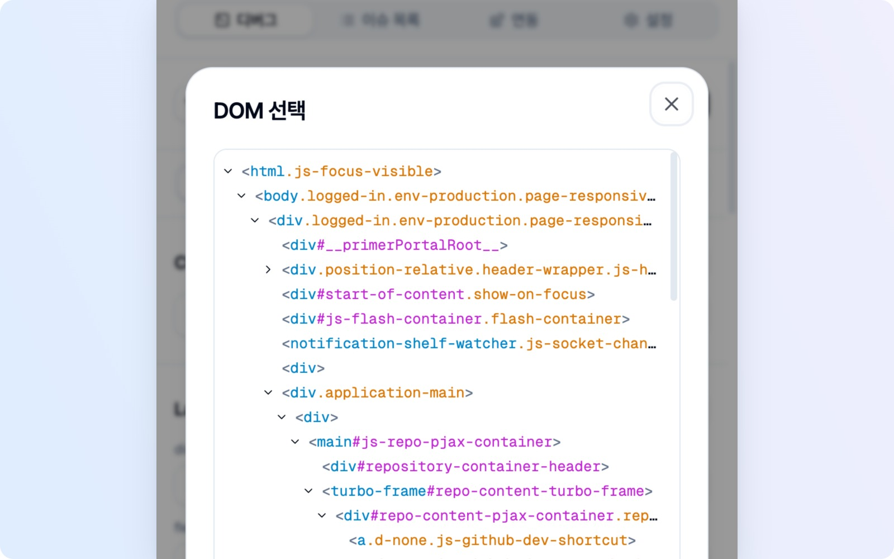

# 요소 선택

## 선택 시작

**디버그** 탭에서 **요소 스타일 편집**을 누릅니다. 그러면 페이지 위에 십자선(crosshair)이 뜨고, 마우스를 올린 요소가 강조됩니다.

> 스타일은 손대지 않고 요소 모습만 스크린샷으로 담고 싶다면, [요소 캡처](../screenshot/capture.md)가 더 빠릅니다.

## 요소 클릭

원하는 요소를 클릭하면 선택됩니다. 선택된 요소의 정보는 사이드패널에 표시됩니다.

## DOM 트리로 이동

정확히 원하는 요소가 잘 안 잡혀도 괜찮습니다. 선택된 요소를 기준으로 **부모·자식 요소로 이동**할 수 있거든요. 한 단계 위(부모)나 아래(자식)로 옮겨 가며 딱 맞는 요소를 찾으면 됩니다.

처음부터 다시 고르고 싶으면 **다시 선택**으로 언제든 새로 시작할 수 있습니다.

## 닿지 않는 요소

일부 요소는 클릭해도 그 자체가 잡히지 않고 **바깥쪽 요소(호스트)가 대신 선택**됩니다. 두 가지 경우인데, 브라우저가 그렇게 동작하도록 정해 둔 것이라 어느 도구를 쓰든 마찬가지입니다.

- **Shadow DOM 내부**: 동영상 플레이어의 기본 컨트롤이나 일부 위젯처럼 내부 구조가 캡슐화된 컴포넌트는 바깥에서 열어볼 수 없습니다. 이때는 그 컴포넌트를 감싼 호스트 요소가 선택됩니다.
- **`::before`·`::after` 가상 요소**: CSS로 그려 낸 장식이라 실제 DOM 요소가 아닙니다. 아이콘이나 말풍선 꼬리처럼 보여도, 클릭하면 그것을 만들어 낸 요소가 잡힙니다.

호스트 요소에 스타일을 주면 안쪽 모습까지 함께 달라지는 경우가 많으니 먼저 호스트로 시도해 보세요. 그래도 원하는 부분이 안 바뀐다면 [스크린샷](../screenshot/capture.md)에 주석을 달아 전달하는 편이 빠릅니다.

## iframe 안의 요소

페이지에 박힌 iframe(다른 문서가 들어 있는 프레임) 안의 요소도 대부분 그대로 선택·편집할 수 있습니다. 결제 창이나 임베드 위젯처럼 **다른 출처(cross-origin)에서 불러온 프레임**이어도 걱정 마세요. 안쪽 요소를 클릭해 스타일을 바꾸고 캡처까지 그대로 이어집니다.

다만 프레임 안에 또 프레임이 겹쳐 있거나(중첩), 보안 정책(sandbox)으로 막혀 있는 경우엔 안쪽 요소에 접근할 수 없습니다. 이럴 땐 안내가 뜨면서 선택이 취소되니, 그 부분은 [스크린샷](../screenshot/capture.md)으로 이미지처럼 담아 보세요.
