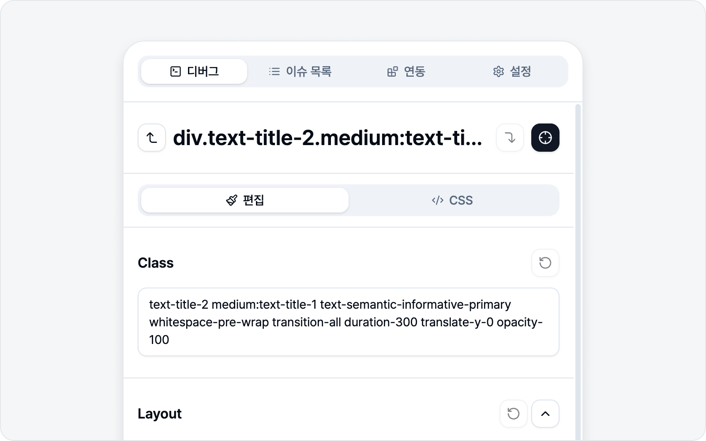
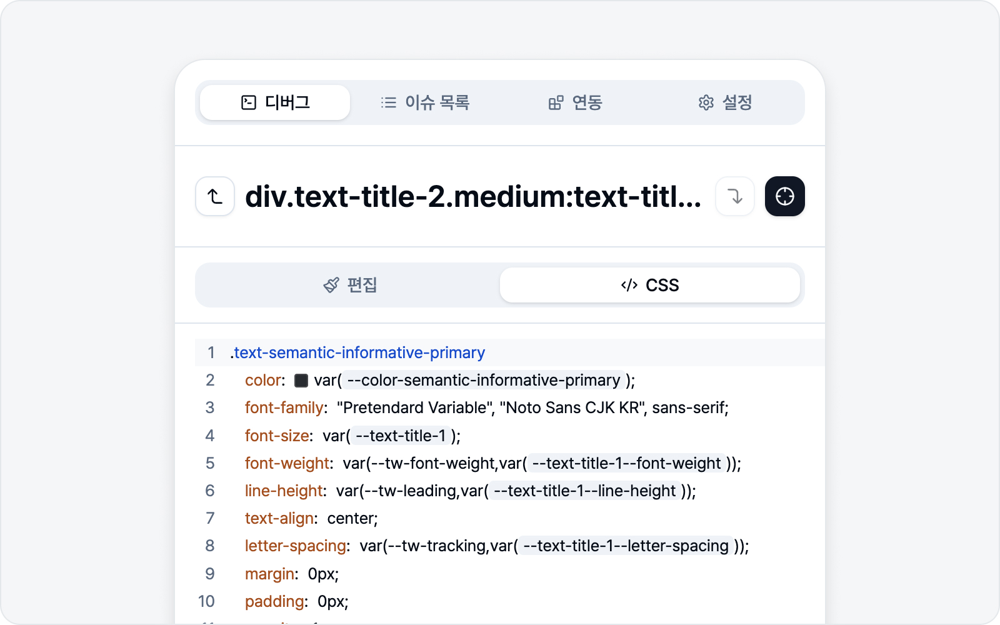

# 스타일링

요소를 선택하면 스타일 패널이 열립니다. 값을 바꾸면 **페이지에 곧바로 반영**되니, 고친 모습을 실제 화면에서 바로 확인하면서 다듬을 수 있습니다.

## 스타일 패널 섹션

패널은 위에서 아래로 다음 섹션 순서로 구성됩니다(라벨은 화면에서 영문으로 표시됩니다).

1. **Class** — 요소의 class 목록 편집.
2. **Layout** — display·flex 정렬·margin·padding·gap.
3. **Position** — position(배치 방식)·z-index(겹침 순서)·위치 오프셋(top·right·bottom·left). position을 relative·absolute 등으로 바꾼 뒤 네 면 오프셋으로 요소를 옮길 수 있습니다.
4. **Container** — 배경·투명도·모서리 반경.
5. **Border** — 테두리 두께·색·스타일. 네 변(위·오른쪽·아래·왼쪽)을 따로 손보거나, 링크 버튼으로 한꺼번에 맞출 수 있습니다.
6. **Size** — 너비·높이와 최소/최대값.
7. **Overflow** — overflow·줄바꿈·말줄임.
8. **Text** — 요소의 텍스트 내용 편집(텍스트가 있는 요소에서만 표시).
9. **Typography** — 글꼴 크기·굵기·줄 높이·자간·정렬·색.
10. **Effects** — 그림자·필터·블렌드.
11. **Transition** — 전환 속성·시간·이징.

## 편집 탭과 CSS 탭

패널 위쪽 요소 이름 아래에 **편집 / CSS** 두 탭이 있습니다. 편한 쪽으로 오가며 다듬으면 됩니다.

- **편집** — 방금 본 섹션들처럼 입력칸·드롭다운으로 다룹니다. 기본값이라 대부분 이걸로 충분합니다.
- **CSS** — 브라우저 개발자 도구의 스타일 패널처럼 CSS를 **직접 편집**합니다. 탭을 열면 그 요소가 지금 가진 스타일이 `선택자 { … }` 블록으로 **미리 채워져** 있어, 빈 화면이 아니라 현재 상태에서 출발합니다. 문법 강조·자동완성(속성명·값 제안)에 더해, 네 방향 여백·테두리는 폼처럼 **한 줄로 묶어** 보여 주고, 색상 값 앞에는 실제 색을 미리보기하는 작은 **색 견본**이 붙어 CSS를 다루기 한결 편합니다.

CSS 탭에서 값을 바꾸거나 새 속성을 넣으면 페이지에 곧바로 반영되고, 바꾼 부분만 변경사항으로 잡힙니다. 미리 채워진 값을 건드리지 않으면 변경으로 치지 않으니, 탭만 열어 훑어봐도 괜찮습니다. 반대로 채워진 선언을 **지우면** 그 속성은 초기값으로 되돌아갑니다. 아직 `;`로 마무리하지 않았거나 문법이 덜 갖춰진 줄은 **취소선**으로 표시돼, "이 줄은 아직 적용되지 않았다"를 한눈에 알아볼 수 있습니다.

두 탭은 **같은 편집 내용을 공유**합니다. 편집 탭에서 바꾼 값은 CSS 탭에도, CSS 탭에 친 값은 편집 탭에도(편집 탭이 지원하는 속성이라면) 그대로 나타나니, 왔다 갔다 해도 작업이 사라지지 않습니다.

CSS 탭이 특히 요긴한 두 경우가 있습니다.

- 편집 탭에 칸이 없는 속성(예: `cursor: pointer;`)까지 자유롭게 넣고 싶을 때.
- 사이트가 `!important`로 걸어 둔 스타일을 이겨야 할 때 — 값 끝에 `!important`를 붙여 주면 됩니다.

> 고른 탭은 **기억됩니다**. CSS 탭을 쓰다 패널을 닫아도, 다음에 요소를 선택하면 CSS 탭으로 다시 열립니다. class·Text 편집은 **편집 탭에서** 하고, 변경사항 보기·AI 스타일링·아래 버튼은 두 탭에서 똑같이 쓸 수 있습니다.

## 라이브 반영과 되돌리기

- 값을 바꾸면 페이지에 **곧바로** 적용됩니다.
- 섹션마다 인라인 변경만 원복하거나, Class·Text를 원본으로 되돌리는 버튼도 따로 있으니 부담 없이 이것저것 시도해 보세요.
- 사이트가 이미 걸어 둔 스타일 **자체를 끄고 싶을 땐**, 드롭다운 항목의 **`unset`**을 고르세요. 되돌리기가 "내가 바꾼 값만 취소"라면, `unset`은 "이 스타일은 적용되면 안 된다"를 표현합니다. 예컨대 말줄임(`text-overflow`)이 걸리면 안 되는 자리에 걸려 있을 때 `unset`으로 꺼서 고친 모습을 보여줄 수 있습니다.

## 네 면을 한 번에, 혹은 따로

여백(margin·padding·gap)·테두리(Border)·모서리 반경·위치 오프셋(Position)처럼 **네 면(또는 모서리·양방향)**을 가진 속성에는 입력칸 옆에 작은 **링크 버튼**이 있습니다. 네 면을 같은 값으로 다룰지, 면마다 따로 손볼지 이 버튼으로 정합니다.

- 링크가 **켜져 있으면** 입력칸이 **하나로 합쳐집니다**. 한 번만 입력하면 네 면이 같은 값으로 맞춰져서, 좁은 패널에서 칸 네 개를 일일이 채울 필요가 없습니다.
- 링크를 **끄면** 위·오른쪽·아래·왼쪽 칸이 **따로 펼쳐져** 면마다 다른 값을 줄 수 있습니다.
- 면마다 값이 다른 상태에서 링크를 켜면, 합쳐진 칸은 **혼합**으로 표시됩니다. 이때 기존 값을 함부로 덮어쓰지 않으니 걱정 마세요 — 새 값을 입력하면 그제야 네 면이 통일됩니다.

## 디자인 토큰(CSS 변수) 인식

색·여백·글꼴 같은 값이 사이트의 **디자인 토큰(CSS 변수)**으로 지정돼 있으면, BugShot이 이를 알아서 인식합니다. 값 입력창에서 같은 계열(family)의 토큰을 모아 보여주니, 임의의 색·숫자를 직접 입력하는 대신 **팀이 이미 쓰는 디자인 시스템 안에서** 형제 토큰으로 바꿀 수 있습니다.

예를 들어 어떤 색이 `--color-primary`로 지정돼 있으면, `--color-danger`·`--color-success`처럼 같은 계열의 다른 토큰을 골라 바로 적용할 수 있습니다. 디자인 시스템을 쓰는 팀이라면, 제안한 수정이 곧바로 실제 코드와 맞물립니다.

이 도움은 CSS 탭에서도 그대로 동작합니다. `var(--` 를 입력하거나 이미 적힌 토큰을 클릭하면 같은 계열의 토큰이 자동완성으로 떠, 골라서 통째로 바꿀 수 있습니다. 또 완성된 토큰 위에 마우스를 올리면 그 토큰이 실제로 가리키는 값을 작게 알려 줘, 코드만 보고도 어떤 값인지 바로 확인됩니다.

## 변경사항 보기

지금까지 무엇을 바꿨는지 헷갈릴 땐, 패널 하단의 **변경사항 보기** 버튼을 눌러 보세요. 버튼 옆 숫자는 지금까지 바꾼 항목 수이고, 바꾼 게 없으면 버튼은 비활성화됩니다.

누르면 다이얼로그가 열리고, 수정한 **요소별로 묶여** 각 항목이 **고치기 전 → 후**로 나열됩니다. 현재 선택한 요소와, 앞서 담아 둔 요소(아래 "여러 요소를 한 이슈에" 참고)가 모두 보입니다.

- 항목 우측 휴지통 아이콘 **이 변경 초기화** — 그 항목 하나만 원래 값으로 되돌립니다. 페이지와 스타일 패널이 바로 갱신됩니다. 한 요소의 마지막 항목까지 되돌리면 그 요소 카드는 통째로 사라집니다.
- 좌측 하단 **전체 초기화** — 모든 요소의 변경을 되돌립니다(이건 한 번 더 확인을 거칩니다).

항목 초기화는 따로 묻지 않고 바로 실행되니, 부담 없이 정리하셔도 됩니다. 되돌려서 변경이 하나도 안 남으면 다이얼로그는 저절로 닫힙니다.

## AI 스타일링

AI(LLM)를 연결해 두면 패널에 **AI 스타일링** 배너가 나타납니다. 직접 값을 만지기 번거로울 땐, **자연어로 지시**만 하면 됩니다.

- "버튼을 더 둥글게"
- "여백을 키워줘"
- "글자를 더 크고 진하게"

그러면 AI가 알맞은 스타일·class 변경을 찾아 페이지에 즉시 적용해 줍니다. AI를 연결하지 않았으면 이 배너는 나타나지 않습니다.

> AI 연결 방법은 [AI LLM 연동](../settings/ai.md)을 참고하세요. AI도 가끔 실수하니 적용된 결과는 한 번 확인해 주세요.

## 여러 요소를 한 이슈에

버그가 한 곳에만 있는 건 아니죠. "버튼 색 + 그 옆 라벨 정렬 + 카드 여백"처럼 여러 요소를 묶어 한 이슈로 보내고 싶을 때가 있습니다.

A 요소를 고쳤다면, 우상단 **다시 선택**으로 다음 요소(B)를 고르면 됩니다. 이때 **A의 변경은 사라지지 않고 페이지에 그대로 남고**, 이슈에도 함께 담깁니다. 이렇게 A·B·C… 원하는 만큼 이어서 담을 수 있어요 — 요소마다 before/after가 따로 기록됩니다.

> 담은 요소는 **변경사항 보기**에서 요소별로 확인하고, 항목 단위로 따로 빼낼 수 있습니다(한 요소의 항목을 모두 빼면 그 요소가 통째로 빠집니다). 한 번에 비우려면 **전체 초기화**를 누르거나, 이슈 작성을 취소하거나 제출을 마치면 그동안 담은 요소가 모두 비워집니다.

## 다음 단계

수정이 끝나면 **다음**을 눌러 이슈 초안으로 넘어갑니다. 고치기 전과 후가 비교로 담깁니다.

> **다음**은 스타일을 최소 한 가지 바꿔야 활성화됩니다(이미 담아 둔 요소가 있으면 현재 요소를 안 바꿔도 넘어갈 수 있어요). 요소를 그대로(스타일 변경 없이) 담고 싶다면 [요소 캡처](../screenshot/capture.md)를 쓰세요.
