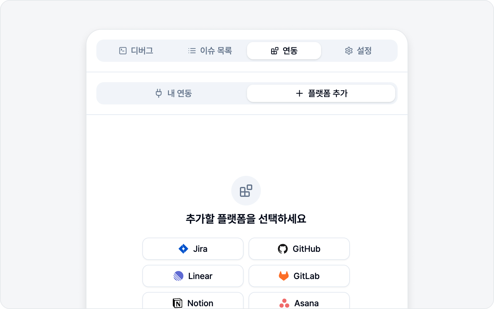

# 연동 설정

애써 만든 리포트도 결국 팀이 쓰는 이슈 트래커로 가야 빛을 발하죠. **연동** 탭에서 Jira·GitHub·Linear·Notion·GitLab·Asana·ClickUp 중 쓰시는 플랫폼을 연결해 두면, 캡처한 버그를 그 플랫폼의 이슈로 바로 등록할 수 있습니다. 정식 이슈 전에 팀에 빠르게 공유하고 싶다면 **Slack**으로도 보낼 수 있습니다.

아직 연결된 플랫폼이 하나도 없어도 괜찮습니다. 캡처하고 초안을 쓰는 것까지는 그대로 하실 수 있고, 연결이 필요한 순간에 노란색 **"플랫폼을 추가해 이슈를 등록하세요."** 배너가 캡처 화면과 미리보기 화면 아래에 떠서 안내해 드립니다. 오른쪽 **플랫폼 추가**를 누르면 이 **연동** 탭으로 바로 넘어옵니다. 부담 없이, 플랫폼 하나 연결하는 것으로 시작해 보세요.

## 바로가기

- [플랫폼 연동](platforms.md) — 8개 플랫폼을 연결하는 방법과 입력값.
- [이슈 트래킹](issue-tracking.md) — 작성한 초안·제출한 이슈를 모아 보고 관리.
