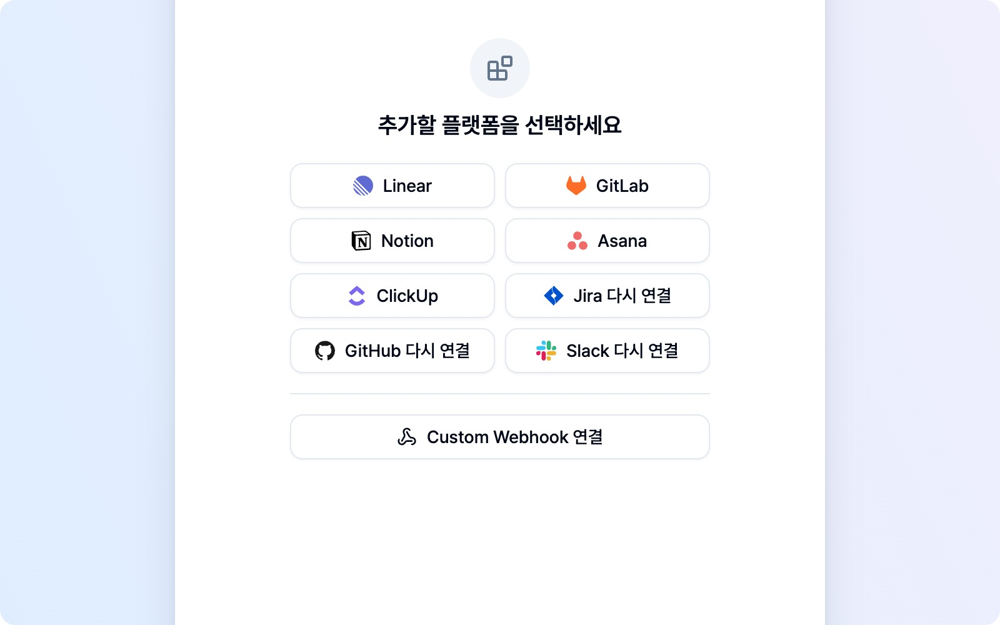
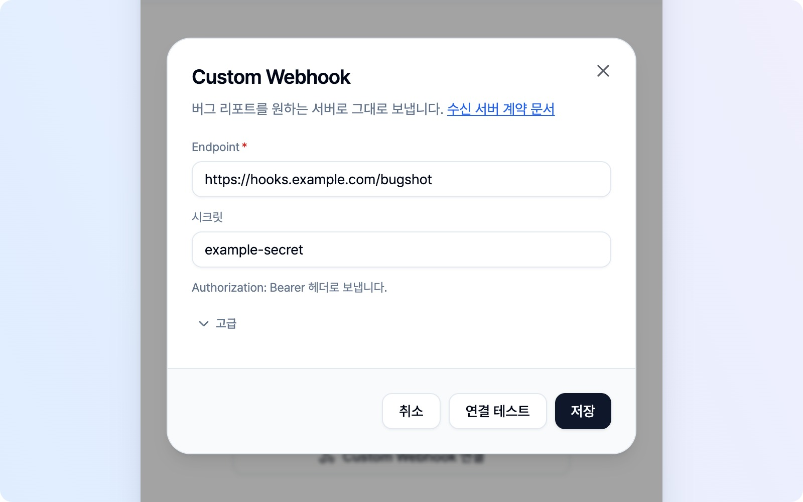
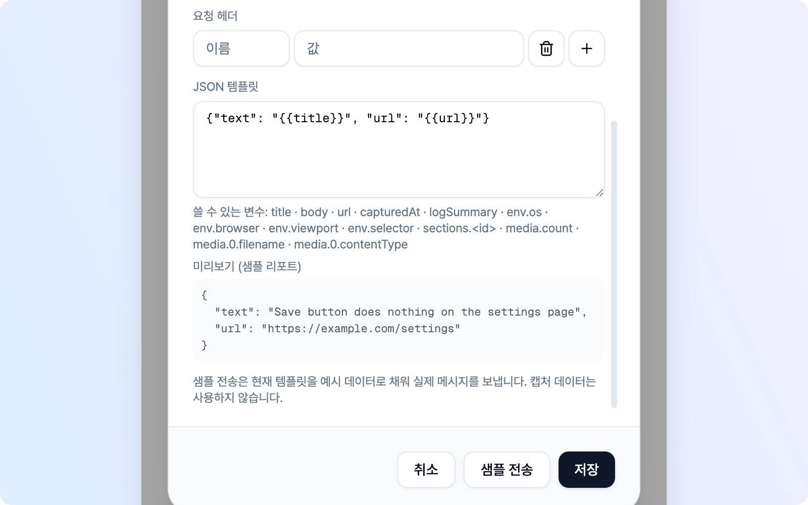

# Custom Webhook

팀에서 쓰는 도구가 지원 플랫폼 목록에 없거나, 사내 시스템으로 리포트를 바로 받고 싶으신가요? **Custom Webhook**으로 직접 운영하는 서버에 버그 리포트를 보낼 수 있습니다. 캡처와 본문은 브라우저에서 지정한 주소로 곧장 가며, BugShot 서버를 거치지 않습니다.

먼저 **리포트를 받을 서버와 그 주소**를 준비해 주세요. 팀원이 사용하는 경우에는 서버 담당자에게 주소와 시크릿을 받으면 됩니다. 서버를 만드는 개발자를 위한 [수신 서버 계약 문서](https://github.com/SinhyeokKang/bugshot-2/blob/main/docs/webhook-contract.md)는 영문으로 제공하며, 요청·응답 형식과 실행 가능한 예제 서버를 담고 있습니다.

> 리포트에는 스크린샷·로그처럼 민감할 수 있는 내용이 포함됩니다. 믿을 수 있는 서버 주소를 사용해 주세요. 수신한 데이터를 어떻게 저장하고 사용하는지는 해당 서버를 운영하는 쪽에서 관리합니다.

## 연결하고 테스트하기

1. **연동 → 플랫폼 추가**를 열고, 플랫폼 목록 아래의 **Custom Webhook 연결**을 누릅니다.
2. **Endpoint**에 리포트를 받을 주소를 입력합니다. 이 항목은 한국어 화면에서도 영문으로 표시됩니다.
3. 서버에서 시크릿을 요구한다면 **시크릿**을 입력합니다. 선택 항목이며, 입력한 값은 `Authorization: Bearer` 헤더로 전송됩니다. 서명 방식은 아닙니다.
4. 기본 형식인 **Multipart**를 그대로 둔 상태에서 **연결 테스트**를 눌러 서버 응답을 확인합니다. 리포트 대신 작은 확인용 요청을 보내므로, 서버 담당자는 계약 문서의 연결 테스트 처리 방법을 적용해야 합니다.
5. **저장**을 누릅니다. 테스트만으로 설정이 저장되지는 않습니다.

주소는 `https`를 사용합니다. 사내망이나 `localhost` 같은 공개되지 않은 주소는 `http`도 허용하지만, 암호화되지 않는다는 안내가 표시됩니다. 다른 주소로 이동시키는 응답은 따라가지 않으니 **최종 수신 주소**를 입력해 주세요.

저장한 뒤 이슈 제출 대상에서 **Custom Webhook**을 고르면 됩니다. 프로젝트나 채널을 따로 선택할 필요 없이 설정한 주소로 보냅니다. 팀원마다 자신의 브라우저에서 연결해 주세요.

## 고급 설정과 전송 형식

기본 전송만 필요하면 **고급**은 접어 두셔도 됩니다. 받는 서비스에 맞춰 형식이나 헤더를 바꿀 때 펼쳐 주세요. 고급 값을 저장해 두었다면 다음에 열 때 펼쳐진 상태로 표시됩니다. **Multipart**는 한국어 화면에서도 영문으로 표시됩니다.

| 형식 | 전송 내용 | 제출 후 이슈 목록 |
|---|---|---|
| **Multipart**(기본) | 본문과 함께 캡처한 이미지·영상·로그 파일·첨부 파일을 한 번에 전송 | 서버가 돌려준 이슈 주소로 항목 생성 |
| **JSON 템플릿** | 받는 서비스에 맞춘 JSON 본문만 전송. **미디어는 전송하지 않음** | **항목을 만들지 않음** |

**요청 헤더**는 서버가 추가 값을 요구할 때 이름과 값으로 입력합니다. 브라우저가 보낼 수 없는 헤더나 중복된 이름은 저장할 때 알려 드립니다. `Authorization`을 직접 넣으면 **시크릿** 칸보다 이 헤더가 우선합니다.

**JSON 템플릿**은 Slack·Discord처럼 정해진 형식으로 받는 훅에 사용할 수 있습니다. `{{title}}`·`{{body}}` 같은 변수를 넣고, 입력란 아래에서 사용할 수 있는 변수와 **미리보기 (샘플 리포트)**를 확인해 주세요. 잘못된 JSON이나 지원하지 않는 변수는 저장할 때 알려 드립니다. 상세 변수 목록과 수신 규격은 수신 서버 계약 문서에서 확인할 수 있습니다.

JSON 템플릿을 선택하면 **연결 테스트** 대신 **샘플 전송**이 나타납니다. 현재 입력한 템플릿을 예시 데이터로 채워 보내며, 현재 캡처 데이터는 사용하지 않습니다. 다만 **수신처에 실제 메시지가 생길 수 있습니다**. 미리보기를 확인한 뒤 보내고, 설정을 유지하려면 **저장**을 눌러 주세요.

> 전송 시간이 초과되어도 서버에는 이미 도착했을 수 있습니다. 리포트나 샘플을 다시 보내기 전에 수신 여부를 확인해 주세요.

## 설정 수정과 제출 결과

주소·시크릿·템플릿을 바꾸려면 **연동 → 플랫폼 추가 → Custom Webhook 설정 수정**을 엽니다. 기존 값이 채워져 있으니 필요한 항목을 고친 뒤 **저장**하면 됩니다.

Multipart로 제출한 리포트는 이슈 목록에 **등록됨**으로 표시됩니다. 카드를 누르면 서버가 돌려준 주소가 열립니다. 서버 쪽 처리 상태는 동기화하지 않으므로, 진행 상황은 해당 주소에서 확인해 주세요. JSON 템플릿은 이슈 목록에 항목을 남기지 않으니 수신처에서 결과를 확인합니다.

연결이나 제출에 실패하면 안내에 따라 주소·시크릿을 확인해 주세요. 서버가 응답했더라도 Multipart의 필수 응답 형식이 맞지 않으면 제출 실패로 표시되고 원본 리포트는 유지됩니다. 이때는 서버 담당자에게 계약 문서의 응답 규격을 확인해 달라고 요청하면 됩니다.
