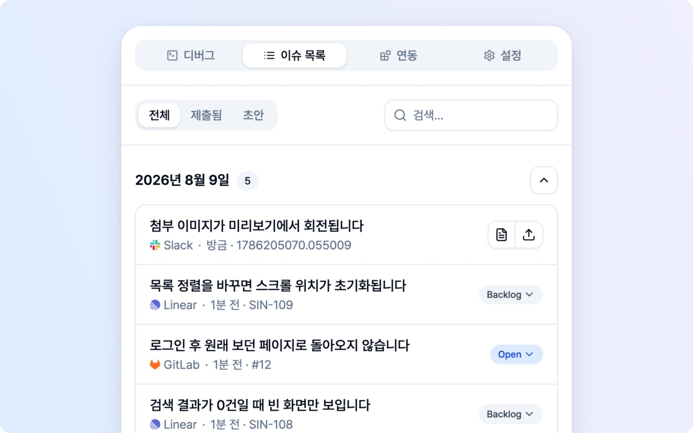
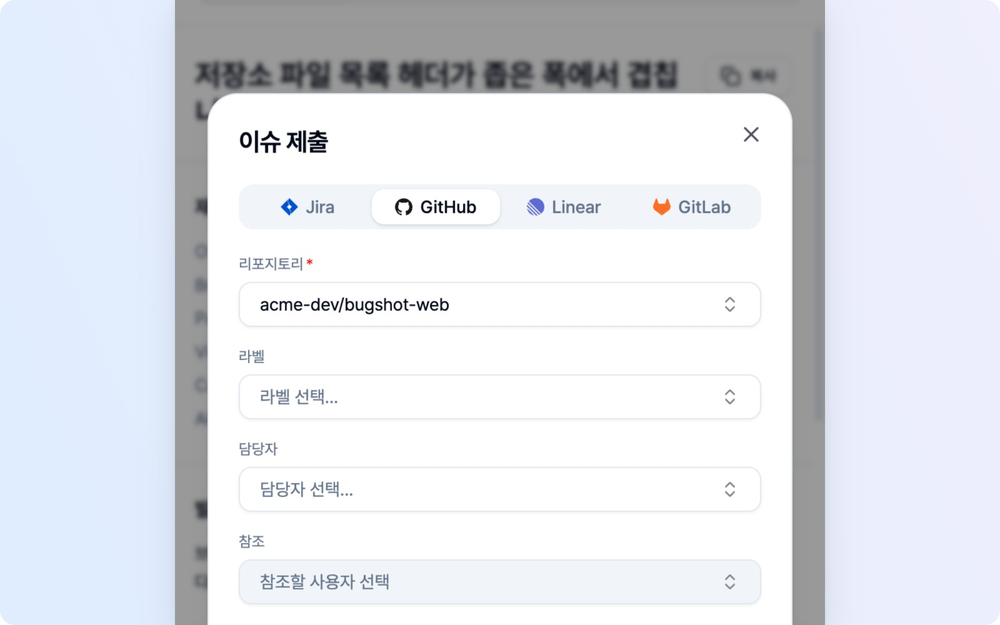
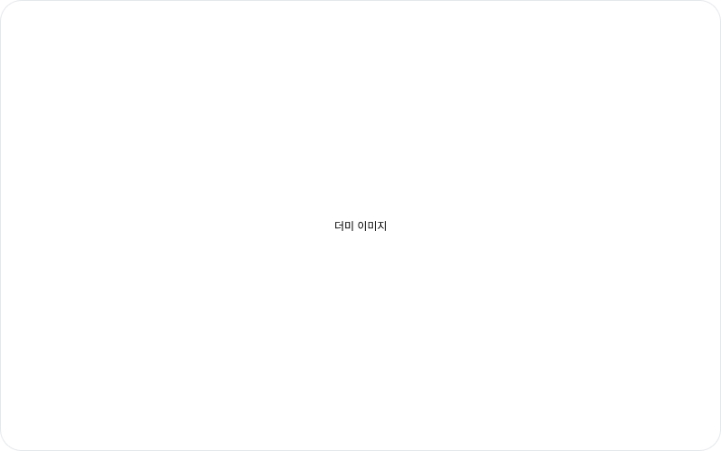

# 이슈 트래킹

지금까지 작성한 초안과 제출한 이슈가 어디 있는지 헷갈리실 일 없습니다. **이슈 목록** 탭에서 한곳에 모아 보실 수 있습니다.

## 찾고 거르기

목록이 길어져도 금방 찾을 수 있습니다.

- **필터** — 전체 / 제출됨(Submitted) / 초안(Draft)으로 거릅니다.
- **검색** — 제목으로 찾습니다.
- **날짜 그룹** — 작성·제출 날짜별로 묶여 표시됩니다.

## 행을 열면

행의 상태에 따라 열리는 화면이 다릅니다.

- **초안(Draft)** — 편집할 수 있습니다. 이어서 작성하거나 내용을 고쳐 제출하면 됩니다.
- **제출됨(Submitted)** — 등록된 플랫폼의 이슈를 엽니다. 복구 안내가 있는 행은 읽기 전용 복구 상세를 엽니다.
- **Slack 보존 이슈** — 연결된 트래커가 있으면 **자세히**에서 보존 원본과 초안을 확인·수정하고 **트래커로 등록**할 수 있습니다. 복구가 남아 있으면 먼저 확인해야 합니다.

## 첨부나 등록 결과를 확인해야 할 때

이슈가 등록돼도 일부 파일이 전달되지 않거나 본문 링크가 빠질 수 있습니다. **첨부 확인 필요**가 붙은 행을 열면 파일별 상태와 보존된 사본을 확인할 수 있습니다. 등록된 이슈는 **제출됨** 목록에 그대로 남습니다. 연결을 해제했더라도 브라우저에 남은 복구 상세는 열 수 있습니다.

**다운로드**로 필요한 파일을 내려받아 등록된 이슈에 직접 첨부할 수 있습니다. Notion 로그는 ZIP, Asana용 이미지는 JPEG처럼 제출할 때 준비된 형식으로 받습니다. 내려받기만 해서는 원격 첨부가 완료된 것으로 표시되지 않습니다. **로컬 파일 없음**이면 보존 기한이 지났거나 브라우저의 파일이 없어 내려받을 수 없는 상태입니다.

## 첨부 다시 시도하기

못 올라간 파일이 있어도 이슈를 새로 만들 필요는 없습니다. **첨부 확인 필요** 행 오른쪽의 회전 화살표 버튼(**첨부 재시도**), 또는 복구 상세 아래쪽의 **첨부 재시도** 버튼을 누르면 됩니다. 이미 등록된 그 이슈를 찾아 남은 파일만 다시 올리고, 필요하면 본문에 링크를 채웁니다. 이 과정에서 **새 이슈는 절대 만들어지지 않으니** 중복 등록은 걱정 마세요.

- **된 일은 다시 하지 않습니다.** 업로드는 됐는데 본문 링크만 빠진 파일은 다시 올리지 않고 본문만 고칩니다. 파일 중 일부만 성공했다면 다음 시도는 남은 파일만 처리합니다.
- **다른 사람이 고친 내용은 그대로 둡니다.** 그새 본문에 문장이 추가됐거나 상태·담당자가 바뀌었어도 건드리지 않고, 첨부가 들어갈 자리에만 링크를 채웁니다.
- **첨부 자리를 고치거나 지웠다면 덮어쓰지 않습니다.** 파일 행에 **이슈 본문이 수정돼 링크를 넣지 못했어요**가 보이고, 이미 올라간 파일은 다시 올리지 않습니다. 이슈를 열어 직접 확인해 주세요.
- **한 번에 한 가지만 실행됩니다.** 실행 중에는 버튼에 돌아가는 표시가 뜨고(복구 상세에서는 **첨부 재시도 중**) 연타해도 한 번만 시작합니다. 다른 사이드 패널에서 같은 이슈를 처리 중이면 조용히 건너뜁니다. 재시도 중에는 **로컬 사본 삭제**도 잠깁니다.
- **결과는 바로 알려 드립니다.** 전부 끝나면 **첨부 N개 완료** 알림과 함께 확인 표시가 사라집니다. 일부가 또 실패하면 **다시 N개 실패**와 함께 남은 파일이 갱신됩니다. 중복 첨부가 될 수 있는 업로드나 연결은 결과를 알 수 없으면 **결과 확인 필요**로 안내하고 자동으로 다시 보내지 않습니다(플랫폼별 예외는 [플랫폼 연동](platforms.md) 참고).

> 재시도는 이슈 본문을 읽고 곧바로 갱신하는 방식이라, 거의 같은 순간에 다른 사람이 같은 본문을 고치면 그 수정이 덮일 수 있습니다. 드문 경우지만 여럿이 활발하게 편집 중인 이슈라면 재시도 뒤에 이슈를 한 번 열어 보세요.

### 다시 시도할 수 없을 때

버튼이 보이지 않거나 눌렀더니 멈추면, 복구 상세에 이유와 대안이 함께 표시됩니다. 어느 경우든 **다운로드**는 계속 쓸 수 있습니다.

| 상황 | 안내 | 해 보실 일 |
|---|---|---|
| 처음 제출한 계정과 다른 계정이 연결됨(눌러 보면 알게 됩니다) | 처음 제출한 계정과 달라서 자동 재시도할 수 없다는 안내 | 연동 탭에서 그 계정으로 다시 연결하거나, 파일을 내려받아 직접 첨부 |
| 처음 제출할 때 계정을 확인하지 못한 기록 | 버튼이 처음부터 숨겨지고 "자동 재시도 불가" 안내 | 파일을 내려받아 직접 첨부 |
| 연결이 끊김·인증 만료 | 다시 연결 안내 | 연동 탭에서 다시 연결(기본값 초기화 등은 [플랫폼 연동](platforms.md) 참고) |
| 수정 권한 없음(403) | 권한 안내 | **이슈 열기**로 확인하거나 직접 첨부 |
| 이슈를 찾을 수 없음(404, 삭제 등) | 새로 만들지 않음 | 파일을 내려받아 필요한 곳에 첨부. 링크가 의미 없어 **이슈 열기**는 숨겨집니다 |
| 결과 확인 필요 | 이미 올라갔을 수 있어 자동으로 다시 보내지 않음 | **이슈 열기**로 확인하고, 없으면 다운로드해 첨부 |
| 이전 버전에서 남은 기록 | 자동 재시도 미지원 | 다운로드해 직접 첨부 |
| Custom Webhook | 첨부 재시도 버튼이 없습니다 | 다운로드해서 사용 |
| **로컬 파일 없음**(파일 하나만 없을 때) | 그 파일만 재시도 불가 | 나머지 파일은 계속 재시도할 수 있습니다 |
| **로컬 파일 없음**(보존 기한이 지났거나 로컬 사본을 삭제함) | 버튼이 숨겨집니다 | 남은 파일이 없어 재시도할 수 없으니 이슈를 열어 직접 확인해 주세요 |

**결과 확인 필요**가 뜬 뒤에도 버튼이 남아 있다면, 이슈의 계정이나 상태를 잠깐 확인하지 못한 경우일 수 있습니다. 이때는 확인만 다시 하니 한 번 더 눌러 보세요. 다만 실행 중 예상하지 못한 오류로 같은 안내가 나왔다면 일부 쓰기가 이미 반영됐을 수 있으니, 이슈를 열어 먼저 확인해 주세요.

**등록됐는지 확인할 수 없어요**가 보이면 먼저 목적지에서 이슈가 생겼는지 확인해 주세요. 중복 생성을 막기 위해 다시 제출할 수 없습니다. 이슈가 없다는 것을 직접 확인한 경우에만 **등록되지 않았음 확인**을 누르고 확인 창에서 진행합니다. 창을 닫으면 상태는 그대로입니다.

## 목록 새로고침

제출한 이슈가 플랫폼에서 어떤 상태인지(열림·닫힘 등) 다시 가져옵니다. 해당 플랫폼이 **연결되어 있어야** 동작하니 이 점만 기억해 두세요.

## 모두 삭제

목록의 모든 이슈를 한 번에 지웁니다. 로컬에 저장된 초안·기록과 연결된 복구 자료를 정리하며, 플랫폼에 이미 등록된 이슈 자체는 그대로 남으니 걱정하지 않으셔도 됩니다.

첨부 전송이나 제출 후속 처리가 끝나지 않았거나 등록 여부를 확인할 수 없으면, 필요한 파일은 브라우저 안에 보존됩니다. 보존 기한은 제출 시도부터 30일이며, 기한이 지난 뒤 사이드 패널을 열면 정리됩니다. 해당 이슈 기록을 삭제하면 연결된 복구 기록도 정리됩니다. 다른 초안이 함께 쓰는 파일은 그 초안을 위해 남을 수 있습니다.

복구 상세의 **로컬 사본 삭제**를 확인하면 보존된 복구 파일을 바로 정리할 수 있습니다. 등록이 확인된 이슈는 복구 표시도 정리되지만 원격 이슈와 첨부는 그대로입니다. 등록 여부가 불명확한 경우에는 파일을 지워도 재제출 차단이 유지됩니다. Slack 승격용 원본이나 다른 초안이 공유하는 원본은 보존될 수 있습니다.
