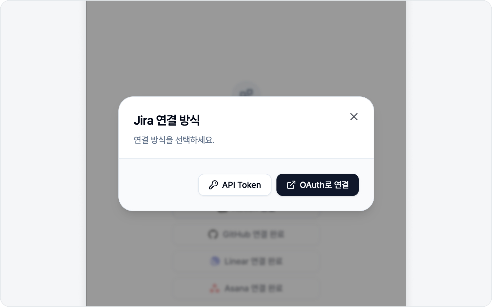
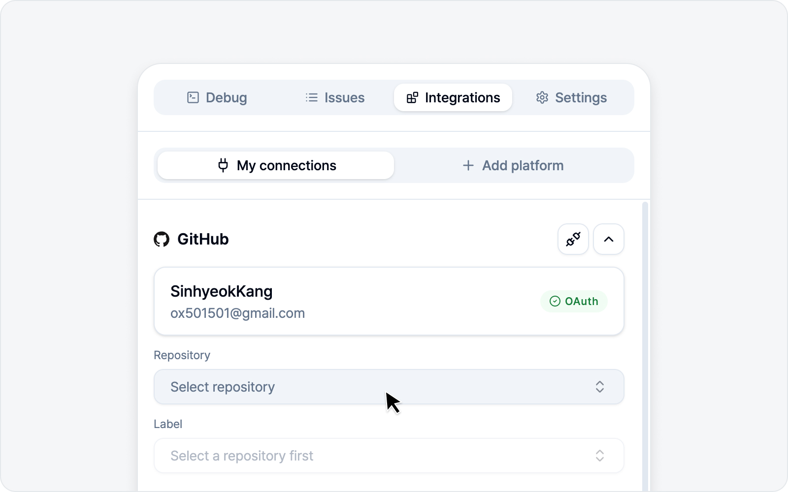

# 플랫폼 연동

플랫폼 연결은 **연동** 탭에서 합니다. 연결된 플랫폼이 없으면 "플랫폼 추가" 화면으로, 하나라도 있으면 "내 연동" 화면으로 들어갑니다.

## 연결하는 법

생각보다 간단합니다. 세 단계면 됩니다.

1. "플랫폼 추가"에서 연결할 플랫폼을 고릅니다.
2. 연결 방식 선택 다이얼로그가 뜨면 **OAuth**(브라우저 로그인) 또는 **토큰 직접 입력** 중 하나를 고릅니다.
3. OAuth면 로그인 창에서 권한을 허용하면 끝, 토큰 방식이면 발급한 토큰과 필요한 값을 입력합니다.

대부분은 OAuth가 가장 편합니다. 다만 조직 정책으로 OAuth를 못 쓰거나 토큰을 선호하신다면 토큰 방식을 쓰면 됩니다. 참고로 **Slack은 OAuth 연결만 지원**하므로, "Slack 연결"을 누르면 바로 로그인 창이 뜹니다.

## 플랫폼별 연결 정보

| 플랫폼 | 연결 방식 | 토큰 입력 시 필요값 | 토큰 발급 |
|---|---|---|---|
| Jira | OAuth / API Token | baseUrl, email, apiToken | id.atlassian.com → API tokens |
| GitHub | OAuth / PAT | PAT | github.com/settings/tokens |
| Linear | OAuth / API Key | apiKey | linear.app 보안 설정 |
| Notion | OAuth / Internal Token | token | notion.so 통합(Integration) |
| GitLab | OAuth / PAT | instanceUrl(self-managed만), pat | gitlab.com PAT |
| Asana | OAuth / PAT | pat | app.asana.com my-apps |
| ClickUp | OAuth / API Token | pat | app.clickup.com 설정 > Apps |
| Slack | OAuth 전용 | — (토큰 입력 없음) | — |

## Slack — 채널·DM으로 가볍게 공유

Slack은 이슈 트래커가 아니라 메시지 앱이라, 다른 플랫폼과는 조금 다르게 동작합니다. 정식 이슈로 올리기 전에 "이거 깨졌어요" 하고 팀 채널에 먼저 던지고 싶을 때 딱 맞습니다.

- **본인 계정으로 전송**: OAuth로 연결하면 **본인 이름으로** 메시지를 보냅니다(봇이 아니라요). 그래서 채널에 따로 봇을 초대할 필요가 없습니다.
- **어디로 보낼지**: 공개 채널·비공개 채널은 물론 DM까지, 본인이 참여 중인 대화면 어디든 고를 수 있습니다. (참여하지 않은 채널은 목록에 뜨지 않습니다.)
- **제목은 채널에, 상세는 스레드로**: 제목이 채널에 메시지로 올라가고, 환경 정보·스타일 변화·로그 요약 같은 상세 내용과 스크린샷·영상·로그 파일은 그 메시지의 **스레드 답글**로 정리됩니다. 채널 타임라인은 제목 한 줄로 깔끔하게 유지됩니다.
- **멘션**: 호명할 멤버를 고르면 메시지에서 `@이름`으로 불러 알림을 보냅니다.

> Slack은 메시지라 "열림/닫힘" 같은 상태가 없습니다. 그래서 이슈 목록에는 "전송됨" 표시만 뜨고, 누르면 해당 메시지로 바로 이동합니다.

## 연결 후 기본값

연결하면 그 플랫폼에서 이슈를 만들 위치의 기본값을 골라 둘 수 있습니다 — Jira·GitLab의 프로젝트, GitHub의 저장소, Linear의 팀, Notion의 데이터베이스, Asana의 프로젝트, ClickUp의 리스트(워크스페이스 → 스페이스 → 리스트 순으로 선택), Slack의 채널처럼요. 한 번만 정해 두면 이슈를 쓸 때마다 다시 고르지 않아도 되니 한결 편합니다.

## 연결 해제

"내 연동"에서 플랫폼별로 연결을 끊을 수 있고(플러그 해제 아이콘), 모든 연결을 한 번에 해제하는 것도 가능합니다. 해제해도 이미 제출한 이슈에는 아무 영향이 없으니 안심하세요.

---

🌐 [English](https://bugshot.gitbook.io/en/integrations/platforms)
