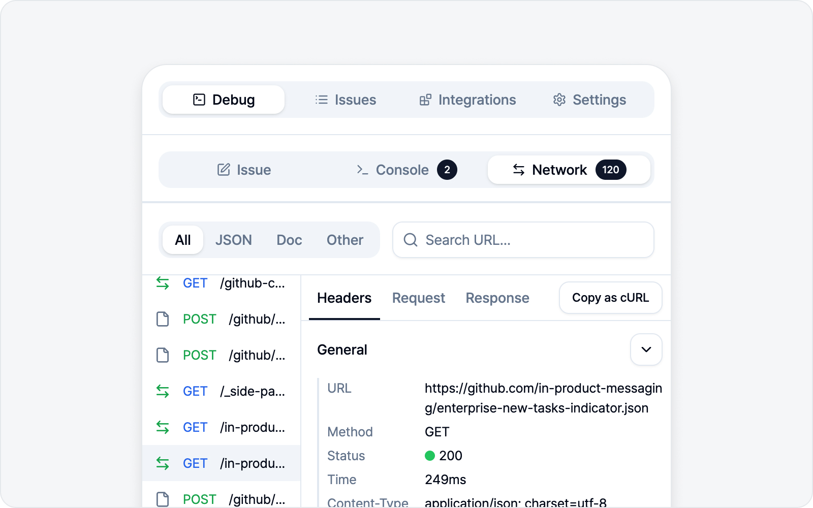

# 실시간 로그

🌐 [English](https://bugshot.gitbook.io/en/logs/live)

**디버그** 탭에는 콘솔·네트워크 서브탭이 있어서, 지금 페이지에서 일어나는 로그를 사이드패널 안에서 바로 볼 수 있습니다. 로그는 실시간으로 알아서 쌓이니, 따로 새로고침하지 않으셔도 됩니다.

콘솔·네트워크 모두, 페이지에 끼어 있는 **다른 출처(iframe, 예: 결제 위젯·임베드)** 에서 나는 로그까지 함께 잡습니다. 이렇게 여러 출처의 로그가 섞이면 로그 목록 위에 **출처 필터**가 나타납니다. 보고 싶은 출처 버튼을 누르면 그 출처 로그만 보이고, 같은 버튼을 다시 누르면 전체로 돌아옵니다(아무것도 선택하지 않은 상태가 전체입니다). 출처를 알 수 없는 로그는 **(알 수 없음)** 으로 묶입니다. 지금 보고 있는 페이지의 로그만 따로 보고 싶을 때 편리합니다.

## 콘솔

페이지에 찍히는 콘솔 출력을 정보·경고·에러까지 빠짐없이 모아 봅니다. 코드에서 직접 띄운 경고·에러(`console.warn`·`console.error`)는 물론, 미처 못 잡힌 예외까지 함께 담아 두니 놓칠 걱정이 없습니다.

- **필터·검색** — 레벨(에러·경고 등)로 거르거나 키워드로 찾습니다.
- **상세** — 항목을 펼쳐 자세한 내용을 봅니다.
- **로그 지우기** — 모아 둔 로그를 비웁니다.

## 네트워크

페이지에서 오간 네트워크 요청을 봅니다.

- **필터·검색** — 요청을 유형별로 거르거나, 검색창으로 찾습니다. 검색은 주소(URL)뿐 아니라 요청·응답 **본문과 헤더**까지 함께 살피니, URL이 기억나지 않아도 응답에 담겼던 값 한 조각으로 바로 찾을 수 있습니다.
- **상세** — 요청·응답 내용을 펼쳐 봅니다.
- **cURL 복사** — 요청을 cURL 명령으로 복사해 터미널에서 그대로 재현해 볼 수 있습니다.
- **로그 지우기** — 모아 둔 로그를 비웁니다.

### WebSocket

실시간 양방향 통신(WebSocket)을 쓰는 페이지라면, WebSocket 연결도 네트워크 목록에 함께 잡힙니다. 위쪽 **WS** 필터를 누르면 WebSocket 연결만 따로 모아 볼 수 있어요. 연결을 누르면 **메시지** 탭이 열리고, 주고받은 메시지가 시간순으로 쌓입니다 — 보낸 메시지(▲)와 받은 메시지(▼)를 한눈에 구분할 수 있고, **전체·송신·수신**으로 방향을 좁혀 볼 수도 있습니다. 메시지를 누르면 내용을 펼쳐 봅니다.

> 글자로 된 메시지를 담습니다. 이미지·파일 같은 바이너리 메시지는 내용 없이 건너뛰며, 건너뛴 개수를 메시지 탭 위에 함께 보여 드리니 빠진 게 있는지 바로 아실 수 있습니다.

## 로그만으로 이슈 만들기 (freeform)

캡처(요소·스크린샷·영상) 없이 **로그만 담아 이슈를 만들 수도 있습니다**. 콘솔·네트워크를 보다가 **이슈 작성** 버튼을 누르면, 캡처 단계를 건너뛰고 바로 이슈 초안으로 들어갑니다. 콘솔·네트워크 로그를 첨부해 그대로 제출하면 됩니다.

> 이슈 작성 흐름(제목·본문·미리보기·제출)은 다른 모드와 같습니다. [이슈 작성(스크린샷)](../screenshot/issue.md)의 공통 단계를 참고하세요.
