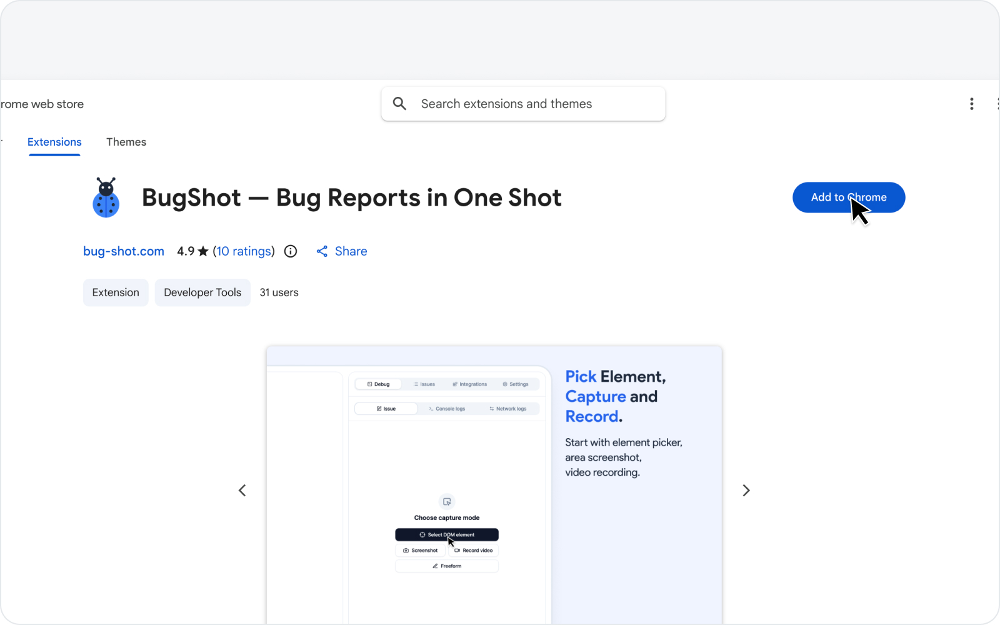
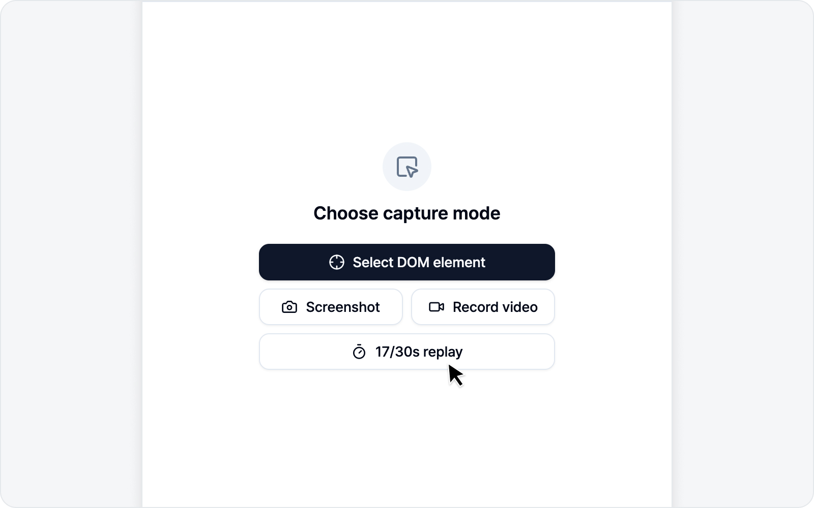
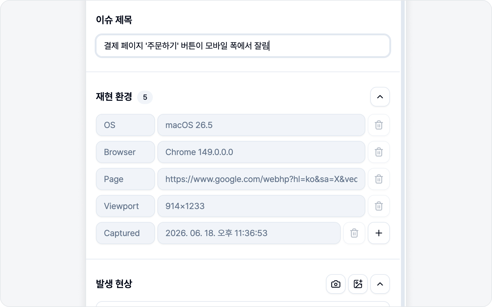
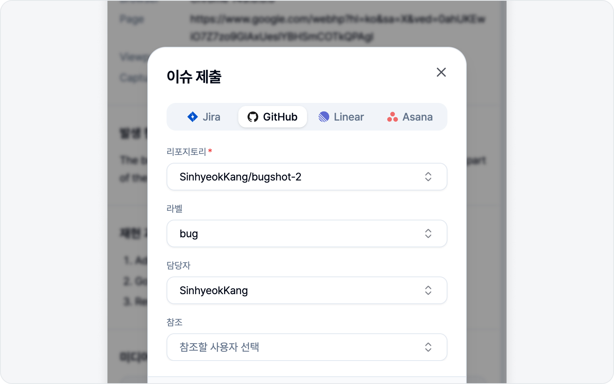

# 빠른 시작

처음이라도 걱정 마세요. 설치부터 첫 이슈 제출까지 5분이면 충분합니다. 아래 흐름을 한 번만 천천히 따라 해 보시면, 그다음부터는 손에 익습니다.

## 1. 설치하기

[Chrome 웹스토어](https://chromewebstore.google.com/detail/bugshot/ohakhekagkodklkickemonmifdcbhmig)에서 BugShot을 설치합니다. 설치하면 툴바에 BugShot 아이콘이 생깁니다.

## 2. 사이드패널 열기

툴바의 BugShot 아이콘을 클릭하거나, 단축키 `Cmd/Ctrl+Shift+E`를 누르면 사이드패널이 열립니다.

> 혹시 단축키가 안 먹는다면, OS나 다른 확장과 겹쳐서 배정이 안 된 걸 수 있습니다. 그럴 땐 툴바 아이콘으로 열면 됩니다.

## 3. 플랫폼 연결하기

이슈를 보내려면 플랫폼이 하나는 연결되어 있어야 합니다. **연동** 탭에서 Jira·GitHub·Linear·Notion·GitLab·Asana·ClickUp 중 하나만 연결하면 됩니다. 자세한 방법은 [플랫폼 연동](integrations/platforms.md)에서 차근차근 안내해 드립니다.

> 지금 연결하기 번거로우시면 건너뛰셔도 괜찮습니다. 캡처하고 초안을 쓰는 것까지는 그대로 되고, 제출할 때가 되면 화면 아래 배너가 여기로 안내해 드립니다.

## 4. 캡처하기

**디버그** 탭에서 캡처 모드를 고릅니다.

- **요소 스타일 편집** — 요소를 골라 스타일을 고친 뒤 before/after로 리포트.
- **요소 캡처** — 요소를 클릭하면 그 요소만 잘라 스크린샷으로.
- **범위 캡처** — 영역을 드래그하거나, 보이는 화면 전체·스크롤을 포함한 페이지 전체를 한 번에 캡처하고 주석으로 표시.
- **화면 녹화** — 동작을 영상으로 녹화.

뭘 골라야 할지 망설여진다면, 처음에는 **범위 캡처**가 가장 간단합니다.

## 5. 본문 작성하기

캡처하면 이슈 초안 화면으로 넘어갑니다. 제목과 발생 현상·재현 과정·기대 결과를 적으면 되는데, 재현 환경(OS·브라우저·URL 등)은 알아서 채워지니 신경 쓰지 않으셔도 됩니다.

## 6. 제출하기

미리보기로 본문을 한 번 확인하고, 연결한 플랫폼의 필드(프로젝트·담당자 등)를 채운 뒤 **이슈 제출**을 누르면 끝입니다. 등록된 이슈 링크가 바로 표시됩니다.

---

각 단계의 자세한 내용이 궁금하시면 [요소 선택 & 스타일링](element/README.md), [스크린샷 캡처](screenshot/README.md), [녹화](video/README.md) 섹션에서 이어집니다.
