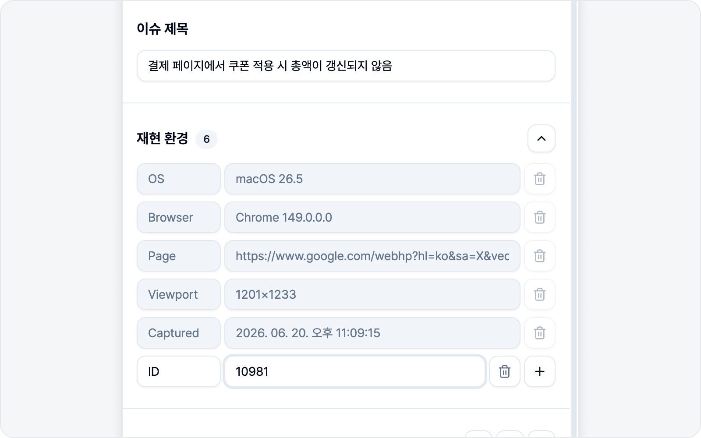
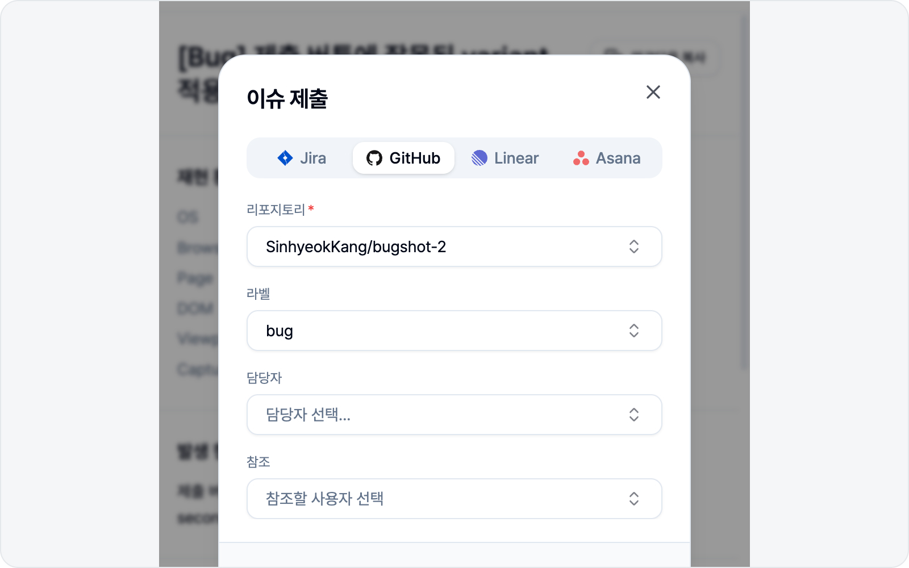

# 이슈 작성 (스크린샷 모드)

주석을 마치고 **주석 완료**를 누르면 이슈 초안이 열립니다. 아래 순서대로 채워 가면 됩니다.

## 1. 제목

설정해 둔 제목 접두어(예 `[QA] `)가 미리 채워져 있습니다. 이어서 제목을 적으면 됩니다.

## 2. 재현 환경

OS·브라우저·페이지 URL·뷰포트 크기·캡처 시각이 **알아서 채워집니다**(읽기 전용). 더 알리고 싶은 정보가 있으면 변수 행을 직접 더하셔도 됩니다.

## 3. 미디어 — 주석 스크린샷

스크린샷 모드의 미디어는 **주석을 입힌 스크린샷**입니다. 화살표·박스로 표시한 그 이미지가 그대로 이슈에 첨부됩니다. 미디어 섹션 오른쪽의 **다운로드** 버튼을 누르면 이 스크린샷을 이미지 파일로 따로 내려받을 수도 있습니다.

## 4. 본문 섹션

설정한 본문 구성대로 섹션이 나타납니다 — 발생 현상·재현 과정·기대 결과·비고(켜 둔 것만). 재현 과정은 번호 목록으로 입력합니다. 한 줄씩 직접 채워도 되고, 아래 AI 초안 작성으로 한 번에 채워도 됩니다.

### 문제된 로그를 본문에 넣기

발생 현상·기대 결과·비고처럼 **문단으로 쓰는 섹션**은 헤더 오른쪽에 **로그 추가** 버튼이 있습니다(재현 과정은 번호 목록이라 없습니다). "이 응답이 문제입니다"를 말로 풀어 쓰는 대신, 그 로그를 본문에 그대로 붙일 수 있습니다.

버튼을 누르면 **로그 추가** 창이 열립니다. **콘솔**·**네트워크** 탭에 각각 몇 건인지 배지로 보이고, 평소 로그를 보던 화면과 똑같이 검색·필터로 찾을 수 있습니다. 문제된 항목을 클릭해 오른쪽 상세에서 내용을 확인하신 뒤 **추가**를 누르면 됩니다.

- **네트워크** — 요청 경로·상태 코드와 함께 **요청·응답 본문**이 담깁니다. "200인데 응답은 실패"처럼 상태 코드만으론 안 보이는 문제를 그대로 보여줄 수 있습니다.
- **콘솔** — 출력된 메시지가, 에러라면 스택 트레이스까지 함께 담깁니다.

들어간 로그는 코드 블록으로 보이지만 **그냥 텍스트**라, 필요 없는 부분은 지우거나 고쳐도 괜찮습니다. 첨부되는 `logs.html`과는 별개입니다 — 첨부는 받는 사람이 파일을 열어야 보이지만, 이렇게 넣은 로그는 **이슈 본문에서 바로** 보입니다.

로그가 길어도 걱정 마세요. 15줄이 넘는 코드 블록은 **접힌 채로** 들어가서, 응답 하나가 화면을 다 차지하는 일은 없습니다. 전체를 보시려면 코드 블록에 마우스를 올려 아래쪽 가운데 뜨는 **펼치기 (38줄)** 버튼을 누르면 됩니다 — 괄호 안 숫자가 그 블록의 전체 줄 수입니다. 다시 **접기**를 누르면 접히고, 미리보기에서도 똑같이 동작합니다. 접힌 블록 안을 클릭해 고치기 시작하면 알아서 펼쳐지니 편하게 편집하셔도 됩니다. 접는 건 보기 편하라고 있는 것일 뿐, **등록되는 이슈 본문에는 늘 로그 전문이 그대로** 들어갑니다.

> 본문에 넣은 로그는 그 이슈를 볼 수 있는 사람 모두에게 그대로 보입니다. 특히 콘솔 로그는 마스킹 없이 원문이 담기니, 민감한 내용이 찍히는 화면이라면 넣기 전에 상세에서 한 번 확인해 주세요.

## ✨ AI 초안 작성

한 줄 한 줄 직접 적기 번거로우셨다면, 이 기능이 큰 힘이 됩니다. AI를 연결해 두면 본문 섹션 아래에 보라색 **"AI로 초안을 작성해보세요"** 배너가 나타납니다.

오른쪽 **AI 초안 작성**을 누르면 작은 입력창이 열립니다. 버그를 한 줄로 간단히 적고 **초안 작성**을 누르면 AI가 **제목과 본문 섹션을 한 번에** 채워 줍니다. 채워지는 건 켜 둔 섹션뿐이고, 제목 접두어도 그대로 유지됩니다. 이미 적어 두신 제목·본문이 있다면 그 내용까지 참고하고, 본문에 붙여 둔 이미지는 지우지 않고 그대로 둔 채 글만 다듬어 채웁니다.

스크린샷 모드에서는 **주석을 입힌 스크린샷 이미지**를 근거로 삼습니다. 한 줄 설명을 곁들이면 화면 속 문제를 더 정확히 읽어 초안에 반영합니다.

> AI도 가끔 실수하니 생성된 초안은 한 번 확인해 주세요. 배너는 AI를 연결했을 때만 보입니다 — 연결 방법은 [AI LLM 연동](../settings/ai.md)에 있습니다.

## 5. 로그 첨부

스크린샷 모드에서도 세 종류의 로그를 함께 첨부할 수 있습니다. **세 토글 모두 기본 켜짐**이라, 따로 손대지 않아도 함께 담깁니다. 필요 없으면 끄면 됩니다.

- **콘솔 로그** — 그동안 발생한 콘솔 출력·에러.
- **네트워크 로그** — 그동안 오간 네트워크 요청.
- **액션 로그** — 클릭·텍스트 입력·페이지 이동·단축키·토글·드롭다운 선택·드래그 앤 드롭까지, 스크린샷을 찍기까지 무엇을 했는지가 재현 단계로 담깁니다.

로그는 사이드패널이 열려 있는 동안 계속 모이고 있어서, 캡처 버튼을 누르기 **전**에 일어난 일까지 이미 담겨 있습니다.

> 입력 필드에 입력한 값과 드롭다운에서 고른 값은, 민감 정보로 판단되지 않으면 **원문 그대로 기록됩니다.** 어떤 값을 넣었을 때 문제가 생겼는지가 재현에 꼭 필요하기 때문입니다. 자세한 기준과 주의점은 [로그 뷰어](../logs/viewer.md)의 안내를 확인해 주세요.

로그 섹션 오른쪽의 **다운로드** 버튼을 누르면, 이슈에 첨부되는 것과 똑같은 로그 리포트(`logs.html`)를 등록 전에 직접 받아볼 수 있습니다.

> 로그를 보고 다루는 방법은 [실시간 로그](../logs/live.md)를 참고하세요.

## 6. 미리보기

제출 전 본문을 미리보기로 확인합니다. **복사**로 본문을 그대로 복사해 다른 곳에 붙여 넣을 수도 있습니다.

## 7. 제출

연결한 플랫폼의 필드(프로젝트·담당자·라벨 등)를 채우고 **이슈 제출**을 누르면 됩니다. 등록이 끝나면 이슈 링크가 표시됩니다.

필드 맨 아래엔 **참조**(CC) 칸도 있습니다. 이 버그를 함께 알아야 할 분들(리뷰어·디자이너·PM 등)을 골라 두면, 등록된 이슈 본문 맨 아래에 `cc @이름` 멘션으로 들어가고 각자에게 플랫폼 알림이 갑니다. 여러 명을 한 번에 고를 수 있고, 이름으로 검색해 빠르게 찾을 수 있어요. 한 번 고른 분들은 다음 이슈에도 미리 채워지니 매번 다시 고르지 않으셔도 됩니다.

> 참조는 레포·팀·프로젝트·워크스페이스처럼 상위 항목을 먼저 골라야 활성화됩니다. Notion만은 연결한 통합에 '사용자 정보 읽기' 권한이 있어야 멤버 목록을 불러올 수 있으니, 목록이 비어 있다면 설정에서 Notion을 다시 연결해 주세요.
