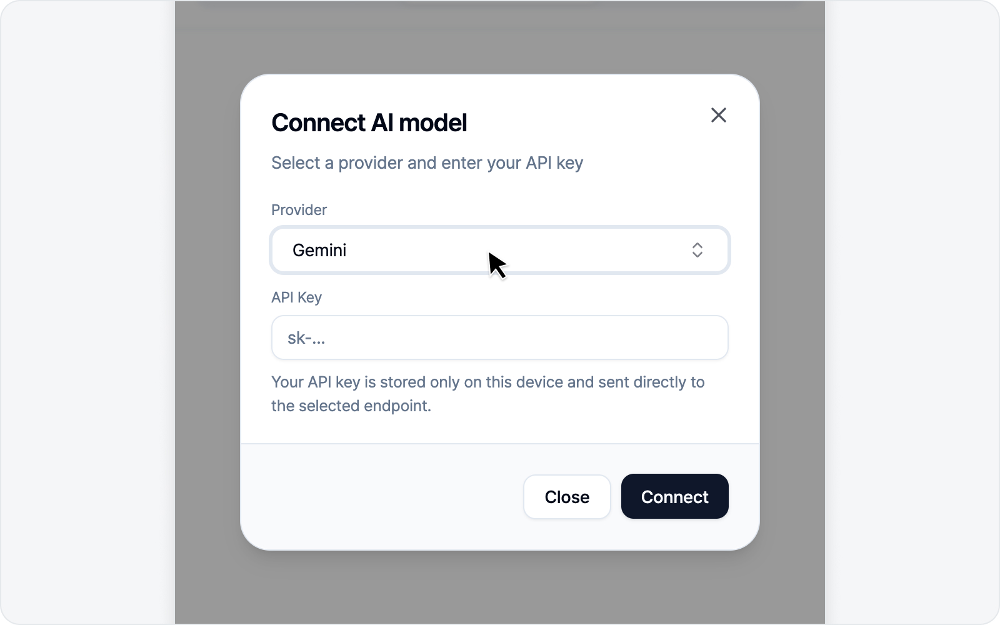
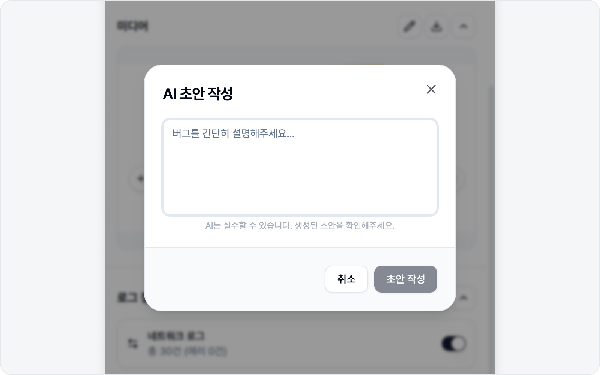

# AI LLM 연동

설정의 **AI 모델** 서브탭에서 직접 쓰시는 LLM을 연결할 수 있습니다. BugShot은 별도 AI 서버를 두지 않고, 여러분이 가진 키를 그대로 씁니다(BYOK — Bring Your Own Key). 그러니 내 키, 내 모델로 안심하고 쓰시면 됩니다.

키가 없어도 괜찮습니다. 브라우저에 Chrome 내장 AI가 준비돼 있으면 별도 설정 없이 그걸로 기본 AI 기능이 동작합니다.

## 연결하기

프로바이더를 고르고 키만 입력하면 됩니다.

- **프로바이더** — 쓰시는 LLM을 목록에서 고르거나, OpenAI 호환 엔드포인트 주소를 직접 입력합니다.
- **API Key** — 해당 서비스에서 발급한 키.

연결하면 사용할 모델을 고르는 화면이 이어지는데, **모델 선택**에서 원하는 모델을 고르시면 됩니다. OpenAI 호환 엔드포인트를 쓰는 프로바이더라면 대부분 무리 없이 연결됩니다. 별도의 권한 허용 절차는 없으니, 입력만 마치면 바로 연결됩니다.

## 어떤 AI로 동작하나요

BugShot은 아래 순서로 알아서 AI를 고릅니다. 여러분이 신경 쓸 일은 거의 없습니다.

1. **연결한 LLM이 있으면** 그 모델로 동작합니다. AI 기능 배너에 프로바이더 이름(예: OpenAI)이 배지로 표시됩니다.
2. **연결한 LLM이 없으면** Chrome 내장 AI로 자동 폴백합니다. 이때 배지에는 **Chrome AI**가 표시되고, 별도 키나 설정은 필요 없습니다.
3. **Chrome 내장 AI도 쓸 수 없는 환경이면** AI 기능이 화면에 나타나지 않습니다. 이럴 땐 위에서 LLM을 직접 연결하시면 됩니다.

> Chrome 내장 AI는 브라우저 버전·기기 환경에 따라 제공되지 않을 수 있습니다. 더 안정적으로 쓰시려면 LLM을 직접 연결하시는 편이 좋습니다.

## 켜지는 두 기능

AI가 준비되면 두 가지 기능을 쓸 수 있습니다.

### AI 스타일링

요소를 고를 때 "버튼을 둥글게", "여백을 키워" 같은 자연어 지시로 스타일을 바꿉니다. 자세한 사용법은 [스타일링](../element/styling.md)에서 다룹니다.

### AI 초안 작성

캡처·로그를 근거로 이슈 본문을 자동으로 채웁니다. 이슈 작성 화면에서 본문 섹션 아래에 보라색 **"AI로 초안을 작성해보세요"** 배너가 나타나고, 오른쪽 **AI 초안 작성**을 누르면 입력창이 열립니다.

여기에 버그를 한 줄로 가볍게만 적고(요소 모드에서는 비워 두셔도 됩니다) **초안 작성**을 누르면, AI가 제목과 켜 둔 본문 섹션을 한 번에 채워 줍니다. 캡처·로그뿐 아니라 이미 적어 두신 제목·본문도 참고하니, 다듬고 싶을 때 다시 눌러도 됩니다. 버그와 직접 관련된 로그가 있으면 **실제 로그 원문을 발생 현상에 코드 블록으로** 함께 넣어 주는데(에러뿐 아니라 정상으로 보여도 원인일 수 있는 200 응답까지 지목합니다), 로그 내용은 AI가 쓰는 게 아니라 캡처된 원문 그대로입니다. 모드마다 근거가 조금씩 다른데, 자세한 흐름은 [이슈 작성(요소)](../element/issue.md)에서 다룹니다.

> AI도 가끔 실수합니다. 생성된 결과는 제출 전에 한 번만 확인해 주세요.
