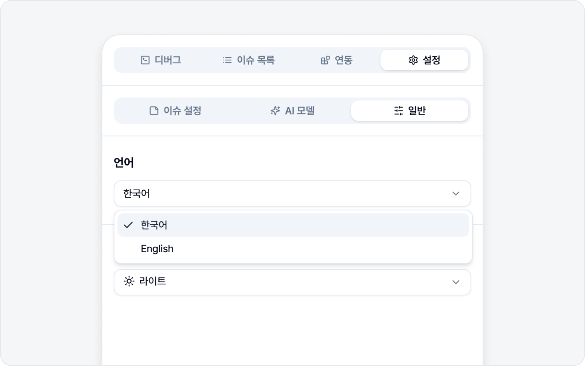
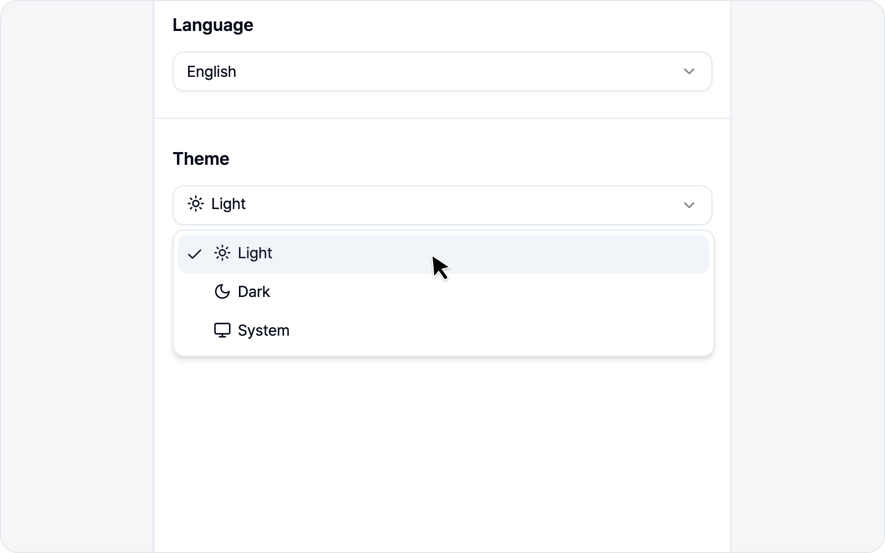
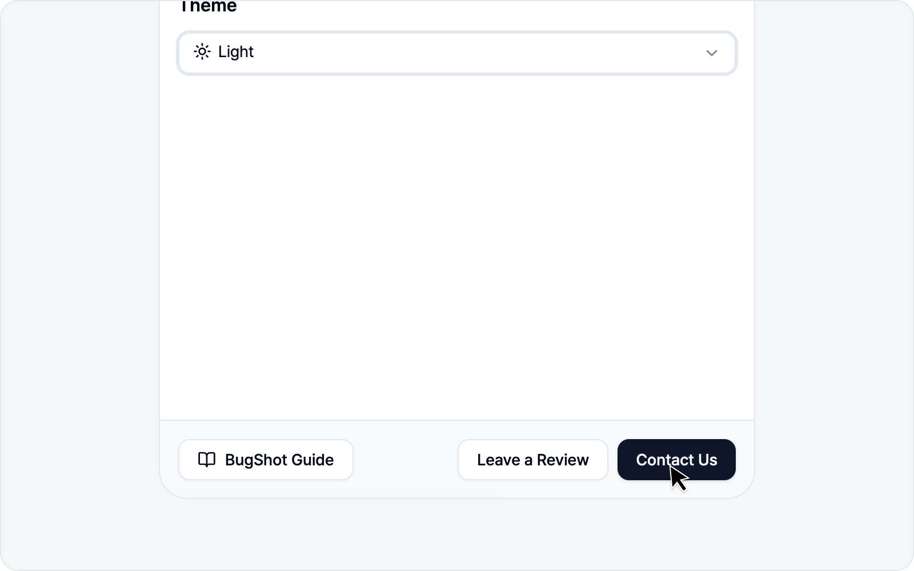

# 일반

언어와 테마처럼 한 번 맞춰 두면 계속 쓰게 되는 설정은 **일반** 서브탭에 모아 두었습니다. 복잡한 게 없으니 부담 없이 둘러보세요.

## 언어

BugShot의 화면 언어를 고릅니다. **한국어**와 **English** 중에서 선택할 수 있어요. 고르는 즉시 사이드패널 전체에 반영되니, 따로 새로고침하지 않으셔도 됩니다.

> 사용 가이드도 언어에 맞춰 열립니다. 한국어로 두면 한국어 가이드, English로 두면 영어 가이드로 연결돼요.

## 테마

화면 밝기를 고르는 설정입니다. 세 가지 중에서 고르시면 됩니다.

| 테마 | 설명 |
|---|---|
| 라이트 | 밝은 화면 |
| 다크 | 어두운 화면 |
| 시스템 | 운영체제 설정을 따라감 |

**시스템**으로 두면 OS가 다크 모드일 때 BugShot도 자동으로 어두워집니다. 따로 신경 쓰기 싫으시면 시스템을 추천드려요.

## 가이드 · 후기 · 문의

일반 탭 맨 아래에는 바로 쓰는 버튼 세 개가 있습니다.

- **BugShot 가이드** — 지금 보고 계신 사용 가이드를 새 탭에서 엽니다. 현재 언어에 맞는 가이드로 연결돼요.
- **후기 남기기** — Chrome 웹 스토어의 BugShot 리뷰 페이지로 이동합니다. 쓰면서 좋았던 점이 있다면 한마디 남겨 주시면 큰 힘이 됩니다.
- **문의하기** — 궁금한 점이나 버그 제보를 메일로 보낼 수 있습니다. 막히는 부분이 있으면 편하게 연락 주세요.
