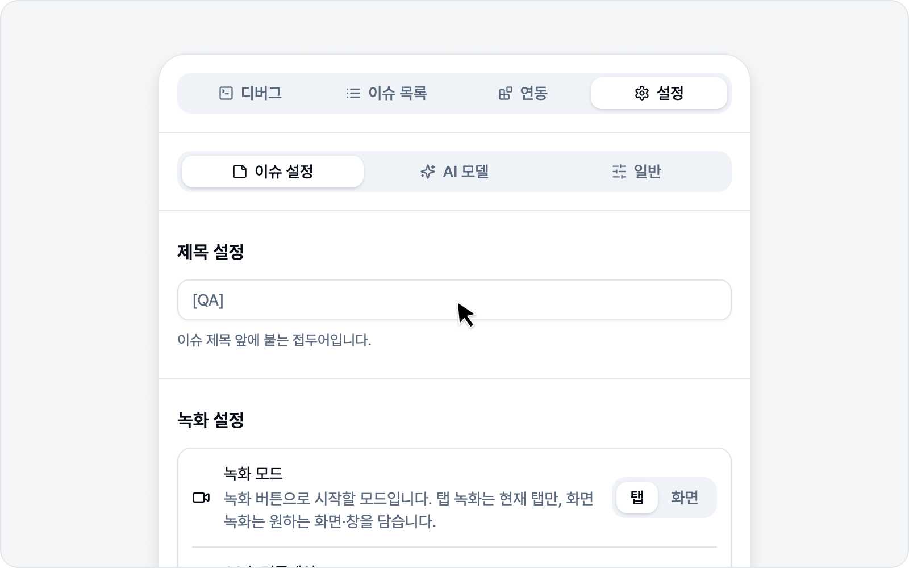
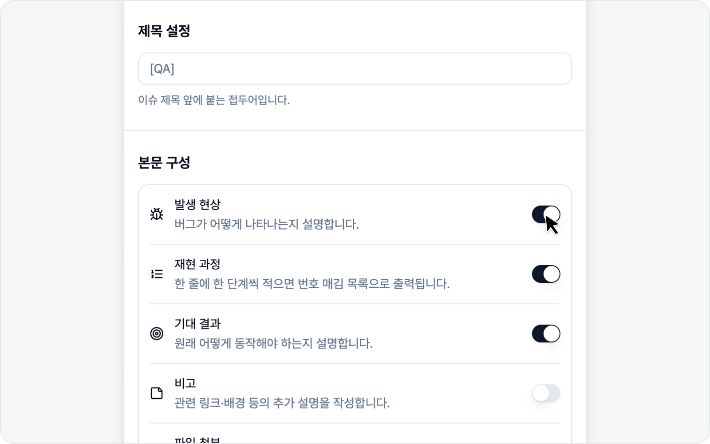
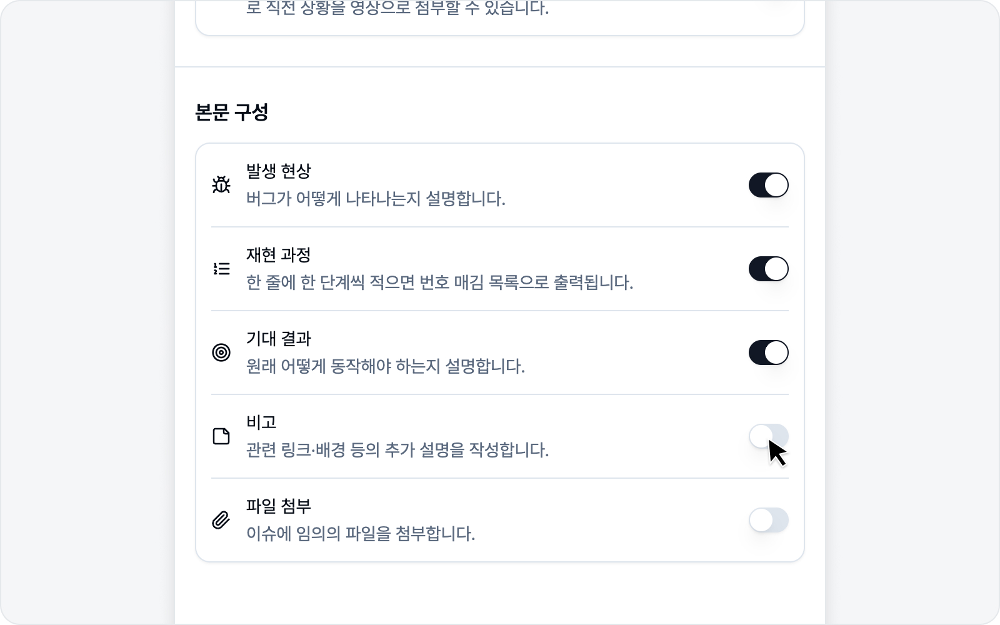

# 이슈 설정

이슈를 쓸 때마다 반복되는 부분, 여기서 미리 맞춰 두면 매번 손이 한결 가벼워집니다.

## 제목 접두어

이슈 제목 앞에 자동으로 붙는 문구입니다. 예를 들어 `[QA] `로 두면 제목이 늘 `[QA] `로 시작합니다. 팀에서 라벨 규칙을 쓰신다면 꽤 요긴합니다.

## 녹화 모드

**녹화 설정** 섹션에서 녹화 버튼이 **탭만 담을지, 화면 전체나 다른 창까지 담을지**를 미리 골라 둡니다. 캡처 진입 화면의 녹화 버튼은 여기서 고른 모드대로 동작해요.

- **탭** — 지금 보고 있는 탭만 녹화합니다. 빠르고, 공유 선택 창도 거치지 않습니다.
- **화면** — 화면 전체나 특정 창을 골라 녹화합니다. 탭 바깥(다른 앱 창, 새 창으로 뜨는 결제·로그인 화면)까지 담아야 할 때 쓰세요.

한 번 골라 두면 다음에 바꾸기 전까지 그대로 유지됩니다. 고른 모드는 캡처 진입 화면의 녹화 버튼 아이콘과 라벨에 바로 반영됩니다.

## 30초 리플레이

화면의 최근 30초를 항상 기록해 두는 기능입니다. 버그를 발견하면 버튼 한 번으로 직전 상황을 영상으로 첨부할 수 있어요.

이 토글을 켜면 화면의 최근 30초가 기록되기 시작합니다. 따로 권한을 허용하는 절차는 없으니, 스위치만 켜시면 바로 동작합니다. 화면을 계속 캡처해 두는 기능이라, 필요 없을 때는 꺼 두셔도 괜찮습니다.

> 30초 리플레이를 어떻게 쓰는지 궁금하시면 [30초 리플레이](../video/replay.md)를 참고하세요.

## AI 설정

**재현 단계 채우기**를 켜 두면, 녹화를 마치고 이슈 작성 화면에 들어올 때 AI가 방금 기록된 액션 로그를 바탕으로 **재현 과정 섹션을 알아서 채워** 줍니다. 한 단계씩 직접 옮겨 적던 수고를 덜어 주는 기능이에요.

- 기본은 **켜짐**입니다.
- AI를 연결해 두었을 때만 동작합니다 — 연결된 AI가 없으면 자동 채움은 일어나지 않고, 재현 과정은 비어 있는 채로 둡니다. AI 연결은 [AI LLM 연동](./ai.md)을 참고하세요.
- 이 기능이 동작하면 액션 로그가 연결된 AI로 전송됩니다. 민감한 화면을 녹화하셨다면 꺼 두셔도 괜찮습니다.

> 실제로 어떻게 채워지는지는 [이슈 작성 (녹화 모드)](../video/issue.md)에서 확인하실 수 있습니다.

## 본문 구성

이슈 본문에 어떤 섹션을 넣을지 켜고 끌 수 있습니다. 기본으로 4개 섹션이 준비되어 있습니다.

| 섹션 | 기본 | 입력 형식 |
|---|---|---|
| 발생 현상 | 켜짐 | 문단 |
| 재현 과정 | 켜짐 | 번호 목록 |
| 기대 결과 | 켜짐 | 문단 |
| 비고 | 꺼짐 | 문단 |

- **재현 과정**은 번호 목록으로 입력합니다 — 한 줄에 한 단계씩 적으면 1, 2, 3…으로 번호가 알아서 붙습니다.
- **비고**는 기본적으로 꺼져 있으니, 필요할 때만 켜시면 됩니다.
- 각 섹션의 **라벨과 안내 문구(플레이스홀더)는 직접 바꿀 수 있습니다**. 팀 용어에 맞춰 "발생 현상"을 다른 이름으로 바꾸는 식으로요.

## 파일 첨부

캡처나 로그로는 담기 어려운 파일을 이슈에 직접 붙여야 할 때가 있죠. 이 토글을 켜면 이슈 작성 화면에 **첨부 파일** 영역이 나타나, 원하는 파일을 골라 함께 등록할 수 있습니다.

- 기본은 **꺼짐**입니다.
- 파일은 **최대 10개**, 합쳐서 **50MB**까지 붙일 수 있습니다.
- 플랫폼마다 한 파일당 용량 제한이 다른데(예: Notion 5MB, GitLab 10MB), 이를 넘는 파일은 "용량 초과"로 표시되고 해당 플랫폼에서 업로드가 거부될 수 있습니다.
- 붙여 둔 파일은 이슈를 제출할 때 함께 업로드됩니다.
