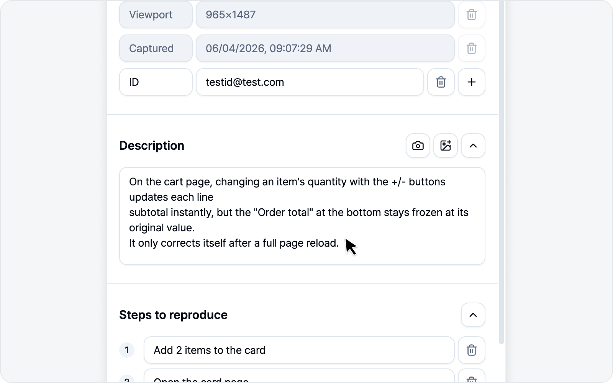

# 이슈 작성 (녹화 모드)

녹화가 끝나면 이슈 초안이 열립니다. 아래 순서대로 채워 가면 됩니다. 녹화 모드는 **영상과 함께 로그를 가장 풍부하게** 담을 수 있는 모드예요.

## 1. 제목

설정해 둔 제목 접두어(예 `[QA] `)가 미리 채워져 있습니다. 이어서 제목을 적으면 됩니다.

## 2. 재현 환경

OS·브라우저·페이지 URL·뷰포트 크기·캡처 시각이 **알아서 채워집니다**(읽기 전용). 더 알리고 싶은 정보가 있으면 변수 행을 직접 더하셔도 됩니다.

## 3. 미디어 — 영상

녹화 모드의 미디어는 **영상**입니다. 방금 녹화한(또는 30초 리플레이로 가져온) 영상이 이슈에 첨부됩니다. 미디어 섹션 오른쪽의 **다운로드** 버튼을 누르면 이 영상을 파일로 따로 내려받을 수도 있습니다.

## 4. 본문 섹션

설정한 본문 구성대로 섹션이 나타납니다 — 발생 현상·재현 과정·기대 결과·비고(켜 둔 것만). 재현 과정은 번호 목록으로 입력합니다. 한 줄씩 직접 채워도 되고, 아래 AI 초안 작성으로 한 번에 채워도 됩니다.

**재현 과정은 알아서 채워집니다.** 녹화를 마치고 이 화면에 들어오면, AI가 방금 기록된 액션 로그를 바탕으로 **재현 과정을 자동으로 정리해** 넣어 줍니다(AI를 연결해 둔 경우에만 — 연결된 AI가 없으면 비어 있는 채로 둡니다). 정리하는 동안엔 화면 위에 오버레이가 잠깐 덮이고, 끝나면 채워진 단계가 나타납니다. 기다리기 어려우면 오버레이 아래쪽의 **중단**을 눌러 멈출 수 있습니다 — 그러면 재현 과정은 비어 있는 채로 두고 직접 쓰시면 됩니다. 마음에 들지 않으면 재현 과정 섹션 오른쪽 위의 **휴지통(전체 초기화)** 버튼으로 한 번에 비우고 직접 쓰시면 됩니다.

> 이 자동 채움이 부담스러우시면 **설정 > 이슈 설정 > 기타 > 재현 과정 채우기**에서 꺼 두실 수 있습니다.

### 문제된 로그를 본문에 넣기

발생 현상·기대 결과·비고처럼 **문단으로 쓰는 섹션**은 헤더 오른쪽에 **로그 추가** 버튼이 있습니다(재현 과정은 번호 목록이라 없습니다). "이 응답이 문제입니다"를 말로 풀어 쓰는 대신, 그 로그를 본문에 그대로 붙일 수 있습니다.

버튼을 누르면 **로그 추가** 창이 열립니다. **콘솔**·**네트워크** 탭에 각각 몇 건인지 배지로 보이고, 평소 로그를 보던 화면과 똑같이 검색·필터로 찾을 수 있습니다. 문제된 항목을 클릭해 오른쪽 상세에서 내용을 확인하신 뒤 **추가**를 누르면 됩니다.

- **네트워크** — 요청 경로·상태 코드와 함께 **요청·응답 본문**이 담깁니다. "200인데 응답은 실패"처럼 상태 코드만으론 안 보이는 문제를 그대로 보여줄 수 있습니다.
- **콘솔** — 출력된 메시지가, 에러라면 스택 트레이스까지 함께 담깁니다.

들어간 로그는 코드 블록으로 보이지만 **그냥 텍스트**라, 필요 없는 부분은 지우거나 고쳐도 괜찮습니다. 첨부되는 `logs.html`과는 별개입니다 — 첨부는 받는 사람이 파일을 열어야 보이지만, 이렇게 넣은 로그는 **이슈 본문에서 바로** 보입니다.

로그가 길어도 걱정 마세요. 15줄이 넘는 코드 블록은 **접힌 채로** 들어가서, 응답 하나가 화면을 다 차지하는 일은 없습니다. 전체를 보시려면 코드 블록에 마우스를 올려 아래쪽 가운데 뜨는 **펼치기 (38줄)** 버튼을 누르면 됩니다 — 괄호 안 숫자가 그 블록의 전체 줄 수입니다. 다시 **접기**를 누르면 접히고, 미리보기에서도 똑같이 동작합니다. 접힌 블록 안을 클릭해 고치기 시작하면 알아서 펼쳐지니 편하게 편집하셔도 됩니다. 접는 건 보기 편하라고 있는 것일 뿐, **등록되는 이슈 본문에는 늘 로그 전문이 그대로** 들어갑니다.

> 본문에 넣은 로그는 그 이슈를 볼 수 있는 사람 모두에게 그대로 보입니다. 특히 콘솔 로그는 마스킹 없이 원문이 담기니, 민감한 내용이 찍히는 화면이라면 넣기 전에 상세에서 한 번 확인해 주세요.

### 본문 이미지에 주석·수정하기

발생 현상 같은 문단 섹션에는 이미지도 넣을 수 있습니다 — 화면을 붙여넣거나, 파일을 끌어다 놓거나, 섹션 헤더의 **이미지 추가** 버튼으로요. 이렇게 본문에 들어간 이미지에 **마우스를 올리면** 오른쪽 위에 작은 버튼이 뜹니다. **주석 달기**를 누르면 스크린샷 주석과 똑같은 편집기가 열려, 화살표로 강조하거나 민감한 부분을 가린 뒤 그 자리에 바로 반영할 수 있습니다. 주석을 한 번이라도 넣으면 **원본 복원** 버튼이 함께 뜨는데, 누르면 편집 전 원본으로 되돌아갑니다. 필요 없는 이미지는 **삭제**로 바로 지웁니다.

> 예전에는 본문에 넣은 이미지를 고치려면 지우고 밖에서 편집한 뒤 다시 넣어야 했는데, 이제 넣은 자리에서 바로 손볼 수 있습니다. 주석을 넣기 전 원본까지 브라우저 안에만 저장되고, 이슈로 나가는 건 늘 지금 보이는(주석을 넣었다면 주석이 들어간) 이미지입니다.

## ✨ AI 초안 작성

한 줄 한 줄 직접 적기 번거로우셨다면, 이 기능이 큰 힘이 됩니다. AI를 연결해 두면 본문 섹션 아래에 보라색 **"AI로 초안을 작성해보세요"** 배너가 나타납니다.

오른쪽 **AI 초안 작성**을 누르면 작은 입력창이 열립니다. 버그를 한 줄로 간단히 적고 **초안 작성**을 누르면 AI가 **제목과 본문 섹션을 한 번에** 채워 줍니다. 채워지는 건 켜 둔 섹션뿐이고, 제목 접두어도 그대로 유지됩니다. 이미 적어 두신 제목·본문이 있다면 그 내용까지 참고하고, 본문에 붙여 둔 이미지는 지우지 않고 그대로 둔 채 글만 다듬어 채웁니다.

녹화 모드에서는 **콘솔·네트워크·액션 로그 요약**을 근거로 삼아, 녹화 중 실제로 무슨 일이 있었는지를 초안에 녹여 줍니다. 로그가 풍부한 모드인 만큼 초안의 정확도도 가장 높습니다.

에러 로그가 잡혀 있었다면 한 가지 더 해 줍니다 — AI가 버그와 직접 관련된 로그를 골라, **실제 로그 원문을 발생 현상 아래에 코드 블록으로** 붙여 줍니다. 로그 내용은 AI가 새로 쓰는 게 아니라 캡처된 원문 그대로라, 지어낸 스택 트레이스가 들어갈 일은 없습니다. 관련 로그가 없으면 아무것도 붙지 않는 게 정상이고, 직접 넣어 둔 로그 블록은 다시 생성해도 그대로 남습니다. 필요 없다 싶으면 블록만 지우셔도 됩니다.

> AI도 가끔 실수하니 생성된 초안은 한 번 확인해 주세요. 배너는 AI를 연결했을 때만 보입니다 — 연결 방법은 [AI LLM 연동](../settings/ai.md)에 있습니다.

## 5. 로그 첨부 — 녹화 모드 전용 정책

녹화 모드는 영상에 더해 세 종류의 로그를 함께 담습니다. 로그 섹션에는 **`logs.html` 카드 하나**가 뜨고 **스위치는 기본 켜짐**입니다 — 스위치 하나로 세 로그를 **통째로** 담거나 뺍니다(로그별로 따로 끄지는 않습니다).

- **콘솔 로그** — 녹화 중 발생한 콘솔 출력·에러.
- **네트워크 로그** — 녹화 중 오간 네트워크 요청.
- **액션 로그** — 클릭·텍스트 입력·페이지 이동은 물론, **단축키·특수키 입력(Enter·Esc·⌘K 등), 체크박스·라디오 토글, 드롭다운 선택, 요소를 끌어다 놓는 드래그 앤 드롭**까지 사용자 동작을 폭넓게 기록합니다. 단축키는 입력한 글자 하나하나가 아니라 어떤 키를 눌렀는지가 담깁니다.

카드를 누르면 **콘솔·네트워크·액션 탭**으로 나뉜 창이 열려 각 로그 내용을 확인할 수 있고, 창 아래 **첨부 해제**로 끌 수도 있습니다.

로그는 사이드패널이 열려 있는 동안 계속 모이고 있어서, 녹화를 시작하기 **전**에 일어난 일까지 이미 담겨 있습니다.

> 입력 필드에 입력한 값과 드롭다운에서 고른 값은, 민감 정보로 판단되지 않으면 **원문 그대로 기록됩니다.** 어떤 값을 넣었을 때 문제가 생겼는지가 재현에 꼭 필요하기 때문입니다. 자세한 기준과 주의점은 [로그 뷰어](../logs/viewer.md)의 안내를 확인해 주세요.

영상 타임라인과 로그가 시간으로 연결되어, 받는 분이 [로그 뷰어](../logs/viewer.md)에서 "이 순간에 무슨 일이 있었는지"를 차근차근 따라갈 수 있습니다.

로그 섹션 오른쪽의 **다운로드** 버튼을 누르면, 이슈에 첨부되는 것과 똑같은 로그 리포트(`logs.html`)를 등록 전에 직접 받아볼 수 있습니다. 영상까지 함께 담겨, 그대로 [로그 뷰어](../logs/viewer.md)에서 열어볼 수 있어요.

## 6. 미리보기

제출 전 본문을 미리보기로 확인합니다. **복사**로 본문을 그대로 복사해 다른 곳에 붙여 넣을 수도 있습니다.

## 7. 제출

연결한 플랫폼의 필드(프로젝트·담당자·라벨 등)를 채우고 **이슈 제출**을 누르면 됩니다. 등록이 끝나면 이슈 링크가 표시됩니다.

필드 맨 아래엔 **참조**(CC) 칸도 있습니다. 이 버그를 함께 알아야 할 분들(리뷰어·디자이너·PM 등)을 골라 두면, 등록된 이슈 본문 맨 아래에 `cc @이름` 멘션으로 들어가고 각자에게 플랫폼 알림이 갑니다. 여러 명을 한 번에 고를 수 있고, 이름으로 검색해 빠르게 찾을 수 있어요. 한 번 고른 분들은 다음 이슈에도 미리 채워지니 매번 다시 고르지 않으셔도 됩니다.

> 참조는 레포·팀·프로젝트·워크스페이스처럼 상위 항목을 먼저 골라야 활성화됩니다. Notion만은 연결한 통합에 '사용자 정보 읽기' 권한이 있어야 멤버 목록을 불러올 수 있으니, 목록이 비어 있다면 설정에서 Notion을 다시 연결해 주세요.
