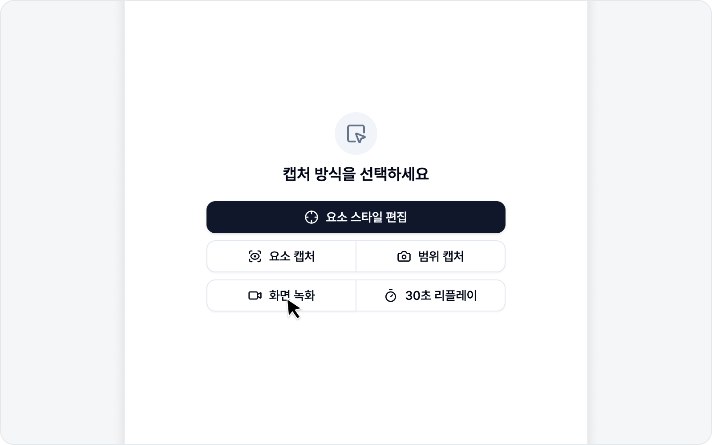
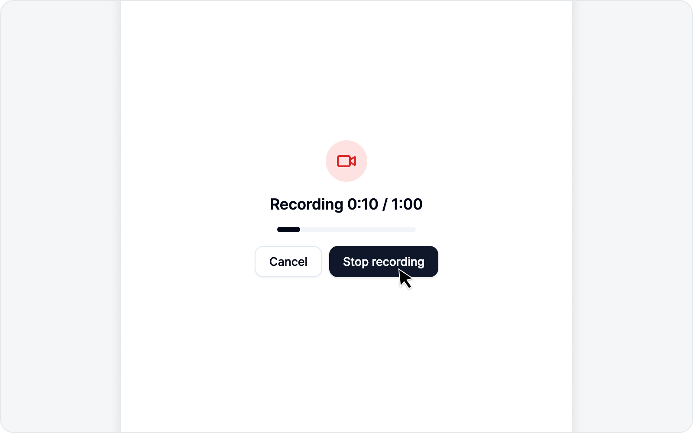

# 실시간 녹화

BugShot의 실시간 녹화는 캡처 진입 화면의 **녹화 버튼** 하나로 시작합니다. 이 버튼이 지금 보고 있는 **탭만** 담을지, **화면 전체나 다른 창까지** 담을지는 설정에서 미리 골라 두는데, 언제든 다시 바꿀 수 있으니 부담 갖지 않으셔도 됩니다.

## 녹화 모드 고르기

**디버그** 탭의 녹화 버튼은 설정에서 고른 모드(**탭 녹화** / **화면 녹화**)대로 동작합니다. 모드는 **설정 > 이슈 설정 > 녹화 설정 > 녹화 모드**에서 고릅니다. 고른 모드는 녹화 버튼의 아이콘과 라벨에 바로 반영됩니다.

## 탭 녹화

**탭 녹화**로 두면 지금 보고 있는 탭의 화면이 녹화 버튼 한 번에 바로 녹화됩니다. 공유 선택 창 없이 빠르게 시작돼요.

> 다만 사이드패널을 연 페이지에서 **다른 사이트로 이동한 뒤** 탭 녹화를 누르면, 브라우저 권한 정책상 그 탭을 곧바로 녹화할 수 없어 자동으로 화면 공유 선택 창으로 넘어갑니다. 이때는 목록에서 지금 보고 있는 탭을 골라 주시면 돼요.

## 화면 녹화

탭 바깥 — 다른 앱 창, 전체 화면, 새 창으로 뜨는 결제·로그인 화면 — 까지 보여줘야 한다면 **화면 녹화**로 둡니다. 녹화 버튼을 누르면 브라우저가 "무엇을 공유할까요?" 하고 묻는 선택 창을 띄우는데, 거기서 **전체 화면 · 특정 창 · 탭** 중 하나를 골라 공유를 누르면 녹화가 시작됩니다.

> 화면 녹화는 브라우저가 직접 권한을 확인하는 방식이라 선택 창을 한 번 거칩니다. 참고해 주세요.

## 녹화 중

녹화 중에는 **경과 시간과 최대 시간**이 타이머로 표시됩니다. 버그를 재현하는 동작을 평소처럼 보여주시면 됩니다.

- **녹화 완료** — 녹화를 멈추고 영상으로 마무리합니다.
- **취소** — 녹화를 버리고 처음으로 돌아갑니다.

화면 녹화라면 브라우저 위쪽의 **공유 중지** 막대를 눌러도 녹화가 마무리됩니다. 영상은 **최대 길이 제한**이 있어서, 그 시간에 닿으면 알아서 멈추니 시간을 재며 조마조마하지 않으셔도 됩니다.

## 화면에 그리기

"여기 이 버튼이요", "이 영역이 깨져요" — 말로만 설명하기엔 애매한 부분, 녹화 화면 위에 직접 그려서 짚어 드릴 수 있습니다. 녹화가 시작되면 녹화 컨트롤 아래에 **그리기 도구 모음**이 나타납니다 — 색상, **펜**·**형광펜**, 굵기를 고를 수 있어서 스크린샷 주석 편집기와 똑같은 느낌으로 그려집니다.

- **펜** 또는 **형광펜**을 누르면 그리기가 켜지고, 마우스 커서가 십자 모양으로 바뀝니다. 이 상태에서 페이지를 **누른 채 끌면** 지나간 자리에 선이 그려집니다. **형광펜**은 반투명하고 굵어서, 마커로 칠하듯 넓은 영역을 강조할 때 좋습니다.
- 색상은 **빨강·노랑·초록·파랑·검정** 다섯 가지, 굵기는 **얇게·보통·굵게** 중에서 고르시면 됩니다. 어렵지 않습니다.
- 그린 선은 **그린 순서대로, 시작한 쪽부터 몇 초에 걸쳐 스르륵 사라지므로** 따로 지울 필요가 없습니다. 강조하고 싶을 때마다 그때그때 그으시면 됩니다.
- 그리는 동안 페이지 클릭은 잠시 막히지만 **스크롤은 그대로 됩니다**. 다 그리셨으면 켜 두었던 **펜/형광펜** 버튼을 다시 누르거나 페이지에서 **Esc** 키를 눌러 그리기를 끄면, 페이지를 평소처럼 다룰 수 있습니다.

그린 선은 녹화 영상에 그대로 담겨서, 나중에 영상을 보는 팀원도 어디를 봐야 할지 한눈에 알 수 있습니다.

> 화면 녹화로 **다른 창이나 모니터**를 공유하고 있다면, 그리기는 BugShot을 연 탭 위에만 나타나므로 그 영상에는 담기지 않을 수 있습니다. 탭 위에 그린 내용을 남기고 싶으시면 그 탭을 공유해 주세요.

## 처리·산출

멈추면 영상이 MP4로 처리되고 썸네일이 만들어집니다. 처리가 끝나면 자연스럽게 이슈 초안으로 넘어갑니다.

> 이어지는 이슈 작성은 [이슈 작성](issue.md)에서 안내해 드립니다.
