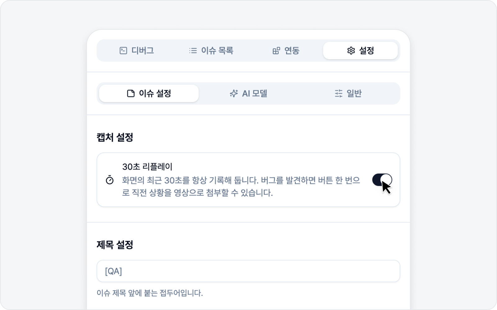
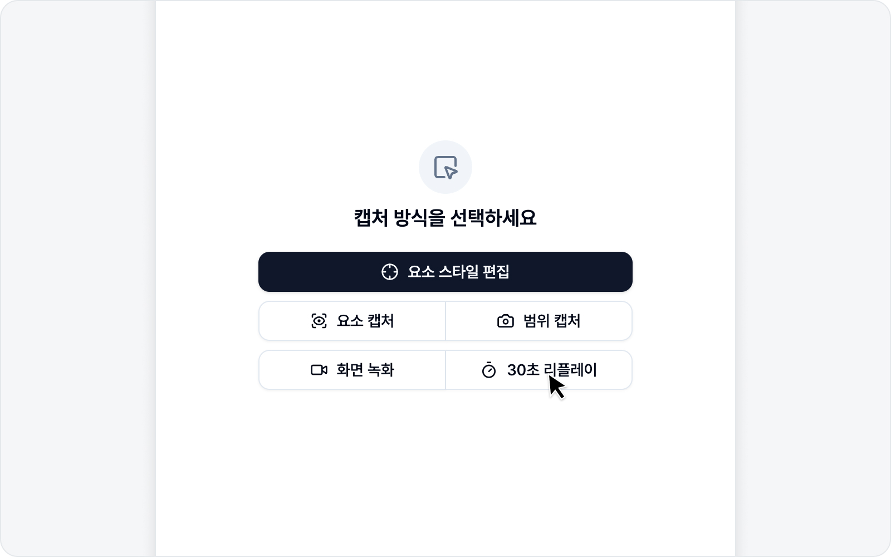

# 30초 리플레이

버그는 늘 녹화를 켜 둔 다음에 일어나 주지 않죠. 30초 리플레이는 화면의 **최근 30초를 항상 기록**해 두기 때문에, 버그를 본 직후 버튼 한 번으로 직전 상황을 영상으로 첨부할 수 있습니다. "아, 방금 녹화 켤걸…" 하는 순간을 줄여 줍니다.

## 선행조건: 설정

리플레이는 미리 켜 두어야 동작합니다.

> 먼저 [이슈 설정](../settings/issue.md)에서 **30초 리플레이 토글을 켜** 주세요. 토글을 켜면 그때부터 직전 30초가 기록됩니다. 따로 권한을 허용하는 절차는 없으니, 스위치만 켜시면 됩니다.

여기에 더해, 작업 도중 **다른 페이지로 이동하더라도 사이드패널이 닫히지 않고, 캡처도 그대로 이어집니다**. 리플레이 사용 여부와 무관하게 적용되니, 페이지를 오가며 버그를 재현할 때 한결 편합니다.

## 사용하기

준비되면 디버그 화면의 **30초 리플레이** 버튼으로 직전 30초를 영상으로 가져옵니다. 지금 어떤 상태인지는 버튼만 봐도 알 수 있습니다.

- **비활성** — 설정에서 아직 켜지 않았습니다. (클릭하면 **이슈 설정**으로 이동해 그 자리에서 바로 켤 수 있습니다.)
- **기록 중** — 화면을 기록하고 있습니다. 언제든 직전 30초를 가져올 수 있어요.
- **인코딩 중…** — 가져온 30초를 영상으로 만드는 중입니다.
- **준비됨** — 영상이 만들어져 이슈에 첨부됩니다.

## 구간 자르기

버그가 난 건 보통 30초 중 잠깐이죠. 영상이 만들어지면 이슈 초안 위로 **자르기 화면**이 자동으로 떠서, 앞뒤의 필요 없는 부분을 잘라내고 버그 순간만 남길 수 있습니다. 어렵지 않습니다 — 앞뒤를 잘라 버그 구간만 남겨 보세요.

- **구간 고르기** — 타임라인 양쪽 끝의 **시작 지점**·**끝 지점** 손잡이를 끌어 남길 구간을 정합니다. 손잡이를 움직이면 영상도 그 위치로 따라가 경계 화면을 확인할 수 있고, 위쪽에 선택한 길이("17s / 30s")가 표시됩니다.
- **재생·일시정지** — 영상을 직접 돌려 보며 버그 지점을 찾습니다. 타임라인에는 콘솔·네트워크에서 **오류가 난 지점**이 표시돼, 어디를 남길지 가늠하는 데 도움이 됩니다.
- **로그 미리보기** — 위쪽의 **콘솔**·**네트워크**·**동작** 버튼으로 캡처된 로그 전체를 미리 볼 수 있습니다(자를 구간을 정하는 참고용).
- **되돌리기·다시 실행** — 손잡이를 잘못 옮겼어도 걱정 마세요. 되돌리거나 다시 실행할 수 있습니다.

다 골랐으면 **확정**을 누르세요. 선택한 구간만 남도록 영상이 다시 만들어지고, 함께 첨부되는 콘솔·네트워크·동작 로그도 그 구간에 맞춰 좁혀집니다. 손잡이를 건드리지 않고 그대로 **확정**하면 30초 전체가 그대로 유지됩니다.

> 자르기 화면은 캡처 직후 **딱 한 번만** 뜨고, 확정하면 원본은 정리됩니다. 자르기가 필요 없으면 그대로 **확정**만 누르면 됩니다. 이 캡처 자체를 그만두려면 **작성 취소**를 누르세요 — 확인 후 처음 화면으로 돌아갑니다.

> 확정하면 이슈 초안으로 넘어갑니다. 이어지는 작성은 [이슈 작성](issue.md)에서 안내해 드립니다.

---

🌐 [English](https://bugshot.gitbook.io/en/video/replay)
