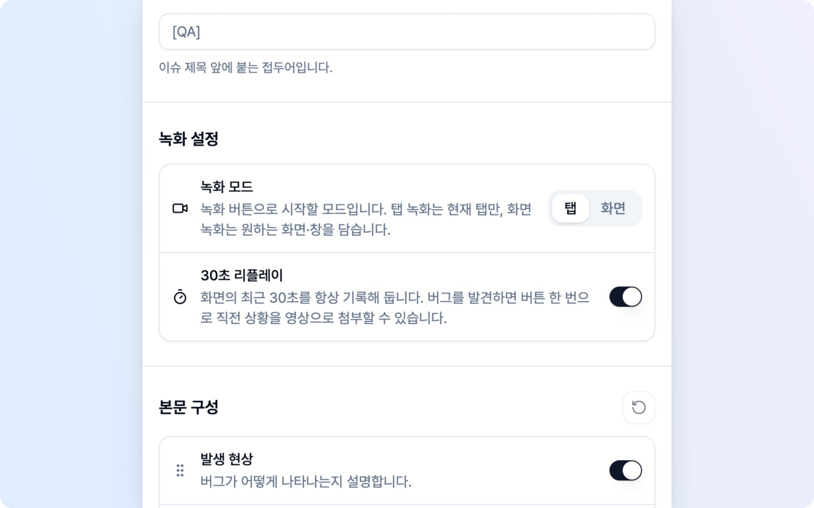
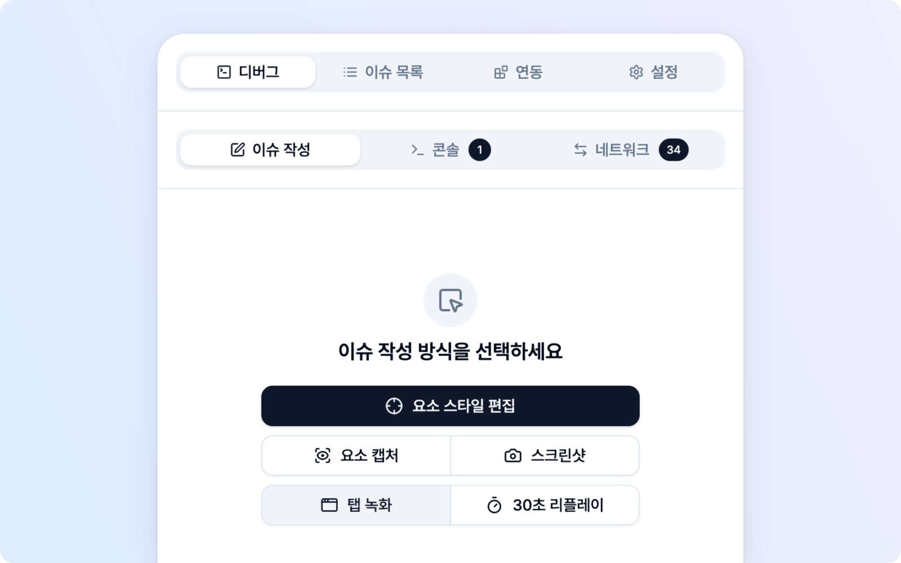

# 30초 리플레이

버그는 늘 녹화를 켜 둔 다음에 일어나 주지 않죠. 30초 리플레이는 화면의 **최근 30초를 항상 기록**해 두기 때문에, 버그를 본 직후 버튼 한 번으로 직전 상황을 영상으로 첨부할 수 있습니다. "아, 방금 녹화 켤걸…" 하는 순간을 줄여 줍니다.

## 선행조건: 설정

리플레이는 미리 켜 두어야 동작합니다.

> 먼저 [이슈 설정](../settings/issue.md)에서 **30초 리플레이 토글을 켜** 주세요. 토글을 켜면 그때부터 직전 30초가 기록됩니다. 따로 권한을 허용하는 절차는 없으니, 스위치만 켜시면 됩니다.

여기에 더해, 작업 도중 **다른 페이지로 이동하더라도 사이드패널이 닫히지 않고, 캡처도 그대로 이어집니다**. 리플레이 사용 여부와 무관하게 적용되니, 페이지를 오가며 버그를 재현할 때 한결 편합니다.

## 사용하기

준비되면 디버그 화면의 **30초 리플레이** 버튼으로 직전 30초를 영상으로 가져옵니다. 지금 어떤 상태인지는 버튼만 봐도 알 수 있습니다.

- **비활성** — 설정에서 아직 켜지 않았습니다. (클릭하면 **이슈 설정**으로 이동해 그 자리에서 바로 켤 수 있습니다.)
- **기록 중** — 화면을 기록하고 있습니다. 언제든 직전 30초를 가져올 수 있어요.
- **인코딩 중…** — 가져온 30초를 영상으로 만드는 중입니다.
- **준비됨** — 영상이 만들어져 이슈에 첨부됩니다.

## 구간 자르기

버그가 난 건 보통 30초 중 잠깐이죠. 영상이 만들어지면 이슈 초안 위로 **자르기 화면**이 자동으로 떠서, 앞뒤의 필요 없는 부분을 잘라내고 버그 순간만 남길 수 있습니다. 어렵지 않습니다 — 앞뒤를 잘라 버그 구간만 남겨 보세요.

> 이 화면은 30초 리플레이 전용이 아닙니다. **탭 녹화·화면 녹화를 멈췄을 때도 똑같이** 뜨니, 30초 리플레이를 켜지 않으셔도 자르기는 그대로 쓰실 수 있습니다.

타임라인 양쪽 끝의 **시작 지점**·**끝 지점** 손잡이를 끌어 남길 구간을 정하고, **확정**을 누르면 그 구간만 남도록 영상이 다시 만들어집니다. 함께 첨부되는 콘솔·네트워크·액션 로그도 같은 구간으로 좁혀지고요. 손잡이를 움직이면 잘려 나갈 로그가 로그 탭에서 **흐릿하게** 표시되니, 확정 전에 무엇이 빠지는지 미리 확인하실 수 있습니다.

> 화면 구성과 각 버튼의 자세한 설명은 [실시간 녹화](record.md)의 "구간 자르기"에 정리해 두었습니다. 두 캡처 방식이 **완전히 같은 화면**을 씁니다.

리플레이에서만 다른 점은 딱 하나입니다 — 손잡이를 건드리지 않고 그대로 **확정**하면 **30초 전체가 그대로 유지**됩니다.

> 자르기 화면은 캡처 직후 **딱 한 번만** 뜨고, 확정하면 원본은 정리됩니다. 자르기가 필요 없으면 그대로 **확정**만 누르면 됩니다. 이 캡처 자체를 그만두려면 **녹화 폐기**를 누르세요 — "녹화를 폐기할까요?" 확인을 거치면 처음 화면으로 돌아갑니다.

> 확정하면 이슈 초안으로 넘어갑니다. 이어지는 작성은 [이슈 작성](issue.md)에서 안내해 드립니다.
